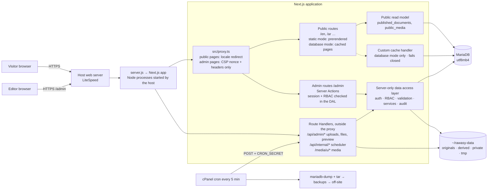

# A1 — Admin / CMS system architecture

**Status:** Phase A1 specification of the RAWASY admin/CMS program. **Design only — nothing in these documents is
implemented**: no `/admin`, no database, no dependency, no migration, no content moved, no public change.

**Documents of A1:**
[A1-ARCHITECTURE](A1-ARCHITECTURE.md) (this) · [A1-DATABASE-SCHEMA](A1-DATABASE-SCHEMA.md) ·
[A1-CONTENT-MODEL](A1-CONTENT-MODEL.md) · [A1-MIGRATION-PLAN](A1-MIGRATION-PLAN.md) ·
[A1-SECURITY-RBAC](A1-SECURITY-RBAC.md) · [A1-MEDIA-STORAGE](A1-MEDIA-STORAGE.md) ·
[A1-PUBLISHING-VERSIONS](A1-PUBLISHING-VERSIONS.md) · report: `docs/reports/2026-10-09-admin-a1-architecture.md`.

---

## 1. Roadmap (locked) and what each phase builds on this design

| Phase | Scope (locked) | Builds, per this design |
|---|---|---|
| **A1** | Architecture & database foundation | these specifications only |
| A2 | Authentication, RBAC & admin shell | database connection and migration CLI; access tables, audit table; login, sessions, 2FA, roles, invitations, bootstrap; `/admin` shell (own root layout); the proxy's **admin branch** (CSP nonce and admin headers only — never routing or authentication) and static headers for `/api/admin/**` and `/api/internal/**` (A1-SECURITY-RBAC §4) |
| A3 | Core CMS | revisions, publishing, public read model (published projections) and the fail-closed cache handler; pages, sections (bespoke blocks, locked), services, machines, projects, categories, industries, clients, certificates, orderings; the media **registry** of today's files (read-only picker, restrictions); automatic redirects; preview — used locally and in authenticated staging; **the production public site stays on its static source until A9** (T1 = Option B, A1-MIGRATION-PLAN §3) |
| A4 | Media library | uploads (chunked), versions, variants, folders, replacement, private documents, media delivery route; option, applied only at the A9 cutover: today's files served from persistent storage at the same addresses |
| A5 | Page builder / visual editor | inspector over the block registry, generic blocks, reusable blocks, responsive and motion presets, structure unlocking agreed with the Owner |
| A6 | Global site controls | menus, site settings, interface text, theme tokens, SEO defaults, redirect management |
| A7 | Forms & enquiries | form copy and fields, enquiry storage (gated), workflow, notifications, export, retention |
| A8 | Publishing, versions, audit & backup safety | compare/restore UI, scheduling, review comments, audit viewer, integrity checks, backup jobs and restore rehearsals |
| A9 | Full content migration & complete QA | complete import of the current content; full freeze/parity proof; **one controlled cutover** of the public site to the database (a release built with `CONTENT_SOURCE=database`); the static release kept ready as an immediate rollback until A9 is accepted; static modules retired to test fixtures only after acceptance; complete QA |

**T1 = Option B (locked by the Owner, A1 Correction 1).** The website is not publicly deployed yet, and the Owner wants
the complete admin/CMS before public hosting is activated. So A2–A8 are built and used **locally and in authenticated
staging**; the approved public website stays on its current static source in production, with **no** progressive
per-domain switch to database reads. A9 imports everything, proves parity, and switches the public read source in one
controlled cutover, with a rollback path to the static source until A9 is accepted (A1-MIGRATION-PLAN §3). The phase
order A1 → A9 is unchanged.

**Dependencies, not reordering:** A3 needs `media_*` tables (to reference and restrict today's images), `redirects`
(slug changes) and `cache_generation` / `cache_invalidations`; A2 creates `audit_events` (sign-in events). Each is the
minimum the earlier phase needs; the full features stay in their phases. Any change of scope is reported for the
Owner's approval first.

## 2. Goals and non-goals

**Goals.** Everything visible on the public website becomes manageable from `/admin` without opening the codebase —
pages, sections, items, both languages, media, services, projects, machinery, industries, clients, certificates,
navigation, SEO, settings, theme tokens, visibility, publishing, versions, audit, enquiries — on the same component
system the approved site uses.

**Non-goals and hard limits.**
- **The admin does not redesign the public site.** A1–A4 do not change appearance, and under T1 = Option B nothing
  from the admin reaches the production site before the A9 cutover; the path is: approved website → same website
  backed by the CMS → visual editor over the same components → owner-led changes later.
- **No arbitrary code execution from the admin** (no script, HTML, CSS text, templates, SQL); a stolen admin account
  must not become code execution (A1-SECURITY-RBAC §10).
- No Redis, Kafka, Elasticsearch, queues or background daemons (not available or not allowed on the host).

## 3. Current system (A1 baseline, `74220ea`)

- Next.js 16.3.8 (App Router, Turbopack), React 19.2.8, Node 22.22.2; runtime dependencies: `next`, `react`,
  `react-dom` only.
- Every page prerendered at build: 109 static pages (102 public addresses in two languages, plus metadata files); the
  catch-all `/[locale]/[...rest]` renders the localized 404 at runtime; `src/proxy.ts` sends unprefixed addresses to
  `/{locale}/…`.
- Content: 20 TypeScript modules in `src/content` read through `src/content/repository.ts` (async functions designed to be
  replaced by "the admin-panel API without changing any component"); ≈ 1,220 English/Arabic text pairs; 143 media files.
- Hosting: Namecheap Stellar Plus, cPanel "Setup Node.js App", `server.js` (custom server: `next()` +
  `getRequestHandler()`), builds made on a local Linux machine and uploaded as an archive (`scripts/package-namecheap.mjs`),
  image cache warmed after start (`scripts/warm-images.mjs`).

## 4. Target architecture

**Layers (source layout proposed for A2+, created only when implemented):**

| Layer | Location (proposed) | Rule |
|---|---|---|
| Admin UI | `src/app/(admin)/admin/**` with its own root layout and CSS | never imported by public routes |
| Public routes and components | today's `src/app/(commerce)/**`, `src/components/commerce/**` | unchanged; read content only through `src/content/repository.ts` |
| Public read model | `src/server/public/**` | reads only `published_documents`, `public_media`, `redirects`; returns today's content types |
| Data access layer | `src/server/{db,auth,policy,content,media,cache,audit}/**` | `import 'server-only'`; every function checks the session and permission it needs |
| Block registry | `src/blocks/**` | schemas, projections, upcasters and renderer mapping shared by admin and public |
| Scripts | `scripts/{db-migrate,admin-bootstrap,warm-pages,…}.mjs` | run by hand or by cron; never imported by the site |

Import boundaries are enforced by lint rules (`no-restricted-imports`) and `server-only`: public code cannot import
admin or write modules; client components cannot import database modules.

## 5. Request flows

1. **Public page view.** *Static mode* (production until the A9 cutover): the prerendered page, exactly as today.
   *Database mode:* the host forwards to a Node process → the proxy (locale handling, as today) → the page cache
   (custom handler) answers only if this request's read of the shared invalidation state succeeded and none of the
   entry's tags changed since it was rendered → otherwise the route renders: the repository reads published documents
   through tagged cached functions → HTML cached → response. If the database is unreachable the answer is a server
   error, never a possibly withdrawn page (A1-PUBLISHING-VERSIONS §8.2). No working copy is ever read.
2. **Admin page.** The proxy's admin branch sets a fresh CSP nonce and the admin headers — no locale redirect, no
   routing, no session check → the page checks the session and permission server-side (no session: redirect to
   `/admin/login`) → dynamic render, `no-store`, `noindex` (A1-SECURITY-RBAC §4).
3. **Admin save.** Server Action → `requirePermission()` (session from the database, role, record state) → schema
   validation → one transaction: working tables, revision (`save`), `content_references`, `search_documents`,
   `audit_events` → typed result. Nothing public changes.
4. **Publish.** Server Action → strict validation → one transaction: publish revision, projection into
   `published_documents`, redirects for slug changes, references, the next cache generation and `cache_invalidations`,
   audit → after commit: `revalidateTag(…, { expire: 0 })` in this process; every process checks the shared
   generations before it serves a cached page → optional warm request (A1-PUBLISHING-VERSIONS §5). Until the A9
   cutover this happens locally and in staging only.
5. **Preview.** `POST /api/admin/preview` → draft mode + preview target in the admin session → the public route renders
   the working copy only when draft mode **and** a valid admin session with `preview.use` are present → `private,
   no-store`, `noindex` (A1-PUBLISHING-VERSIONS §11).
6. **Upload (A4).** Chunked `PUT`s to `/api/admin/media/uploads/**`, a Route Handler outside the proxy (no body
   buffering) → temporary file → signature and size checks → original stored → variants generated one at a time → rows
   + audit → "pending review" (A1-MEDIA-STORAGE §6).
7. **Scheduled publication (A8).** cron (every 5 min) → `POST /api/internal/scheduler` with `CRON_SECRET` → due items
   locked and published inside the app process (so caches can be invalidated) → `system_job_runs`.
8. **Enquiry (A7).** Public Server Action → validation, honeypot, timing token, rate limit → transaction (enquiry,
   status history, outbox row) → "received, reference …" only after commit → email attempt after the response
   (`after()`), retries by cron.

## 6. Rendering and caching model

**Two content modes, one switch (T1 = Option B, corrected in A1 Correction 1).** `CONTENT_SOURCE` is fixed into a
release when it is built; switching means deploying a release built in the other mode. There is no per-domain or
per-page switch, and `src/content/repository.ts` stays the single reading point for components in both modes.

| Mode | Where | Public pages |
|---|---|---|
| `static` | **production until the A9 cutover is accepted**, and the rollback target | prerendered at build from `src/content/*` exactly as today (109 static pages); no public page reads the database; no custom cache handler |
| `database` | local development and authenticated staging from A3; production from the A9 cutover | read only `published_documents`, `public_media` and `redirects` through the public read model; rendered at runtime and cached as below |

**Constraint (database mode):** builds happen on the developer's machine, which has no access to the hosted database
(remote access is reported closed on the host and is never opened for builds), so database-backed pages cannot be
prerendered at build time.

**Decision (A3, database mode):** render pages **at runtime on first request and cache them** (incremental static
regeneration):
- The root layout's `generateStaticParams` returns `[]` in database mode (in static mode it returns both locales, as
  today; a child's empty list would inherit the parent's params — verified in the 16.3.8 source), `dynamicParams` stays
  `true`, every route keeps a `revalidate` safety net (proposed 3,600 s). The same pages, rendered by the same
  components, from the same data — only *when* they render changes. To be confirmed by an A3 build test (route table and
  cache headers in both modes).
- `sitemap.xml` reads published data at runtime (`dynamic = 'force-dynamic'` with a cached, tagged read); `robots.txt`
  and the manifest stay static.
- The data layer refuses to query during `next build` (`NEXT_PHASE`), so an accidental build-time query fails loudly.
- **Cross-process invalidation that fails closed:** Next 16.3.8 keeps tag invalidations in each process's memory only.
  A **custom `cacheHandler`** wraps the built-in file-system cache and, before serving any cached entry, reads the shared
  invalidation state (`cache_generation` + `cache_invalidations`, one indexed statement; default for every request).
  Invalidations are numbered in commit order and entries are stamped with the number their render started from, so
  every process — including one that has just started — honours a publish. **If the state cannot be read, no cached
  entry is served:** the page is rendered from the database, and if the database is unreachable the visitor gets a
  server error rather than a possibly withdrawn page; a breaker stops retries for a few seconds at a time, and logs name
  error codes only (A1-PUBLISHING-VERSIONS §8.2). The handler stores no 404 of unknown slugs (inode protection) and
  does nothing at build time. Next stays pinned; the handler is re-verified at every upgrade.
- **After each database-mode release:** a gentle page warm-up (the `warm-images.mjs` approach) renders every sitemap
  page once.
- **Rejected:** building on the server (2 GB shared memory, slow, risky); exporting a content snapshot into the build
  (needs production data on the build machine, stale by deployment); enabling Cache Components (`cacheComponents`):
  a large migration that needs data at build time and still does not share invalidations across processes; a cache that
  serves its last copy when the database cannot be reached (it could serve withdrawn content: rejected by the Owner in
  A1 Correction 1).

## 7. Hosting model and constraints (Namecheap Stellar Plus)

### 7.1 Platform facts from official Namecheap documentation (updated in A1 Correction 1)

The Owner's Correction 1 brief cites these official pages as directly confirming the facts below for Namecheap's
shared hosting. (The A1 environment's network proxy refuses Namecheap's site, so the pages were not opened from here;
search extracts of KB 157 and KB 9453 agree with the cron and daemon rules.) They describe the **platform**. None of
them is a measurement of the RAWASY account (§7.2): the 30 entry processes, for example, is a limit, not the number of
processes the app runs, and no platform page states the database connection limit.

| Platform fact | Official page |
|---|---|
| LiteSpeed 6.2.2 web server · MariaDB 11.4.9 · Node.js 22.22 in the available version pool | [KB 129](https://www.namecheap.com/support/knowledgebase/article.aspx/129/22/what-version-of-the-software-is-used-on-your-servers/) — What version of the software is used on your servers? |
| Stellar Plus: 2 GB physical memory · `maxEntryProc` 30 · I/O 50 MB/s | [KB 1127](https://www.namecheap.com/support/knowledgebase/article.aspx/1127/103/a-handy-guide-to-resource-limits-or-what-is-lve/) — A handy guide to resource limits, or what is LVE |
| 300,000 inode limit | [KB 9331](https://www.namecheap.com/support/knowledgebase/article.aspx/9331/29/how-to-check-the-number-of-inodes-in-your-hosting-account/) — How to check the number of inodes in your hosting account |
| cron no more often than every 5 minutes · no more than 5 simultaneous cron jobs | [KB 9453](https://www.namecheap.com/support/knowledgebase/article.aspx/9453/29/how-to-run-scripts-via-cron-jobs/) — How to run scripts via cron jobs; [KB 157](https://www.namecheap.com/support/knowledgebase/article.aspx/157/22/do-you-have-any-server-resource-restrictions/) |
| stand-alone daemons (background server processes) prohibited | [KB 157](https://www.namecheap.com/support/knowledgebase/article.aspx/157/22/do-you-have-any-server-resource-restrictions/) — Do you have any server resource restrictions? |

Labels in the table below: **[P]** platform fact from the official pages above · **[V]** verified from another primary
source (CloudLinux, Phusion Passenger, MariaDB, ModSecurity, `sharp` documentation or source) · **[O]** other Namecheap
page seen only through search extracts · **[R]** reported by third parties · **[I]** inferred from the facts beside it ·
**[A]** account-specific: verified on the RAWASY account before staging (§7.3).

| Topic | Finding | Consequence for the design |
|---|---|---|
| Account limits | physical memory 2 GB, `maxEntryProc` 30, I/O 50 MB/s [P]; 300,000 inodes [P]; CPU figures inconsistent between pages [O]; reaching the entry-process limit returns 508, exceeding memory kills processes [V]; the app's actual use of each [A] | small DB pool; one `sharp` job at a time; streaming uploads; never build on the server; 404s not cached; few variant files |
| Database | **MariaDB 11.4.9** [P]; server default charset `latin1` until 11.6 [V]; remote access disabled (SSH tunnel only) [O → A]; phpMyAdmin with 1 GB import/export [O → A]; `max_user_connections`, `wait_timeout`, the database user's authentication plugin and grants [A] — a limit of 30 connections from an old forum post [R] is not used | explicit `utf8mb4` everywhere; migrations run on the server; the pool budget is a formula with a production default of 2 (A1-DATABASE-SCHEMA §4.2) |
| Node | Node.js 22.22 available [P]; "Setup Node.js App" (CloudLinux Node.js Selector) [O]; CloudLinux 8 / glibc 2.28 [O + I]; Passenger loads CommonJS start files [V] | Node 22.22.x everywhere (`.nvmrc`, as today); `server.js` stays CommonJS; `sharp` 0.35.5 sits exactly at its glibc minimum → pin |
| Web server and app processes | LiteSpeed 6.2.2 [P]; its Node launcher (`lsnode`) starts processes on demand [O]; under Passenger, Node gets one process by default, pool size and idle time being server settings [V]; web-server restarts stop the app [I]; **how many app processes run on this account, and when they start, idle out and restart [A]** | design for **any number of processes and frequent restarts**: shared invalidations, sessions and rate limits in the database, no in-memory state that matters; no process count is assumed anywhere |
| Client IP | both Passenger and LiteSpeed set the socket address to `127.0.0.1` [V]; Passenger appends `X-Forwarded-For` [V] | IP = right-most trusted `X-Forwarded-For` entry |
| Cron | no more often than every 5 minutes, at most 5 simultaneous jobs [P]; cron counts against entry processes [V] | scheduler precision ≤ 5 min; short jobs; jobs call the app's internal endpoint |
| Daemons | stand-alone background processes prohibited [P]; no script may use ≥ 25 % of resources for 60 s [O] | no workers; processing in requests or short cron jobs |
| Uploads | the request-body limit this application actually sees [A]; ModSecurity's recommended default rejects bodies > 12.5 MiB [V]; Next's proxy truncates bodies > 10 MB [V] | 4 MB chunks to a Route Handler outside the proxy |
| Backups | AutoBackup (Stellar Plus): 6 daily, 3 weekly, 5 monthly full cPanel backups, self-restore, downloadable [O]; server backups are not for customers [O] | own nightly dumps + media archives, copied off the account |
| SSH | available on request (port 21098); cPanel Terminal [O]; whether SSH / Terminal is enabled on this account [A] | bootstrap CLI, migrations, backups and the 2FA reset run there |
| Email | 200 emails per hour per domain; SMTP 465 (SSL) / 587 (TLS) [O]; the domain's mail and DNS configuration (SPF, DKIM, DMARC) [A] | outbox with retries; far above the need |
| Fair use | multimedia files capped at 10 GB under the "unmetered" policy [O] | optional downscaling of originals; off-site backups |

### 7.2 Account-specific facts still to verify (not platform facts)

These belong to the RAWASY account and are **not** inferred from the platform pages: the actual Node app process count
and lifecycle; `max_user_connections`; `wait_timeout`; the database user's authentication plugin; its grants; whether
SSH / cPanel Terminal is available on this account; actual resource use (memory, CPU, entry processes, I/O, inodes);
the upload limits this application sees; the mail and DNS configuration. Until they are measured, the documents assume
nothing about them: the pool budget is a formula (A1-DATABASE-SCHEMA §4.2), the cache is correct for any number of
processes (§6), uploads are chunked below every known limit.

### 7.3 Checklists (split in A1 Correction 1)

**A2 local implementation requirements** — A2 proceeds with these alone; no hosting-account check blocks it:
- Node 22.22.x (the repository's `.nvmrc` and `engines`, as today);
- a local MariaDB compatible with the target 11.4 (for example a MariaDB 11.4 container), with `utf8mb4` /
  `utf8mb4_unicode_520_ci` set explicitly and a local user on `mysql_native_password`;
- the database pool and every other setting as configuration (`DB_POOL_LIMIT` and the names in A1-SECURITY-RBAC §12),
  with local values;
- **no production credentials** anywhere in the local environment and no connection to the hosted database; local keys
  are throwaway values, never reused in staging or production.

**Pre-staging / pre-production host verification** — before the admin is connected to the Namecheap MariaDB or to
staging or production storage (the Owner runs it, or approves it being run; results go into that phase's report):
1. Web server and processes: `curl -sI` on the domain (the `server` header); how many `X-Forwarded-For` entries the host
   adds (`TRUSTED_PROXY_HOPS`); a short load test of the staging app, counting distinct app process ids over time (the
   app logs one line with its process id at start); the first request after 10, 30 and 60 idle minutes; what a restart
   does.
2. Database, in phpMyAdmin or the `mariadb` client: `VERSION()`, `@@max_user_connections`, `@@wait_timeout`,
   `@@character_set_server`, `@@collation_server`, `@@time_zone`, `@@sql_mode`; `SHOW CREATE USER` (authentication
   plugin) and `SHOW GRANTS` (including `LOCK TABLES`, `TRIGGER`, `CREATE`, `ALTER`, `INDEX`); remote access closed.
3. Connections actually used by cron jobs, the migration CLI, a backup run and phpMyAdmin (`SHOW PROCESSLIST` during
   each) → apply the budget formula → set `DB_POOL_LIMIT` (2 unless the measurement allows more and the Owner agrees).
4. SSH or cPanel Terminal enabled — required, because the bootstrap, migrations, backups and the emergency 2FA reset
   run there; `ldd --version`, `mariadb --version`, `mariadb-dump` available.
5. Resource use during the load test (cPanel Resource Usage: memory, entry processes, NPROC, I/O, inodes).
6. Upload limits seen by the app: 5 / 12 / 15 / 20 MB uploads to the staging app; note any 413 or truncation.
7. Cron: a job every 5 minutes running a Node script; never more than 5 jobs at once.
8. Backups: an AutoBackup test restore of one file and one database.
9. Mail and DNS: an SMTP test message; SPF, DKIM (and DMARC) for the sending domain.

No production database is ever used for local development, and staging never points at the production database (§12).

## 8. Database, ORM and connections (summary)

MariaDB (as hosted) + **Drizzle ORM** (core query builder only — its relational API emits SQL MariaDB lacks) +
**mysql2** (pool per process, `DB_POOL_LIMIT` with a production default of 2 until the account is measured — a budget
formula, no assumed process count; `utf8mb4_unicode_520_ci`, `SET time_zone = '+00:00'`) — appropriate for this host
with six documented constraints (A1-DATABASE-SCHEMA §1, §4). Schema changes through generated, reviewed SQL applied by a
locked, backup-checked CLI (A1-DATABASE-SCHEMA §10).

## 9. Mutations, validation and background work

| Operation | Mechanism | Why |
|---|---|---|
| Save, submit, review, publish, schedule, restore, archive, delete (all content, menus, settings) | **Server Actions** in the admin | built-in Origin check, typed, one round trip with the refreshed UI, `updateTag` read-your-own-writes |
| Users, roles, sessions, 2FA | Server Actions | same |
| Uploads | **Route Handlers** under `/api/admin/media/uploads/**`, outside the proxy (chunked `PUT`, `POST complete`) | actions are capped at 1 MB and buffer bodies; the proxy would buffer and truncate; progress events |
| Private file download, CSV export | Route Handlers (`GET`, authenticated) | streamed responses, download headers |
| Public media delivery | Route Handler | deliverability check, streaming, immutable caching |
| Preview on/off | Route Handlers (`POST`) | draft-mode cookie + server-computed redirect |
| Scheduler, outbox retries, cleanup | Route Handler `POST /api/internal/*` with `CRON_SECRET`, called by cron | cache invalidation must run inside the app process |
| Enquiry submission | public Server Action | Origin check; works without JavaScript (progressive enhancement) |

Every mutation: authenticate → authorize (permission + record) → validate (Zod schema, server-side) → transaction →
audit → invalidate → small typed result (no internal objects leak to the client). Post-response work uses `after()`
only for best-effort tasks backed by durable rows (the outbox), because the custom server installs no shutdown handler
and pending `after()` callbacks can be lost when the host stops a process. **Testing:** schema and policy unit tests
(table-driven permission matrix), service tests against MariaDB 11.4 in a container, Playwright for admin flows and the
existing public suite unchanged; a test runner and CI (none exists today) are A2 decisions.

## 10. Search
Admin search across content and media through `search_documents` (normalized Arabic and English text, `LIKE`
matching; `FULLTEXT` later if needed) — no Elasticsearch. The public site has no search today; none is proposed.

## 11. Backup and restore (A8 implements; A1 specifies)

| Item | Method | When (proposed) | Retention (Owner decision) |
|---|---|---|---|
| Database | `mariadb-dump --single-transaction --quick --routines --triggers --hex-blob --default-character-set=utf8mb4`, excluding `sessions`, `auth_tokens`, `rate_limits`, `login_attempts`; gzip + SHA-256; credentials from `~/.my.cnf` (0600) | nightly 03:15 Riyadh (00:15 UTC), and before every migration and every release | 14 daily, 8 weekly, 6 monthly on the account; copies off the account |
| Media | `tar` (GNU, `--listed-incremental`) of `originals/`, `private/`, `enquiries/` (variants are regenerated from originals) | nightly incremental, weekly full | as above |
| Naming | `rawasy-<env>-db-YYYYMMDDTHHMMSSZ.sql.gz`, `rawasy-<env>-media-<full|inc>-YYYYMMDD.tar.gz` | | |
| Off-site | downloaded by the Owner or pushed to storage the Owner chooses (never the same account only); optionally encrypted with the Owner's public key | weekly at least | |
| Secrets | never in backups: `.env`/environment values, `~/.my.cnf`; dumps exclude session and token tables; the recovery-critical keys are escrowed offline instead (A1-SECURITY-RBAC §12.1) | | |
| AutoBackup | Namecheap's AutoBackup stays on as an extra layer | | |

**Restore** (Owner, CLI only): stop the app (or maintenance page) → restore the dump with the `mariadb` client of the
same or a newer version (MariaDB 11 dumps start with a sandbox-mode line older clients reject) → restore media → run
"regenerate variants" and "rebuild public_media / search / references" → **set a new cache epoch**
(`cache_generation.epoch`, so no page cached before the restore is served — A1-PUBLISHING-VERSIONS §8.2) → restore the
recovery-critical keys from escrow and issue new replaceable secrets (A1-SECURITY-RBAC §12.3) → revoke all sessions →
start → page warm-up → spot checks. **Rehearsal:** restore the latest backups into staging every quarter and after any schema change; record
the result in `system_job_runs`. No backup job exists in A1.

## 12. Environments, configuration and bootstrap

| | Local | Staging (recommended) | Production |
|---|---|---|---|
| App | `next dev` / local build | a second cPanel Node app on a subdomain (shares the account's limits), `noindex`, protected by HTTP auth or IP | the site |
| Content mode | `static` or `database` | `database` (authenticated preview of the CMS, A3–A8) | **`static` until the A9 cutover**, then `database` |
| Database | local MariaDB compatible with 11.4 (container) seeded from fixtures | its own database: before A9 filled by the importer from the static content; after A9 restored from anonymized production backups | none before A9; created and imported at the A9 cutover |
| Storage | `RAWASY_DATA_DIR` in the project's scratch folder | its own folder | `~/rawasy-data` |
| Secrets | `.env.local` (never committed) | cPanel environment variables | cPanel environment variables |
| Migrations | same files, same order everywhere | | |

Never point a local or staging app at the production database. Environment variable **names** are listed in
A1-SECURITY-RBAC §12; no value appears in any document or file in the repository. **First owner:** CLI bootstrap with a
one-time setup link (A1-SECURITY-RBAC §3.9) — no default password anywhere.

## 13. Shared-hosting performance

| Area | Approach |
|---|---|
| Memory | small pool; streaming uploads; `sharp` one at a time with pixel limits; no large in-memory caches beyond Next's LRU |
| Processes | no daemons; cron jobs short and spaced; uploads and publishing are short requests |
| Database connections | `DB_POOL_LIMIT` per process (production default 2, raised only by the budget formula after measurement, A1-DATABASE-SCHEMA §4.2); in static mode public pages use none; in database mode a cached page costs one indexed freshness read |
| Image processing | once per upload (variants), never on page views for uploads |
| Backups | streamed `mariadb-dump --quick`, compressed, at night |
| Search | normalized `LIKE` over a few hundred rows |
| Revision and audit growth | small rows; pruning and retention jobs |
| Concurrency | optimistic locks for editing; row locks for publishing; named locks for jobs |
| Cache invalidation | targeted tags, generations in commit order, fails closed; site-wide refreshes are cheap at ≈ 100 pages; renders are lazy per process |

## 14. Dashboard data (A8)
From existing tables, no extra storage: items by state (drafts, in review, scheduled, published, archived, Trash);
translations missing or needing review; media pending review, restricted, missing alt text; new and open enquiries;
failed notifications; recent publications and the audit trail; scheduled items due; last scheduler, cleanup and backup
runs (`system_job_runs`); disk use of `RAWASY_DATA_DIR`; licence and certificate renewal dates (`expires_on`); sign-in
failures and locked accounts.

## 15. Public routes, `/admin` and conflicts
The URL contract (every current address kept; generic pages at `/{locale}/{slug}` resolved by the existing catch-all;
reserved slugs; redirects only on the 404 path) is in A1-CONTENT-MODEL §4. `/admin` page requests pass through the
proxy's admin branch only for the CSP nonce and admin headers — never the locale redirect, public routing or
authentication; they are authenticated server-side in every page, action and handler, `noindex`, `no-store`, never in
the sitemap or linked; `/api/**` (uploads included) stays outside the proxy (A1-SECURITY-RBAC §4). New public
prefixes introduced by the CMS: `/media/u/` (uploaded media) and `/api/admin/*`, `/api/internal/*` — none collides with
a current address.
