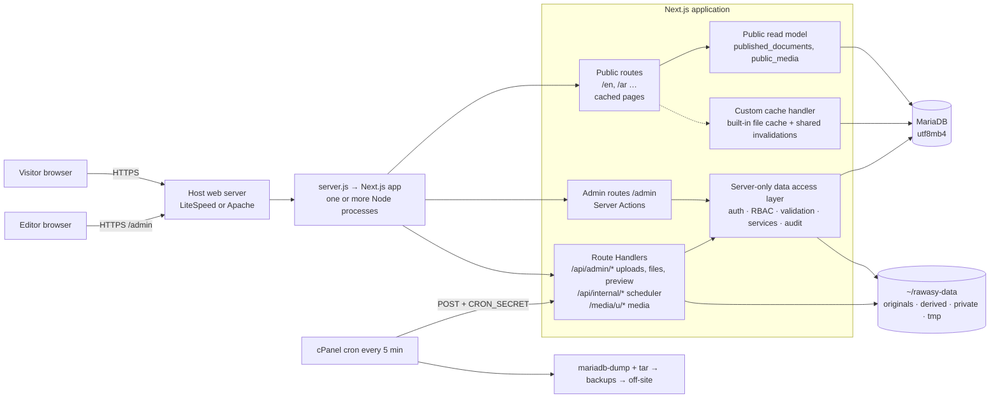

# A1 — Admin / CMS system architecture

**Status:** Phase A1 specification of the RAWASY admin/CMS program. **Design only — nothing in these documents is
implemented**: no `/admin`, no database, no dependency, no migration, no content moved, no public change.

**Documents of A1:**
[A1-ARCHITECTURE](A1-ARCHITECTURE.md) (this) · [A1-DATABASE-SCHEMA](A1-DATABASE-SCHEMA.md) ·
[A1-CONTENT-MODEL](A1-CONTENT-MODEL.md) · [A1-MIGRATION-PLAN](A1-MIGRATION-PLAN.md) ·
[A1-SECURITY-RBAC](A1-SECURITY-RBAC.md) · [A1-MEDIA-STORAGE](A1-MEDIA-STORAGE.md) ·
[A1-PUBLISHING-VERSIONS](A1-PUBLISHING-VERSIONS.md) · report: `docs/reports/2026-10-09-admin-a1-architecture.md`.

---

## 1. Roadmap (locked) and what each phase builds on this design

| Phase | Scope (locked) | Builds, per this design |
|---|---|---|
| **A1** | Architecture & database foundation | these specifications only |
| A2 | Authentication, RBAC & admin shell | database connection and migration CLI; access tables, audit table; login, sessions, 2FA, roles, invitations, bootstrap; `/admin` shell (own root layout); proxy matcher exclusion; admin headers |
| A3 | Core CMS | revisions, publishing, public read model and cache handler; pages, sections (bespoke blocks, locked), services, machines, projects, categories, industries, clients, certificates, orderings; the media **registry** of today's files (read-only picker, restrictions); automatic redirects; preview; public site switched per Option A (A1-MIGRATION-PLAN §3) |
| A4 | Media library | uploads (chunked), versions, variants, folders, replacement, private documents, media delivery route; option: today's files served from persistent storage at the same addresses |
| A5 | Page builder / visual editor | inspector over the block registry, generic blocks, reusable blocks, responsive and motion presets, structure unlocking agreed with the Owner |
| A6 | Global site controls | menus, site settings, interface text, theme tokens, SEO defaults, redirect management |
| A7 | Forms & enquiries | form copy and fields, enquiry storage (gated), workflow, notifications, export, retention |
| A8 | Publishing, versions, audit & backup safety | compare/restore UI, scheduling, review comments, audit viewer, integrity checks, backup jobs and restore rehearsals |
| A9 | Full content migration & complete QA | remaining domains imported, static modules retired to test fixtures, complete parity proof and QA |

**Dependencies, not reordering:** A3 needs `media_*` tables (to reference and restrict today's images), `redirects`
(slug changes) and `cache_invalidations`; A2 creates `audit_events` (sign-in events). Each is the minimum the earlier
phase needs; the full features stay in their phases. Any change of scope is reported for the Owner's approval first.

## 2. Goals and non-goals

**Goals.** Everything visible on the public website becomes manageable from `/admin` without opening the codebase —
pages, sections, items, both languages, media, services, projects, machinery, industries, clients, certificates,
navigation, SEO, settings, theme tokens, visibility, publishing, versions, audit, enquiries — on the same component
system the approved site uses.

**Non-goals and hard limits.**
- **The admin does not redesign the public site.** A1–A4 do not change appearance; the path is: approved website →
  same website backed by the CMS → visual editor over the same components → owner-led changes later.
- **No arbitrary code execution from the admin** (no script, HTML, CSS text, templates, SQL); a stolen admin account
  must not become code execution (A1-SECURITY-RBAC §10).
- No Redis, Kafka, Elasticsearch, queues or background daemons (not available or not allowed on the host).

## 3. Current system (A1 baseline, `74220ea`)

- Next.js 16.3.8 (App Router, Turbopack), React 19.2.8, Node 22.22.2; runtime dependencies: `next`, `react`,
  `react-dom` only.
- Every page prerendered at build: 109 static pages (102 public addresses in two languages, plus metadata files); the
  catch-all `/[locale]/[...rest]` renders the localized 404 at runtime; `src/proxy.ts` sends unprefixed addresses to
  `/{locale}/…`.
- Content: 20 TypeScript modules in `src/content` read through `src/content/repository.ts` (async functions designed to be
  replaced by "the admin-panel API without changing any component"); ≈ 1,220 English/Arabic text pairs; 143 media files.
- Hosting: Namecheap Stellar Plus, cPanel "Setup Node.js App", `server.js` (custom server: `next()` +
  `getRequestHandler()`), builds made on a local Linux machine and uploaded as an archive (`scripts/package-namecheap.mjs`),
  image cache warmed after start (`scripts/warm-images.mjs`).

## 4. Target architecture

**Layers (source layout proposed for A2+, created only when implemented):**

| Layer | Location (proposed) | Rule |
|---|---|---|
| Admin UI | `src/app/(admin)/admin/**` with its own root layout and CSS | never imported by public routes |
| Public routes and components | today's `src/app/(commerce)/**`, `src/components/commerce/**` | unchanged; read content only through `src/content/repository.ts` |
| Public read model | `src/server/public/**` | reads only `published_documents`, `public_media`, `redirects`; returns today's content types |
| Data access layer | `src/server/{db,auth,policy,content,media,cache,audit}/**` | `import 'server-only'`; every function checks the session and permission it needs |
| Block registry | `src/blocks/**` | schemas, projections, upcasters and renderer mapping shared by admin and public |
| Scripts | `scripts/{db-migrate,admin-bootstrap,warm-pages,…}.mjs` | run by hand or by cron; never imported by the site |

Import boundaries are enforced by lint rules (`no-restricted-imports`) and `server-only`: public code cannot import
admin or write modules; client components cannot import database modules.

## 5. Request flows

1. **Public page view.** The host forwards to a Node process → the page cache (custom handler) answers if the entry is
   newer than every invalidation of its tags → otherwise the route renders: the repository reads published documents
   through tagged cached functions → HTML cached → response. No working copy is ever read.
2. **Admin save.** Server Action → `requirePermission()` (session from the database, role, record state) → schema
   validation → one transaction: working tables, revision (`save`), `content_references`, `search_documents`,
   `audit_events` → typed result. Nothing public changes.
3. **Publish.** Server Action → strict validation → one transaction: publish revision, projection into
   `published_documents`, redirects for slug changes, references, `cache_invalidations`, audit → after commit:
   `revalidateTag(…, { expire: 0 })` in this process (others learn from `cache_invalidations`) → optional warm request
   (A1-PUBLISHING-VERSIONS §5).
4. **Preview.** `POST /api/admin/preview` → draft mode + preview target in the admin session → the public route renders
   the working copy only when draft mode **and** a valid admin session with `preview.use` are present → `private,
   no-store`, `noindex` (A1-PUBLISHING-VERSIONS §11).
5. **Upload (A4).** Chunked `PUT`s to a Route Handler outside the proxy → temporary file → signature and size checks →
   original stored → variants generated one at a time → rows + audit → "pending review" (A1-MEDIA-STORAGE §6).
6. **Scheduled publication (A8).** cron (every 5 min) → `POST /api/internal/scheduler` with `CRON_SECRET` → due items
   locked and published inside the app process (so caches can be invalidated) → `system_job_runs`.
7. **Enquiry (A7).** Public Server Action → validation, honeypot, timing token, rate limit → transaction (enquiry,
   status history, outbox row) → "received, reference …" only after commit → email attempt after the response
   (`after()`), retries by cron.

## 6. Rendering and caching model

**Constraint:** builds happen on the developer's machine, which has no access to the production database (Namecheap
disables remote MySQL), so database-backed pages cannot be prerendered at build time.

**Decision (A3):** render pages **at runtime on first request and cache them** (incremental static regeneration):
- The root layout's `generateStaticParams` returns `[]` (today it returns both locales, and a child's empty list would
  inherit the parent's params — verified in the 16.3.8 source), `dynamicParams` stays `true`, every route keeps a
  `revalidate` safety net (proposed 3,600 s). The same pages, rendered by the same components, from the same data —
  only *when* they render changes. To be confirmed by an A3 build test (route table and cache headers).
- `sitemap.xml` reads published data at runtime (`dynamic = 'force-dynamic'` with a cached, tagged read); `robots.txt`
  and the manifest stay static.
- The data layer refuses to query during `next build` (`NEXT_PHASE`), so an accidental build-time query fails loudly.
- **Cross-process invalidation:** Next 16.3.8 keeps tag invalidations in each process's memory only. A **custom
  `cacheHandler`** wraps the built-in file-system cache and consults the shared `cache_invalidations` table (at most one
  indexed query per second per process), so every process — and a restarted one — honours a publish. It stores no 404
  of unknown slugs (inode protection), and does nothing at build time. Next stays pinned; the handler is re-verified at
  every upgrade (A1-PUBLISHING-VERSIONS §8).
- **After each release:** a gentle page warm-up (the `warm-images.mjs` approach) renders every sitemap page once.
- **Rejected:** building on the server (2 GB shared memory, slow, risky); exporting a content snapshot into the build
  (needs production data on the build machine, stale by deployment); enabling Cache Components (`cacheComponents`):
  a large migration that needs data at build time and still does not share invalidations across processes.

## 7. Hosting model and constraints (Namecheap Stellar Plus)

Labels: **[V]** verified from an official primary source (CloudLinux, Phusion Passenger, MariaDB, ModSecurity, `sharp`
documentation or source) · **[O]** official Namecheap page seen only through search extracts (Namecheap's site was not
reachable from the A1 environment) · **[R]** reported by third parties · **[U]** unknown — to verify on the account.

| Topic | Finding | Consequence for the design |
|---|---|---|
| Account limits | physical memory 2 GB, 30 entry processes, IO 50 MB/s, CPU figures inconsistent [O]; 300,000 inodes [O]; reaching the process limit returns 508, exceeding memory kills processes [V] | small DB pool; one `sharp` job at a time; streaming uploads; never build on the server; 404s not cached; few variant files |
| Database | **MariaDB 11.4.9** [O]; server default charset `latin1` until 11.6 [V]; remote access disabled (SSH tunnel only) [O]; phpMyAdmin with 1 GB import/export [O]; `max_user_connections` = 30 [R, old] | explicit `utf8mb4` everywhere; migrations run on the server; pool budget (A1-DATABASE-SCHEMA §4) |
| Node | "Setup Node.js App" (CloudLinux Node.js Selector) with Node 18–24 [O]; CloudLinux 8 / glibc 2.28 [O + I]; Passenger loads CommonJS start files [V] | `server.js` stays CommonJS; `sharp` 0.35.5 sits exactly at its glibc minimum → pin |
| Processes | Passenger gives Node **one process** by default with unlimited concurrent requests per process; pool size and idle time are server settings, not `.htaccess` [V]; Apache restarts stop the app [I]; if the server is **LiteSpeed** (some Namecheap pages say so [O]), its `lsnode` launcher spawns processes on demand [O]; which one runs here is **[U]** | design for **several processes and frequent restarts**: shared invalidations, sessions and rate limits in the database, no in-memory state that matters |
| Client IP | both Passenger and LiteSpeed set the socket address to `127.0.0.1` [V]; Passenger appends `X-Forwarded-For` [V] | IP = right-most trusted `X-Forwarded-For` entry |
| Cron | minimum interval 5 minutes, at most 5 simultaneous jobs [O]; cron counts against entry processes [V] | scheduler precision ≤ 5 min; short jobs; jobs call the app's internal endpoint |
| Daemons | stand-alone background processes prohibited; no script may use ≥ 25 % of resources for 60 s [O] | no workers; processing in requests or short cron jobs |
| Uploads | request-body limit not published [U]; ModSecurity's recommended default rejects bodies > 12.5 MiB [V]; Next's proxy truncates bodies > 10 MB [V] | 4 MB chunks to a Route Handler outside the proxy |
| Backups | AutoBackup (Stellar Plus): 6 daily, 3 weekly, 5 monthly full cPanel backups, self-restore, downloadable [O]; server backups are not for customers [O] | own nightly dumps + media archives, copied off the account |
| SSH | available on request (port 21098); cPanel Terminal [O] | bootstrap CLI, migrations, backups run there |
| Email | 200 emails per hour per domain; SMTP 465 (SSL) / 587 (TLS) [O] | outbox with retries; far above the need |
| Fair use | multimedia files capped at 10 GB under the "unmetered" policy [O] | optional downscaling of originals; off-site backups |

**The Owner's checklist** (to run before A2; also in the report): web server (`curl -sI` → `server` header); resource
limits page (memory, entry processes, NPROC, IO, inodes); SSH enabled; `ldd --version`, `mariadb --version`,
`mariadb-dump` available; in phpMyAdmin: `VERSION()`, `@@max_user_connections`, `@@wait_timeout`,
`@@character_set_server`, `@@collation_server`, `@@time_zone`, `@@sql_mode`, the user's authentication plugin and grants
(`LOCK TABLES`, `TRIGGER`); upload a 5 / 12 / 15 / 20 MB file to a staging app and note any 413; app idle behaviour
(first request after 10/30/60 minutes); cron at 5 minutes running a Node script; AutoBackup test restore of one file and
one database; SMTP test message and SPF/DKIM.

## 8. Database, ORM and connections (summary)

MariaDB (as hosted) + **Drizzle ORM** (core query builder only — its relational API emits SQL MariaDB lacks) +
**mysql2** (pool per process, `utf8mb4_unicode_520_ci`, `SET time_zone = '+00:00'`, small limits) — appropriate for this
host with six documented constraints (A1-DATABASE-SCHEMA §1). Schema changes through generated, reviewed SQL applied by a
locked, backup-checked CLI (A1-DATABASE-SCHEMA §10).

## 9. Mutations, validation and background work

| Operation | Mechanism | Why |
|---|---|---|
| Save, submit, review, publish, schedule, restore, archive, delete (all content, menus, settings) | **Server Actions** in the admin | built-in Origin check, typed, one round trip with the refreshed UI, `updateTag` read-your-own-writes |
| Users, roles, sessions, 2FA | Server Actions | same |
| Uploads | **Route Handlers** (chunked `PUT`, `POST complete`) | actions are capped at 1 MB and buffer bodies; progress events |
| Private file download, CSV export | Route Handlers (`GET`, authenticated) | streamed responses, download headers |
| Public media delivery | Route Handler | deliverability check, streaming, immutable caching |
| Preview on/off | Route Handlers (`POST`) | draft-mode cookie + server-computed redirect |
| Scheduler, outbox retries, cleanup | Route Handler `POST /api/internal/*` with `CRON_SECRET`, called by cron | cache invalidation must run inside the app process |
| Enquiry submission | public Server Action | Origin check; works without JavaScript (progressive enhancement) |

Every mutation: authenticate → authorize (permission + record) → validate (Zod schema, server-side) → transaction →
audit → invalidate → small typed result (no internal objects leak to the client). Post-response work uses `after()`
only for best-effort tasks backed by durable rows (the outbox), because the custom server installs no shutdown handler
and pending `after()` callbacks can be lost when the host stops a process. **Testing:** schema and policy unit tests
(table-driven permission matrix), service tests against MariaDB 11.4 in a container, Playwright for admin flows and the
existing public suite unchanged; a test runner and CI (none exists today) are A2 decisions.

## 10. Search
Admin search across content and media through `search_documents` (normalized Arabic and English text, `LIKE`
matching; `FULLTEXT` later if needed) — no Elasticsearch. The public site has no search today; none is proposed.

## 11. Backup and restore (A8 implements; A1 specifies)

| Item | Method | When (proposed) | Retention (Owner decision) |
|---|---|---|---|
| Database | `mariadb-dump --single-transaction --quick --routines --triggers --hex-blob --default-character-set=utf8mb4`, excluding `sessions`, `auth_tokens`, `rate_limits`, `login_attempts`; gzip + SHA-256; credentials from `~/.my.cnf` (0600) | nightly 03:15 Riyadh (00:15 UTC), and before every migration and every release | 14 daily, 8 weekly, 6 monthly on the account; copies off the account |
| Media | `tar` (GNU, `--listed-incremental`) of `originals/`, `private/`, `enquiries/` (variants are regenerated from originals) | nightly incremental, weekly full | as above |
| Naming | `rawasy-<env>-db-YYYYMMDDTHHMMSSZ.sql.gz`, `rawasy-<env>-media-<full|inc>-YYYYMMDD.tar.gz` | | |
| Off-site | downloaded by the Owner or pushed to storage the Owner chooses (never the same account only); optionally encrypted with the Owner's public key | weekly at least | |
| Secrets | never in backups: `.env`/environment values, `~/.my.cnf`; dumps exclude session and token tables | | |
| AutoBackup | Namecheap's AutoBackup stays on as an extra layer | | |

**Restore** (Owner, CLI only): stop the app (or maintenance page) → restore the dump with the `mariadb` client of the
same or a newer version (MariaDB 11 dumps start with a sandbox-mode line older clients reject) → restore media → run
"regenerate variants" and "rebuild public_media / search / references" → revoke all sessions → start → page warm-up →
spot checks. **Rehearsal:** restore the latest backups into staging every quarter and after any schema change; record
the result in `system_job_runs`. No backup job exists in A1.

## 12. Environments, configuration and bootstrap

| | Local | Staging (recommended) | Production |
|---|---|---|---|
| App | `next dev` / local build | a second cPanel Node app on a subdomain (shares the account's limits), `noindex`, protected by HTTP auth or IP | the site |
| Database | local MariaDB 11.4 (container) seeded from fixtures | its own database, restored from anonymized production backups | production database |
| Storage | `RAWASY_DATA_DIR` in the project's scratch folder | its own folder | `~/rawasy-data` |
| Secrets | `.env.local` (never committed) | cPanel environment variables | cPanel environment variables |
| Migrations | same files, same order everywhere | | |

Never point a local or staging app at the production database. Environment variable **names** are listed in
A1-SECURITY-RBAC §12; no value appears in any document or file in the repository. **First owner:** CLI bootstrap with a
one-time setup link (A1-SECURITY-RBAC §3.9) — no default password anywhere.

## 13. Shared-hosting performance

| Area | Approach |
|---|---|
| Memory | small pool; streaming uploads; `sharp` one at a time with pixel limits; no large in-memory caches beyond Next's LRU |
| Processes | no daemons; cron jobs short and spaced; uploads and publishing are short requests |
| Database connections | ≤ 4 per process; pages are served from cache, so most requests never touch the database |
| Image processing | once per upload (variants), never on page views for uploads |
| Backups | streamed `mariadb-dump --quick`, compressed, at night |
| Search | normalized `LIKE` over a few hundred rows |
| Revision and audit growth | small rows; pruning and retention jobs |
| Concurrency | optimistic locks for editing; row locks for publishing; named locks for jobs |
| Cache invalidation | targeted tags; site-wide refreshes are cheap at ≈ 100 pages; renders are lazy per process |

## 14. Dashboard data (A8)
From existing tables, no extra storage: items by state (drafts, in review, scheduled, published, archived, Trash);
translations missing or needing review; media pending review, restricted, missing alt text; new and open enquiries;
failed notifications; recent publications and the audit trail; scheduled items due; last scheduler, cleanup and backup
runs (`system_job_runs`); disk use of `RAWASY_DATA_DIR`; licence and certificate renewal dates (`expires_on`); sign-in
failures and locked accounts.

## 15. Public routes, `/admin` and conflicts
The URL contract (every current address kept; generic pages at `/{locale}/{slug}` resolved by the existing catch-all;
reserved slugs; redirects only on the 404 path) is in A1-CONTENT-MODEL §4. `/admin` is excluded from the locale proxy,
authenticated server-side, `noindex`, `no-store`, never in the sitemap or linked (A1-SECURITY-RBAC §4). New public
prefixes introduced by the CMS: `/media/u/` (uploaded media) and `/api/admin/*`, `/api/internal/*` — none collides with
a current address.
