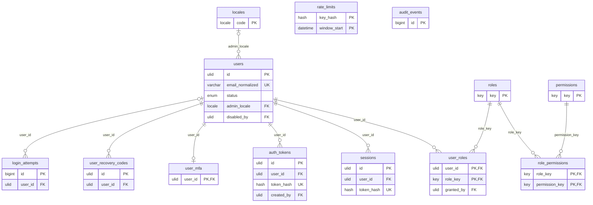
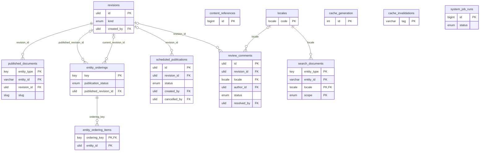
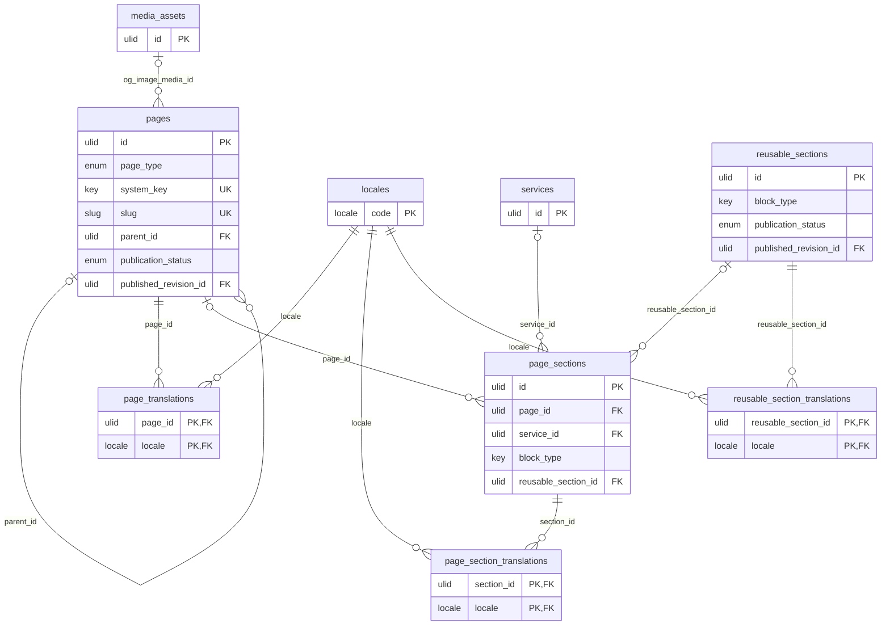
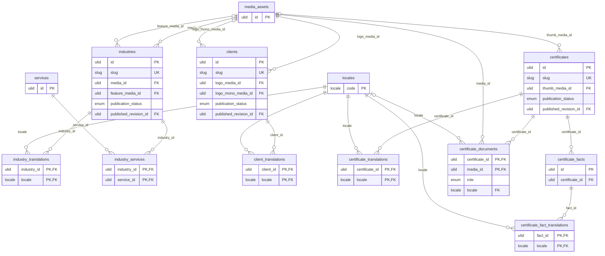
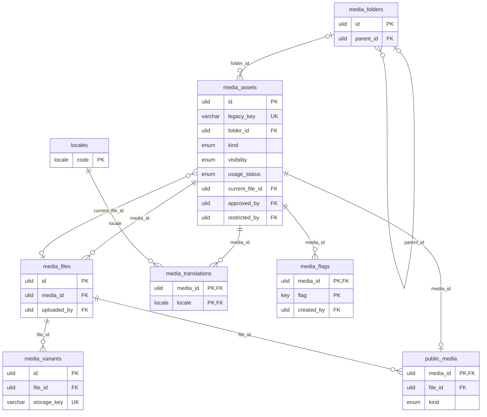
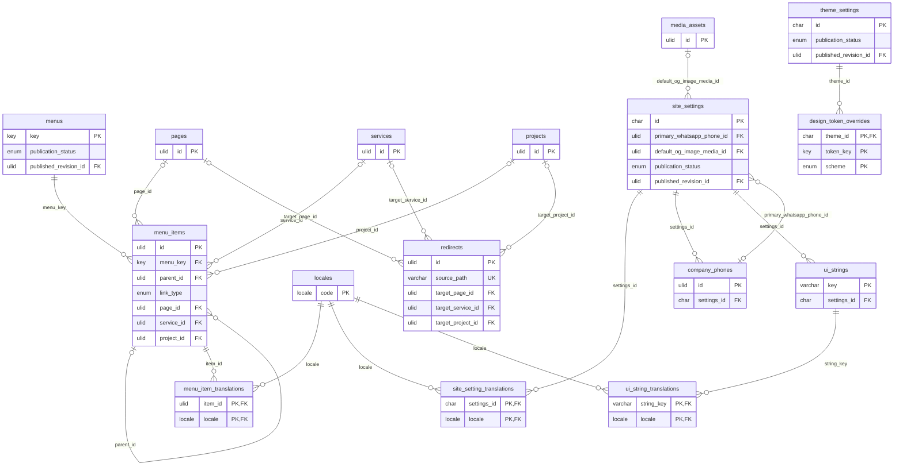
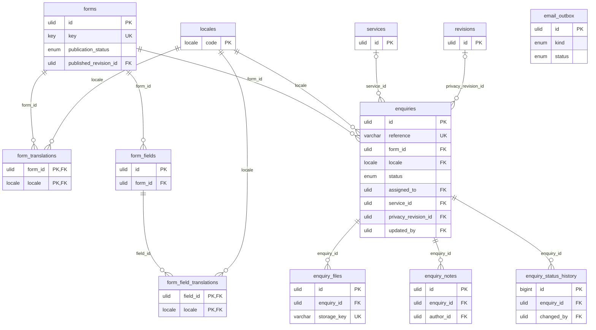

# A1 — Database architecture and schema

**Status:** Phase A1 specification. **Design only — no database, table, migration file or dependency exists.** SQL in
this document is illustrative; the real schema is written in A2+ as Drizzle schema files and reviewed migrations.

Related: [A1-ARCHITECTURE](A1-ARCHITECTURE.md) · [A1-CONTENT-MODEL](A1-CONTENT-MODEL.md) ·
[A1-PUBLISHING-VERSIONS](A1-PUBLISHING-VERSIONS.md) · [A1-SECURITY-RBAC](A1-SECURITY-RBAC.md) ·
[A1-MEDIA-STORAGE](A1-MEDIA-STORAGE.md) · [A1-MIGRATION-PLAN](A1-MIGRATION-PLAN.md).

The table catalogue (§7) and the diagrams (§8) are generated from one specification, so every relationship drawn is a
foreign key listed in the tables, and vice versa.

---

## 1. Engine, ORM and driver — verdict

**Recommendation: keep the preferred stack — MariaDB (as hosted) + Drizzle ORM + mysql2 — with six constraints.**
No hard blocker was found for Drizzle's core query builder, `drizzle-kit generate` and the runtime migrator on MariaDB
≥ 10.5 with mysql2 3.24 under Node 22. Material issues exist and are handled by design rather than by changing the
stack; the Owner should know them (A1 report item 31):

| # | Issue (verified in the published packages' source, A1) | Design response |
|---|---|---|
| 1 | Drizzle's **relational query API** (`db.query.…` with `with:`) emits `LEFT JOIN LATERAL`, which **MariaDB does not support** (absent from MariaDB's grammar up to the current main branch). The `mode: 'planetscale'` workaround still fails for `one` relations and for limits/order inside relations (correlated derived tables). Drizzle 1.0 removes modes and keeps LATERAL. | **Use only the core builder** (`select … leftJoin …`, plus a second query grouped in code where needed). Never pass `schema`/`mode` to `drizzle()`. A lint rule forbids `db.query`. This also survives the 1.0 upgrade. |
| 2 | `drizzle-kit push` and `pull` read the live schema with MySQL 8-specific `information_schema` assumptions and crash on MariaDB's CHECK constraints (every MariaDB JSON column has one). | Never `push`/`pull`. Schema changes = `drizzle-kit generate` → reviewed SQL file → runtime migrator (§10). `drizzle-kit check` in CI. |
| 3 | The runtime migrator applies files whose journal timestamp is newer than the last applied one (out-of-order files are **skipped silently**), runs DDL that MariaDB commits implicitly (**no atomicity**), and takes **no lock**. | A wrapper CLI (§10): fresh backup required, named lock (`GET_LOCK`), journal order and applied-file hashes verified before running, one DDL statement per file where possible, never run at app start. |
| 4 | Drizzle 0.45 **cannot declare table or column character sets/collations**; generated `CREATE TABLE` statements carry no table options. MariaDB 11.4's server default is still `latin1`. | `ALTER DATABASE … CHARACTER SET utf8mb4 COLLATE utf8mb4_unicode_520_ci` before the first migration; the review step adds `ENGINE=InnoDB DEFAULT CHARSET=utf8mb4 COLLATE=utf8mb4_unicode_520_ci` to every `CREATE TABLE`; ASCII key columns use a `customType` that emits `CHARACTER SET ascii COLLATE ascii_bin`; a CI check fails on any table without explicit options. |
| 5 | MariaDB's `JSON` is `LONGTEXT` + a `JSON_VALID` check; mysql2 parses it into objects only with MariaDB ≥ 10.5 extended metadata **and** mysql2 ≥ 3.23; otherwise strings come back. | A defensive JSON column type (parse when a string arrives) plus Zod validation of every JSON value read (A1-CONTENT-MODEL §15). Floors: MariaDB ≥ 10.5, mysql2 ≥ 3.23. |
| 6 | mysql2 does not support MariaDB's `ed25519` or `PARSEC` authentication plugins. | The database user must use `mysql_native_password` (reported as cPanel's default for MariaDB users): local users are created with it in A2; the account's user is checked with `SHOW CREATE USER` before the admin connects to it (A1-ARCHITECTURE §7.3). |

Further notes: Drizzle's `.prepare()` is client-side (no server-side statement cache is consumed); `pool.execute()` is
not used, and `maxPreparedStatements` is capped at 64 anyway (the server-wide statement limit is shared by every
account on the host). `drizzle-orm` ≥ 0.45.2 is required (a fix for identifier escaping described as possible SQL
injection). Next.js 16.3.8 does not externalize `mysql2` by default: `serverExternalPackages: ['mysql2']` in
`next.config.ts` (A2). Drizzle 1.0 is at release-candidate stage (`1.0.0-rc.4`, June 2026): **not adopted**; revisit at
general availability (its migration-table and folder changes are a planned upgrade task).

**Version pinning (A2 decides the exact pins, all exact, no ranges):** `drizzle-orm` 0.45.x ≥ 0.45.2 (latest 0.45.4,
published 2026-10-08; prefer a release that has been public for two weeks), `drizzle-kit` 0.31.11 (development
dependency only — production needs only `drizzle-orm`, `mysql2` and the migrations folder), `mysql2` 3.24.x ≥ 3.23.0.

**Alternatives considered:** Kysely (sound query builder, its own migrator with locking — a reasonable fallback if
Drizzle's issues grow); Prisma (engine binaries and memory are a poor fit for 2 GB shared hosting); raw `mysql2`
(no typed schema, no migration tooling). None is better enough to replace the brief's preferred stack.

**The database server.** Namecheap's official knowledgebase lists **MariaDB 11.4.9** on its shared hosting servers (a
platform fact; sources in A1-ARCHITECTURE §7.1). Facts of the RAWASY account are **not** platform facts and are read on
the account before the admin is connected to its database (A1-ARCHITECTURE §7.3, pre-staging verification):
`max_user_connections`, `wait_timeout`, the database user's authentication plugin and grants, and whether remote access
is closed (SSH tunnel only) and phpMyAdmin available, as search extracts suggested during A1. A figure of 30 connections
seen in an old forum post is **not** used for planning. Local development (A2 onward) runs against a local MariaDB
compatible with 11.4, never against the hosted database.

## 2. Character set and collation

- **Everything `utf8mb4`** (Arabic, any Unicode, emoji in names), declared explicitly on the database, every table and
  every ASCII column — never inherited from server defaults (MariaDB 11.4 defaults to `latin1`).
- **Collation: `utf8mb4_unicode_520_ci`** for all text. Reasons: available on every MariaDB version and on MySQL 5.6+/8,
  so dumps restore on either (MySQL 8's `utf8mb4_0900_ai_ci` exists in MariaDB only as an alias from 11.4.5, and
  MariaDB's `utf8mb4_uca1400_*` does not exist in MySQL); case-insensitive comparisons for names and emails; Arabic
  **diacritics (tashkeel) are ignored** at the primary level (UCA weight 0), so `مُحَمَّد` = `محمد`; mysql2 can request
  it at connection time (collation id 246; MariaDB's newer `uca1400` collations have ids ≥ 2048 that the handshake cannot
  carry). The newer `utf8mb4_uca1400_ai_ci` (Unicode 14) is a reasonable alternative if the Owner prefers MariaDB-only
  dumps; the choice is recorded in the decision log.
- **Arabic search is normalized in the application, not by the collation:** UCA collations do not fold alef forms
  (آ أ إ ٱ ا), ta marbuta and ha (ة ه), alef maqsura and ya (ى ي), and `unicode_520` counts tatweel (ـ). The
  `search_documents` text is normalized (strip tashkeel and tatweel, unify alef forms, ة→ه, ى→ي, Arabic-Indic digits →
  ASCII digits, lowercase Latin) on write and the query is normalized the same way.
- **Binary/ASCII columns** (`ascii_bin`): ULIDs, slugs, registry keys, locale codes, storage keys, redirect paths,
  cache tags, hashes (`BINARY(32)`). Exact, case-sensitive, one byte per character (smaller indexes).
- **Emails:** stored as typed, plus `email_normalized` (`utf8mb4_bin`, lower-cased) for uniqueness and login.

## 3. Conventions

### 3.1 Type shorthands used in §7

| Shorthand | Physical type | Use |
|---|---|---|
| `ULID` | `CHAR(26) CHARACTER SET ascii COLLATE ascii_bin` | primary/foreign keys of entities (generated by the application, time-ordered, globally unique) |
| `SLUG` | `VARCHAR(80) CHARACTER SET ascii COLLATE ascii_bin` | URL slugs (`^[a-z0-9]+(-[a-z0-9]+)*$`) |
| `KEY32` / `KEY64` | `VARCHAR(32/64) CHARACTER SET ascii COLLATE ascii_bin` | registry keys: roles, permissions, block types, flags, tokens, entity types |
| `LOCALE` | `VARCHAR(10) CHARACTER SET ascii COLLATE ascii_bin` | locale codes (`en`, `ar`) |
| `DT` | `DATETIME(3)` | instants, always UTC (§3.4) |
| `HASH` | `BINARY(32)` | SHA-256 values |
| `BOOL` | `BOOLEAN` (`TINYINT(1)`) | flags |
| `VARCHAR(n)`, `TEXT`, `MEDIUMTEXT` | `utf8mb4_unicode_520_ci` | text |
| `JSON` | `JSON` (MariaDB: `LONGTEXT` + `JSON_VALID` check) | validated documents only (§3.6) |
| `ENUM(…)` | `ENUM` | closed sets owned by code (statuses); changing one is a migration |

### 3.2 Identifiers
- **Entities: ULID** generated in the application (no round trip, sortable by creation time, stable across environments
  so imports and revisions can refer to them, not enumerable like auto-increment numbers). Readable in phpMyAdmin.
- **Append-only logs: `BIGINT UNSIGNED AUTO_INCREMENT`** (`audit_events`, `login_attempts`, `content_references`,
  `enquiry_status_history`, `system_job_runs`): compact and ordered.
- **Reference data: natural keys** (`locales.code`, `roles.key`, `permissions.key`, `menus.key`,
  `entity_orderings.key`, singletons `site_settings.id = 'site'`, `theme_settings.id = 'theme'`,
  `cache_generation.id = 1`).
- **Join tables: composite primary keys** (no surrogate id).
- **Public URLs use slugs**, never ids; enquiries show a human reference (`Q-2026-00001`), never their id.

### 3.3 Naming
`snake_case`, plural table names, `<singular>_id` foreign keys, `*_translations` for localized rows, `*_at` for
instants, `*_on` for dates, `is_*`/`has_*` for booleans, `position` for order within a parent.

### 3.4 Time
`DATETIME(3)` in **UTC** (not `TIMESTAMP`: no 2038 limit, no silent conversion, and no MariaDB implicit
default/on-update surprises). Every connection runs `SET time_zone = '+00:00'`; values are produced by the application
(UTC) with `DEFAULT CURRENT_TIMESTAMP(3)` only as a safety net. Display and entry in **Asia/Riyadh** (UTC+3, no daylight
saving) happen in the admin. Calendar dates without time (`effective_date`, `expires_on`, `retain_until`) use `DATE`.

### 3.5 Nullability
`NOT NULL` unless the value can legitimately be unknown or not applicable; optional facts are `NULL` (never empty
strings or placeholder text such as "N/A"); empty alt text `''` means decorative and is distinct from `NULL` (not yet
written).

### 3.6 JSON policy
JSON is used only where the structure varies by a code-defined type or is an ordered list inside one field, and it is
**always validated** (Zod schema per type and version) on write and parsed safely on read. Uses:
`page_sections.settings`, `page_section_translations.content`, `reusable_sections.settings` (+ translations), rich-text
fields (`service_translations.body`, `project_translations.description`), short ordered lists
(`service_translations.highlights`, `site_setting_translations.address_lines` / `vision_aims`), `form_translations.copy`,
`form_fields.validation` / `options`, `form_field_translations.option_labels`, `forms.notification_emails`,
`enquiries.extra`, `revisions.snapshot`, `published_documents.document`, derived caches (`public_media.variants`,
`public_media.default_alt`), and small operational details (`audit_events.changes`, `system_job_runs.details`).
No JSON column is ever filtered or joined on in a public query.

### 3.7 Delete behaviour
- **Soft delete** (`deleted_at`) for content, media, users and enquiries; **archive** (publication state) for content;
  **purge** (real `DELETE`) is Owner-only and blocked while references exist.
- **Foreign key actions:** within an aggregate (translations, children) `ON DELETE CASCADE`; across aggregates
  (content → media, service → machine, menu → page, redirect → target) `ON DELETE RESTRICT`; actor columns
  (`created_by`, `updated_by` …) `ON DELETE SET NULL`; polymorphic references (`revisions`, `published_documents`,
  `content_references`, `audit_events`, `scheduled_publications`, `review_comments`, `search_documents`) have no foreign
  key and are maintained by the services and checked by an integrity job (A8).
- **Unique indexes include soft-deleted rows** (MariaDB has no partial indexes): a slug in the Trash stays reserved until
  purged — deliberately, so an old address is never reused by accident.

### 3.8 Constraints
MariaDB enforces `CHECK` constraints (since 10.2): status/field combinations listed per table are declared where the
expression is a single-row rule; cross-table rules (e.g. a private original must be a private media item) are enforced
by the services in the same transaction, optionally backed by triggers if the host permits them.

## 4. Engine settings and connections

### 4.1 Pool (one per Node process)

```ts
// Illustrative (A2). One pool per process, kept on globalThis so hot paths reuse it.
createPool({
  host, port, user, password, database,     // from DB_* environment variables (A1-SECURITY-RBAC §12)
  connectionLimit: 2,                       // DB_POOL_LIMIT: production default 2 until the account is measured (§4.2)
  maxIdle: 1,                               // DB_POOL_LIMIT − 1 (at least 0): must be < connectionLimit, or idle connections are never closed
  idleTimeout: 30_000,                      // below the account's wait_timeout (read on the account, §4.2)
  queueLimit: 50,                           // fail fast instead of queueing forever
  waitForConnections: true,
  connectTimeout: 10_000,
  enableKeepAlive: true,
  keepAliveInitialDelay: 10_000,
  charset: 'utf8mb4_unicode_520_ci',        // connection collation = table collation
  timezone: 'Z',
  supportBigNumbers: true,
  bigNumberStrings: false,
  multipleStatements: false,                // never allow stacked statements
  maxPreparedStatements: 64,
  gracefulEnd: true,
});
pool.on('connection', (c) => c.query("SET time_zone = '+00:00', SESSION sql_mode = 'STRICT_ALL_TABLES,NO_ZERO_DATE,NO_ZERO_IN_DATE,ERROR_FOR_DIVISION_BY_ZERO,NO_ENGINE_SUBSTITUTION'"));
```

### 4.2 Connection budget (corrected in A1 Correction 1)

A1 as first written assumed "up to 4 app processes" and an unverified limit of 30, and its example did not follow its
own formula. Neither the number of app processes nor `max_user_connections` is known: the platform limits Namecheap
publishes (2 GB of memory, 30 entry processes, 50 MB/s of I/O, 300,000 inodes) are not the app's process count and not
a database limit. The budget is therefore a **rule to apply once both are measured**, not a figure:

```
P × L + R ≤ U        so        L = min(4, floor((U − R) / P)),  and L ≥ 1 or the plan is not feasible

U = max_user_connections of the account's database user (SELECT @@max_user_connections, and the host's answer)
P = the most app processes measured running at once (the host starts and stops them, not the app)
L = DB_POOL_LIMIT, the connections one app process may open
R = connections reserved outside the app processes = 5:
      1  migration CLI (holds the migration lock while it runs)
      1  scheduler / cron (a cron script's own connection; the scheduler's work runs in an app process, counted in P)
      1  backups (mariadb-dump)
      2  phpMyAdmin and operator access (an SSH session, the bootstrap or 2FA-reset CLI)
```

- **Production default: `DB_POOL_LIMIT=2`.** It is a conservative starting value, not derived from a measured P, and it
  is **not raised** until the account has been checked for `max_user_connections`, the real process behaviour under
  load, and the connections cron jobs, migrations, backups and phpMyAdmin actually use (A1-ARCHITECTURE §7.3). If the
  measurement gives P × 2 + 5 > U, the value is lowered to 1 or the process count is limited in the host's settings
  before the admin goes live; with L = 1 still too many, production does not start.
- **Worked example with hypothetical values (not measurements):** U = 15 and P = 5 give L = floor((15 − 5) / 5) = 2, and
  5 × 2 + 5 = 15 ≤ 15. The formula and every example in these documents agree.
- **Cap 4:** renders are short and the pool's queue absorbs bursts; more connections per process would add little.
- **Local development** sets any value (A2 implements `DB_POOL_LIMIT` as configuration); it never uses production
  credentials. In static mode (production until the A9 cutover, A1-MIGRATION-PLAN) public pages make no connection at
  all; in database mode most public requests are served from the page cache, after the one indexed freshness read
  (A1-PUBLISHING-VERSIONS §8.2).

### 4.3 Lifecycle and failures
- The pool is created lazily on first use and closed on process exit (A2 proposes adding `SIGTERM` → `app.close()` →
  `pool.end()` to `server.js`; changing `server.js` needs the Owner's approval).
- Fatal connection errors remove the connection from the pool (mysql2); queries retry once only when they are reads.
- **Breaker (A1 Correction 1):** after a failed connection or a timed-out freshness read, public reads in that process
  fail at once for 5 seconds (doubling to 60 while failures continue) instead of each waiting for a connection; then one
  request tries again (A1-PUBLISHING-VERSIONS §8.2). The admin reports "database unavailable" during that time. Errors are
  logged by class or code only, never with the host, user, database name, SQL or the driver's message.
- Transactions always run on a pooled connection obtained by `db.transaction()`; nested work uses savepoints. A failure
  in `BEGIN` itself is caught so the connection is always released.
- The database is never queried during `next build` (the build machine has no access): the data layer throws if
  `NEXT_PHASE === 'phase-production-build'`, and DB-backed routes render at runtime (A1-ARCHITECTURE §6).
- Concurrency: optimistic (`lock_version`) for editing; `SELECT … FOR UPDATE` for publication; `GET_LOCK()` named locks
  for the scheduler and the migration CLI; `SKIP LOCKED` (MariaDB ≥ 10.6) for job queues.

## 5. Shared column groups

#### TS — Timestamps and actors

| Column | Type | Null | Notes |
|---|---|---|---|
| `created_at` | DT | no | UTC; set by the application |
| `created_by` | ULID | yes | FK users(id) ON DELETE SET NULL |
| `updated_at` | DT | no | UTC; set on every write |
| `updated_by` | ULID | yes | FK users(id) ON DELETE SET NULL |

#### SD — Soft delete (Trash)

| Column | Type | Null | Notes |
|---|---|---|---|
| `deleted_at` | DT | yes | set = in the Trash; never shown publicly; restorable until purged |
| `deleted_by` | ULID | yes | FK users(id) ON DELETE SET NULL |

Index: (deleted_at).

#### PUB — Publication (aggregate roots only)

| Column | Type | Null | Notes |
|---|---|---|---|
| `publication_status` | ENUM('unpublished','published','archived') | no | DEFAULT 'unpublished' — is a version live? |
| `draft_status` | ENUM('none','draft','in_review') | no | DEFAULT 'draft' — state of the working copy |
| `published_revision_id` | ULID | yes | FK revisions(id) ON DELETE RESTRICT — the live version |
| `current_revision_id` | ULID | yes | FK revisions(id) ON DELETE RESTRICT — latest saved working version |
| `lock_version` | INT UNSIGNED | no | DEFAULT 0 — optimistic concurrency, +1 per save |
| `first_published_at` | DT | yes |  |
| `published_at` | DT | yes | last publication |
| `published_by` | ULID | yes | FK users(id) ON DELETE SET NULL |
| `archived_at` | DT | yes |  |
| `archived_by` | ULID | yes | FK users(id) ON DELETE SET NULL |

Index: (publication_status, draft_status).

Rules: publication_status = 'published' ⇒ published_revision_id IS NOT NULL; publication_status = 'archived' ⇒ draft_status = 'none'.

#### SRC — Provenance (admin-only, never rendered)

| Column | Type | Null | Notes |
|---|---|---|---|
| `source_basis` | ENUM('profile','licence','owner','inferred','other') | yes | where the facts come from |
| `source_pages` | VARCHAR(40) | yes | e.g. '7' or '8-11' of the company profile |
| `source_note` | TEXT | yes | internal note; excluded from every public projection |

#### SEO_R — SEO (root, not localized)

| Column | Type | Null | Notes |
|---|---|---|---|
| `robots_index` | BOOL | no | DEFAULT 1 |
| `robots_follow` | BOOL | no | DEFAULT 1 |
| `in_sitemap` | BOOL | no | DEFAULT 1 (ignored while not published or noindex) |
| `canonical_override` | VARCHAR(255) | yes | rare; same-site path only; Owner/Admin |
| `og_image_media_id` | ULID | yes | FK media_assets(id) ON DELETE RESTRICT; falls back to the site default |

#### SEO_T — SEO (localized, in translation tables)

| Column | Type | Null | Notes |
|---|---|---|---|
| `seo_title` | VARCHAR(120) | yes | falls back to the entity title |
| `seo_description` | VARCHAR(320) | yes | falls back to the summary |
| `og_title` | VARCHAR(120) | yes | falls back to seo_title |
| `og_description` | VARCHAR(320) | yes | falls back to seo_description |

#### TR — Translation status (translation tables)

| Column | Type | Null | Notes |
|---|---|---|---|
| `translation_status` | ENUM('draft','complete','needs_review') | no | DEFAULT 'draft' |
| `completed_at` | DT | yes | when marked complete |
| `completed_by` | ULID | yes | FK users(id) ON DELETE SET NULL |
| `updated_at` | DT | no |  |
| `updated_by` | ULID | yes | FK users(id) ON DELETE SET NULL |


## 6. All tables at a glance

84 tables in 8 domains. "Root" = aggregate root with the publication columns (PUB); "Tr" = translation table.

| # | Table | Domain | Phase | Role |
|---|---|---|---|---|
| 1 | `locales` | Locales, users and access control | A2 | reference data |
| 2 | `users` | Locales, users and access control | A2 | not content |
| 3 | `roles` | Locales, users and access control | A2 | reference data |
| 4 | `permissions` | Locales, users and access control | A2 | reference data |
| 5 | `role_permissions` | Locales, users and access control | A2 | reference data |
| 6 | `user_roles` | Locales, users and access control | A2 | not content |
| 7 | `sessions` | Locales, users and access control | A2 | not content |
| 8 | `auth_tokens` | Locales, users and access control | A2 | not content |
| 9 | `user_mfa` | Locales, users and access control | A2 | not content |
| 10 | `user_recovery_codes` | Locales, users and access control | A2 | not content |
| 11 | `login_attempts` | Locales, users and access control | A2 | not content |
| 12 | `rate_limits` | Locales, users and access control | A2 | not content |
| 13 | `audit_events` | Locales, users and access control | A2 | not content |
| 14 | `revisions` | Revisions, publishing and the public read model | A3 | history |
| 15 | `published_documents` | Revisions, publishing and the public read model | A3 | is the published state |
| 16 | `entity_orderings` | Revisions, publishing and the public read model | A3 | Root (published) |
| 17 | `entity_ordering_items` | Revisions, publishing and the public read model | A3 | child row |
| 18 | `content_references` | Revisions, publishing and the public read model | A3 | derived index |
| 19 | `scheduled_publications` | Revisions, publishing and the public read model | A8 | job queue |
| 20 | `review_comments` | Revisions, publishing and the public read model | A8 | ADMIN-ONLY |
| 21 | `search_documents` | Revisions, publishing and the public read model | A3 | derived index |
| 22 | `cache_generation` | Revisions, publishing and the public read model | A3 | operations |
| 23 | `cache_invalidations` | Revisions, publishing and the public read model | A3 | operations |
| 24 | `system_job_runs` | Revisions, publishing and the public read model | A8 | operations |
| 25 | `pages` | Pages and the section (block) model | A3 | Root (published) |
| 26 | `page_translations` | Pages and the section (block) model | A3 | Tr of `pages` |
| 27 | `page_sections` | Pages and the section (block) model | A3 | child row |
| 28 | `page_section_translations` | Pages and the section (block) model | A3 | Tr of `page_sections` |
| 29 | `reusable_sections` | Pages and the section (block) model | A5 | Root (published) |
| 30 | `reusable_section_translations` | Pages and the section (block) model | A5 | Tr of `reusable_sections` |
| 31 | `services` | Services, machines and projects | A3 | Root (published) |
| 32 | `service_translations` | Services, machines and projects | A3 | Tr of `services` |
| 33 | `service_gallery_items` | Services, machines and projects | A3 | child row |
| 34 | `service_gallery_item_translations` | Services, machines and projects | A3 | Tr of `service_gallery_items` |
| 35 | `service_machines` | Services, machines and projects | A3 | child row |
| 36 | `service_related_services` | Services, machines and projects | A3 | child row |
| 37 | `service_featured_projects` | Services, machines and projects | A3 | child row |
| 38 | `machines` | Services, machines and projects | A3 | Root (published) |
| 39 | `machine_translations` | Services, machines and projects | A3 | Tr of `machines` |
| 40 | `projects` | Services, machines and projects | A3 | Root (published) |
| 41 | `project_translations` | Services, machines and projects | A3 | Tr of `projects` |
| 42 | `project_media` | Services, machines and projects | A3 | child row |
| 43 | `project_categories` | Services, machines and projects | A3 | Root (published) |
| 44 | `project_category_translations` | Services, machines and projects | A3 | Tr of `project_categories` |
| 45 | `project_category_assignments` | Services, machines and projects | A3 | child row |
| 46 | `project_services` | Services, machines and projects | A3 | child row |
| 47 | `project_flags` | Services, machines and projects | A3 | child row |
| 48 | `industries` | Industries, clients and certificates | A3 | Root (published) |
| 49 | `industry_translations` | Industries, clients and certificates | A3 | Tr of `industries` |
| 50 | `industry_services` | Industries, clients and certificates | A3 | child row |
| 51 | `clients` | Industries, clients and certificates | A3 | Root (published) |
| 52 | `client_translations` | Industries, clients and certificates | A3 | Tr of `clients` |
| 53 | `certificates` | Industries, clients and certificates | A3 | Root (published) |
| 54 | `certificate_translations` | Industries, clients and certificates | A3 | Tr of `certificates` |
| 55 | `certificate_facts` | Industries, clients and certificates | A3 | child row |
| 56 | `certificate_fact_translations` | Industries, clients and certificates | A3 | Tr of `certificate_facts` |
| 57 | `certificate_documents` | Industries, clients and certificates | A3 | child row |
| 58 | `media_folders` | Media library | A4 | ADMIN-ONLY |
| 59 | `media_assets` | Media library | A3 | not draft/publish: public delivery is decided by the deliverability rule |
| 60 | `media_files` | Media library | A3 | storage record |
| 61 | `media_variants` | Media library | A4 | storage record |
| 62 | `media_translations` | Media library | A3 | Tr of `media_assets` |
| 63 | `media_flags` | Media library | A3 | ADMIN-ONLY |
| 64 | `public_media` | Media library | A3 | is the public media state |
| 65 | `menus` | Navigation, site settings, theme, interface text and redirects | A6 | Root (published) |
| 66 | `menu_items` | Navigation, site settings, theme, interface text and redirects | A6 | child row |
| 67 | `menu_item_translations` | Navigation, site settings, theme, interface text and redirects | A6 | Tr of `menu_items` |
| 68 | `site_settings` | Navigation, site settings, theme, interface text and redirects | A6 | Root (published) |
| 69 | `site_setting_translations` | Navigation, site settings, theme, interface text and redirects | A6 | Tr of `site_settings` |
| 70 | `company_phones` | Navigation, site settings, theme, interface text and redirects | A6 | child row |
| 71 | `ui_strings` | Navigation, site settings, theme, interface text and redirects | A6 | child row |
| 72 | `ui_string_translations` | Navigation, site settings, theme, interface text and redirects | A6 | Tr of `ui_strings` |
| 73 | `theme_settings` | Navigation, site settings, theme, interface text and redirects | A6 | Root (published) |
| 74 | `design_token_overrides` | Navigation, site settings, theme, interface text and redirects | A6 | child row |
| 75 | `redirects` | Navigation, site settings, theme, interface text and redirects | A3 | active on save |
| 76 | `forms` | Forms, enquiries and outgoing email | A7 | Root (published) |
| 77 | `form_translations` | Forms, enquiries and outgoing email | A7 | Tr of `forms` |
| 78 | `form_fields` | Forms, enquiries and outgoing email | A7 | child row |
| 79 | `form_field_translations` | Forms, enquiries and outgoing email | A7 | Tr of `form_fields` |
| 80 | `enquiries` | Forms, enquiries and outgoing email | A7 | PRIVATE |
| 81 | `enquiry_files` | Forms, enquiries and outgoing email | A7 | PRIVATE |
| 82 | `enquiry_notes` | Forms, enquiries and outgoing email | A7 | PRIVATE |
| 83 | `enquiry_status_history` | Forms, enquiries and outgoing email | A7 | PRIVATE |
| 84 | `email_outbox` | Forms, enquiries and outgoing email | A7 | PRIVATE |

By phase of introduction: A2 13 · A3 45 · A4 2 · A5 2 · A6 10 · A7 9 · A8 3. The A3 count includes the media registry tables (`media_assets`, `media_files`, `media_translations`, `media_flags`, `public_media`), `redirects` (automatic on slug change), `cache_generation` and `cache_invalidations`, which A3 needs before A4/A6 build their full features — a dependency, not a reordering of the roadmap.

## 7. Table catalogue

### Locales, users and access control

Introduced in: A2.

#### `locales`

The site's languages. Adding a language is a row, not a schema change.

- **Phase:** A2
- **Primary key:** `code`
- **Rules / checks:** exactly one is_default row (application rule + migration seed)
- **Publication:** reference data; changed only by migration or the Owner
- **Delete behaviour:** never deleted while referenced (RESTRICT from every translation table)

| Column | Type | Null | Notes |
|---|---|---|---|
| `code` | LOCALE | no | 'en', 'ar' (BCP 47 language tag) |
| `name` | VARCHAR(60) | no | English name, e.g. 'Arabic' |
| `native_name` | VARCHAR(60) | no | e.g. 'عربي' |
| `direction` | ENUM('ltr','rtl') | no |  |
| `html_lang` | VARCHAR(16) | no | 'en', 'ar-SA' (the <html lang> value today) |
| `og_locale` | VARCHAR(16) | no | 'en_US', 'ar_SA' |
| `is_default` | BOOL | no | exactly one row (x-default, fallback for unprefixed URLs) |
| `is_enabled` | BOOL | no | public routes exist for enabled locales only |
| `is_required` | BOOL | no | must be complete before publication (both today) |
| `sort_order` | SMALLINT | no |  |

#### `users`

Admin accounts. No public registration: created by invitation or the bootstrap CLI.

- **Phase:** A2
- **Primary key:** `id`
- **Shared column groups:** TS (Timestamps and actors), SD (Soft delete (Trash))
- **Foreign keys:** `admin_locale` → `locales` (ON DELETE SET NULL); `disabled_by` → `users` (ON DELETE SET NULL)
- **Unique:** (email_normalized)
- **Indexes:** (status)
- **Rules / checks:** at least one active Owner must remain (application invariant, checked in the same transaction)
- **Publication:** not content
- **Delete behaviour:** soft delete only (attribution in revisions and audit stays meaningful); purge is an Owner-only data-erasure task

| Column | Type | Null | Notes |
|---|---|---|---|
| `id` | ULID | no |  |
| `email` | VARCHAR(254) | no | as entered (shown in the admin) |
| `email_normalized` | VARCHAR(254) utf8mb4_bin | no | trimmed + lower-cased; login key |
| `display_name` | VARCHAR(120) | no |  |
| `status` | ENUM('invited','active','disabled') | no | disabled = cannot sign in; sessions revoked |
| `password_hash` | VARCHAR(255) | yes | PHC string (argon2id, or scrypt fallback); NULL while invited |
| `password_changed_at` | DT | yes |  |
| `failed_login_count` | SMALLINT UNSIGNED | no | DEFAULT 0; reset on success |
| `locked_until` | DT | yes | temporary lock after repeated failures |
| `last_login_at` | DT | yes |  |
| `admin_locale` | LOCALE | yes | FK locales(code) — language of the admin interface |
| `disabled_at` | DT | yes |  |
| `disabled_by` | ULID | yes | FK users(id) ON DELETE SET NULL |
| *+ TS, SD* | | | shared columns (see “Shared column groups”) |

#### `roles`

Roles: owner, admin, editor, reviewer (seeded). Custom roles only if the Owner asks for them later.

- **Phase:** A2
- **Primary key:** `key`
- **Shared column groups:** TS (Timestamps and actors)
- **Publication:** reference data
- **Delete behaviour:** system roles: never; custom roles: only with no members (RESTRICT from user_roles)

| Column | Type | Null | Notes |
|---|---|---|---|
| `key` | KEY32 | no | 'owner', 'admin', 'editor', 'reviewer' |
| `name` | VARCHAR(60) | no |  |
| `description` | VARCHAR(300) | yes |  |
| `rank` | SMALLINT | no | owner 100, admin 80, editor 40, reviewer 30 — nobody manages an equal or higher rank |
| `is_system` | BOOL | no | system roles cannot be deleted or renamed |
| *+ TS* | | | shared columns (see “Shared column groups”) |

#### `permissions`

Permission keys defined in code (resource.action) and seeded by migration.

- **Phase:** A2
- **Primary key:** `key`
- **Publication:** reference data (code-owned)
- **Delete behaviour:** removed only by migration

| Column | Type | Null | Notes |
|---|---|---|---|
| `key` | KEY64 | no | e.g. 'projects.publish', 'private_documents.view' |
| `resource` | KEY32 | no |  |
| `action` | KEY32 | no |  |
| `description` | VARCHAR(300) | no |  |
| `is_sensitive` | BOOL | no | needs a recent re-authentication (step-up) |

#### `role_permissions`

The permission matrix (A1-SECURITY-RBAC.md) as data.

- **Phase:** A2
- **Primary key:** `role_key` + `permission_key`
- **Foreign keys:** `role_key` → `roles` (ON DELETE CASCADE); `permission_key` → `permissions` (ON DELETE CASCADE)
- **Indexes:** (permission_key)
- **Publication:** reference data; system roles' rows are seeded and Owner-locked
- **Delete behaviour:** with its role or permission

| Column | Type | Null | Notes |
|---|---|---|---|
| `role_key` | KEY32 | no | FK roles(key) ON DELETE CASCADE |
| `permission_key` | KEY64 | no | FK permissions(key) ON DELETE CASCADE |

#### `user_roles`

Which roles a user holds (effective permissions = union).

- **Phase:** A2
- **Primary key:** `user_id` + `role_key`
- **Foreign keys:** `user_id` → `users` (ON DELETE CASCADE); `role_key` → `roles` (ON DELETE RESTRICT); `granted_by` → `users` (ON DELETE SET NULL)
- **Indexes:** (role_key)
- **Publication:** not content
- **Delete behaviour:** revoking a role deletes the row (audited); every change revokes the user's other sessions

| Column | Type | Null | Notes |
|---|---|---|---|
| `user_id` | ULID | no | FK users(id) ON DELETE CASCADE |
| `role_key` | KEY32 | no | FK roles(key) ON DELETE RESTRICT |
| `granted_by` | ULID | yes | FK users(id) ON DELETE SET NULL |
| `granted_at` | DT | no |  |

#### `sessions`

Database-backed admin sessions; the cookie holds a random token, the table only its hash.

- **Phase:** A2
- **Primary key:** `id`
- **Foreign keys:** `user_id` → `users` (ON DELETE CASCADE)
- **Unique:** (token_hash)
- **Indexes:** (user_id, revoked_at); (absolute_expires_at)
- **Publication:** not content (PRIVATE)
- **Delete behaviour:** expired/revoked rows purged daily; excluded from database backups

| Column | Type | Null | Notes |
|---|---|---|---|
| `id` | ULID | no | also the audit session id |
| `user_id` | ULID | no | FK users(id) ON DELETE CASCADE |
| `token_hash` | HASH | no | SHA-256 of the cookie token |
| `created_at` | DT | no |  |
| `last_seen_at` | DT | no | updated at most once a minute |
| `idle_expires_at` | DT | no |  |
| `absolute_expires_at` | DT | no |  |
| `reauthenticated_at` | DT | no | step-up window for sensitive actions |
| `mfa_verified_at` | DT | yes |  |
| `ip` | VARCHAR(45) | yes | shown in the device list |
| `user_agent` | VARCHAR(255) | yes | truncated |
| `revoked_at` | DT | yes |  |
| `revoked_reason` | ENUM('logout','revoked','password_changed','role_changed','user_disabled','rotated','restore') | yes |  |
| `replaced_by_id` | ULID | yes | rotation chain (no FK) |

#### `auth_tokens`

One table for every single-use emailed or printed token: password reset, invitation, email change, owner setup.

- **Phase:** A2
- **Primary key:** `id`
- **Foreign keys:** `user_id` → `users` (ON DELETE CASCADE); `created_by` → `users` (ON DELETE SET NULL)
- **Unique:** (token_hash)
- **Indexes:** (user_id, purpose, used_at); (expires_at)
- **Publication:** not content (PRIVATE)
- **Delete behaviour:** purged after expiry; excluded from database backups

| Column | Type | Null | Notes |
|---|---|---|---|
| `id` | ULID | no |  |
| `user_id` | ULID | no | FK users(id) ON DELETE CASCADE |
| `purpose` | ENUM('password_reset','invitation','email_change','owner_setup') | no |  |
| `token_hash` | HASH | no | SHA-256; the token itself is never stored |
| `new_email` | VARCHAR(254) | yes | email_change only |
| `expires_at` | DT | no | reset 30 min, invitation 72 h, owner setup 30 min (proposed) |
| `used_at` | DT | yes | single use |
| `created_at` | DT | no |  |
| `created_by` | ULID | yes | FK users(id) ON DELETE SET NULL (NULL = self-service or CLI) |
| `created_ip` | VARCHAR(45) | yes |  |

#### `user_mfa`

Optional TOTP second factor (one per user).

- **Phase:** A2
- **Primary key:** `user_id`
- **Foreign keys:** `user_id` → `users` (ON DELETE CASCADE)
- **Publication:** not content (PRIVATE)
- **Delete behaviour:** with the user; removing 2FA is audited and needs re-authentication

| Column | Type | Null | Notes |
|---|---|---|---|
| `user_id` | ULID | no | FK users(id) ON DELETE CASCADE |
| `totp_secret_enc` | VARBINARY(255) | no | AES-256-GCM (iv \| tag \| ciphertext) with the AUTH_ENCRYPTION_KEY version named in key_version; the key is escrowed offline, never in backups (A1-SECURITY-RBAC §12) |
| `key_version` | TINYINT UNSIGNED | no | version of the key that encrypted this row: rotation re-encrypts row by row; a version that cannot be recovered leads to the emergency 2FA reset (A1-SECURITY-RBAC §12.2–§12.4) |
| `confirmed_at` | DT | yes | NULL until the first valid code |
| `last_used_step` | BIGINT UNSIGNED | yes | rejects a replayed code |
| `created_at` | DT | no |  |

#### `user_recovery_codes`

Single-use 2FA recovery codes (hashed).

- **Phase:** A2
- **Primary key:** `id`
- **Foreign keys:** `user_id` → `users` (ON DELETE CASCADE)
- **Indexes:** (user_id)
- **Publication:** not content (PRIVATE)
- **Delete behaviour:** regenerating replaces the whole set

| Column | Type | Null | Notes |
|---|---|---|---|
| `id` | ULID | no |  |
| `user_id` | ULID | no | FK users(id) ON DELETE CASCADE |
| `code_hash` | HASH | no |  |
| `used_at` | DT | yes |  |
| `created_at` | DT | no |  |

#### `login_attempts`

Security log of sign-in attempts (evidence for lockouts and the dashboard).

- **Phase:** A2
- **Primary key:** `id`
- **Foreign keys:** `user_id` → `users` (ON DELETE SET NULL)
- **Indexes:** (email_hash, attempted_at); (ip, attempted_at); (attempted_at)
- **Publication:** not content (ADMIN-ONLY)
- **Delete behaviour:** kept 90 days (proposed), then purged

| Column | Type | Null | Notes |
|---|---|---|---|
| `id` | BIGINT UNSIGNED AUTO_INCREMENT | no |  |
| `attempted_at` | DT | no |  |
| `email_hash` | HASH | no | SHA-256 of the normalized email (counts per account without storing typos in clear) |
| `user_id` | ULID | yes | FK users(id) ON DELETE SET NULL (NULL for unknown emails) |
| `ip` | VARCHAR(45) | yes |  |
| `succeeded` | BOOL | no |  |
| `failure_reason` | ENUM('bad_credentials','locked','disabled','mfa_failed','rate_limited') | yes |  |
| `user_agent` | VARCHAR(255) | yes |  |

#### `rate_limits`

Fixed-window counters shared by every app process: login, password reset, uploads, enquiry submissions.

- **Phase:** A2
- **Primary key:** `key_hash` + `window_start`
- **Indexes:** (expires_at)
- **Publication:** not content
- **Delete behaviour:** expired rows purged by the cleanup job

| Column | Type | Null | Notes |
|---|---|---|---|
| `key_hash` | HASH | no | SHA-256 of e.g. 'login:ip:…' or 'enquiry:ip:…' |
| `window_start` | DT | no |  |
| `count` | INT UNSIGNED | no | INSERT … ON DUPLICATE KEY UPDATE count = count + 1 |
| `expires_at` | DT | no |  |

#### `audit_events`

Append-only record of who did what, when, from which session — every mutation, sign-in and denied attempt.

- **Phase:** A2 (table and sign-in events); A8 (complete coverage and viewer)
- **Primary key:** `id`
- **Indexes:** (occurred_at); (entity_type, entity_id, occurred_at); (actor_user_id, occurred_at); (action, occurred_at); (request_id)
- **Publication:** not content (ADMIN-ONLY)
- **Delete behaviour:** never edited; retention purge only (proposed 24 months, Owner decision)
- **Note:** Append-only in the application: no update or delete path exists; retention purge is the only delete (Owner-approved policy, itself audited).

| Column | Type | Null | Notes |
|---|---|---|---|
| `id` | BIGINT UNSIGNED AUTO_INCREMENT | no | order of events |
| `occurred_at` | DT | no |  |
| `request_id` | ULID | no | one id per request; groups the events of one action |
| `actor_type` | ENUM('user','system','cli') | no | system = cron/scheduler; cli = bootstrap/migration tools |
| `actor_user_id` | ULID | yes | no FK on purpose: events outlive accounts |
| `actor_label` | VARCHAR(200) | yes | display name + email at the time |
| `actor_roles` | VARCHAR(100) | yes | role keys at the time, e.g. 'editor' |
| `session_id` | ULID | yes | no FK (sessions are purged) |
| `ip` | VARCHAR(45) | yes |  |
| `action` | KEY64 | no | e.g. 'project.publish', 'auth.login_failed', 'media.restrict' |
| `entity_type` | KEY32 | yes |  |
| `entity_id` | VARCHAR(64) | yes | ULID or natural key |
| `entity_label` | VARCHAR(255) | yes | title at the time |
| `outcome` | ENUM('success','denied','failed') | no |  |
| `summary` | VARCHAR(500) | no | human-readable, e.g. 'Published “Clock Tower Landmark” (revision 7)' |
| `before_revision_id` | ULID | yes | for content: the versions compared |
| `after_revision_id` | ULID | yes |  |
| `changes` | JSON | yes | redacted field diff for non-revisioned changes (users, roles, settings of the account) |
| `prev_hash` | HASH | yes | optional tamper-evidence chain (A8 decision) |
| `hash` | HASH | yes | SHA-256(prev_hash + canonical event) |


### Revisions, publishing and the public read model

Introduced in: A3 (tables) · A8 (history UI, scheduling, review comments).

#### `revisions`

Immutable snapshots of a whole aggregate (root + children + translations) — version history, restore, compare.

- **Phase:** A3
- **Primary key:** `id`
- **Foreign keys:** `created_by` → `users` (ON DELETE SET NULL)
- **Unique:** (entity_type, entity_id, revision_number)
- **Indexes:** (entity_type, entity_id, created_at); (kind, created_at)
- **Publication:** history
- **Delete behaviour:** never edited; unsealed 'save' revisions pruned by policy (proposed: older than 90 days, keeping the latest 20 per entity)
- **Note:** Polymorphic (entity_type + entity_id): no FK to the entity; integrity is kept by the content services and checked by the A8 integrity job.

| Column | Type | Null | Notes |
|---|---|---|---|
| `id` | ULID | no |  |
| `entity_type` | KEY32 | no | 'page', 'service', 'project', … (registry in code) |
| `entity_id` | VARCHAR(64) | no | ULID, or the key of a singleton/ordering |
| `revision_number` | INT UNSIGNED | no | 1, 2, 3 … per entity |
| `kind` | ENUM('save','submit','publish','unpublish','archive','restore','import') | no | approval is recorded on the publish revision (who published after review) |
| `schema_version` | SMALLINT UNSIGNED | no | version of the snapshot shape (upcasters read old ones) |
| `snapshot` | JSON | no | the full aggregate, validated; includes admin-only fields |
| `snapshot_sha256` | HASH | no | dedupe + integrity |
| `base_revision_id` | ULID | yes | the version this draft started from |
| `restored_from_id` | ULID | yes | kind = restore |
| `message` | VARCHAR(500) | yes | change note |
| `locales_changed` | VARCHAR(64) | yes | e.g. 'ar' |
| `live_from` | DT | yes | publish revisions: when it went live |
| `live_until` | DT | yes | when it was replaced or unpublished — answers 'what was live on date X' |
| `is_sealed` | BOOL | no | save revisions may be pruned; sealed ones (submit, publish, restore, import…) never |
| `created_at` | DT | no |  |
| `created_by` | ULID | yes | FK users(id) ON DELETE SET NULL |

#### `published_documents`

THE public read model: one row per live aggregate holding its public projection. The public site reads nothing else for content.

- **Phase:** A3
- **Primary key:** `entity_type` + `entity_id`
- **Foreign keys:** `revision_id` → `revisions` (ON DELETE RESTRICT)
- **Unique:** (entity_type, slug)
- **Indexes:** (entity_type, published_at)
- **Publication:** is the published state
- **Delete behaviour:** row removed on unpublish, archive or delete
- **Note:** Written only by the publish/unpublish transaction; deleting the row takes the aggregate offline at once.

| Column | Type | Null | Notes |
|---|---|---|---|
| `entity_type` | KEY32 | no |  |
| `entity_id` | VARCHAR(64) | no |  |
| `revision_id` | ULID | no | FK revisions(id) ON DELETE RESTRICT — the published revision |
| `slug` | SLUG | yes | routable aggregates (pages, services, projects) for lookup by address |
| `schema_version` | SMALLINT UNSIGNED | no | version of the public projection |
| `document` | JSON | no | public projection: no admin-only fields, no restricted media |
| `content_sha256` | HASH | no | ETag-style change detection |
| `published_at` | DT | no |  |

#### `entity_orderings`

Publishable orderings of whole collections (services, machines, projects, project categories, clients, industries, certificates) — an order belongs to the list, not to an item.

- **Phase:** A3
- **Primary key:** `key`
- **Shared column groups:** PUB (Publication (aggregate roots only)), TS (Timestamps and actors)
- **Rules / checks:** publication_status = 'published' ⇒ published_revision_id IS NOT NULL; publication_status = 'archived' ⇒ draft_status = 'none'
- **Publication:** aggregate root (working order → published order); a live item missing from the order is listed after it
- **Delete behaviour:** never (seeded)

| Column | Type | Null | Notes |
|---|---|---|---|
| `key` | KEY32 | no | 'services', 'machines', 'projects', 'project_categories', 'clients', 'industries', 'certificates' |
| `entity_type` | KEY32 | no |  |
| *+ PUB, TS* | | | shared columns (see “Shared column groups”) |

#### `entity_ordering_items`

Working copy of an ordering.

- **Phase:** A3
- **Primary key:** `ordering_key` + `entity_id`
- **Foreign keys:** `ordering_key` → `entity_orderings` (ON DELETE CASCADE)
- **Unique:** (ordering_key, position)
- **Publication:** child of entity_orderings
- **Delete behaviour:** an item purged from its table is removed from every ordering in the same transaction

| Column | Type | Null | Notes |
|---|---|---|---|
| `ordering_key` | KEY32 | no | FK entity_orderings(key) ON DELETE CASCADE |
| `entity_id` | ULID | no | the item (type from the ordering) |
| `position` | INT UNSIGNED | no |  |

#### `content_references`

Every reference one aggregate makes to another (FK columns and ids inside validated JSON alike): usage lists, delete protection, impact analysis, cache invalidation.

- **Phase:** A3
- **Primary key:** `id`
- **Indexes:** (target_type, target_id, scope); (source_type, source_id, scope)
- **Publication:** derived index
- **Delete behaviour:** rebuilt; never edited by hand
- **Note:** Rebuilt for the source on every save (scope working) and every publish (scope published), inside the same transaction.

| Column | Type | Null | Notes |
|---|---|---|---|
| `id` | BIGINT UNSIGNED AUTO_INCREMENT | no |  |
| `scope` | ENUM('working','published') | no | references of the working copy or of the live version |
| `source_type` | KEY32 | no |  |
| `source_id` | VARCHAR(64) | no |  |
| `source_section_id` | ULID | yes | page sections |
| `field_path` | VARCHAR(191) | no | e.g. 'cover', 'sections[3].settings.items[2].mediaId' |
| `target_type` | KEY32 | no | 'media', 'project', 'service', 'page', … |
| `target_id` | VARCHAR(64) | no |  |

#### `scheduled_publications`

Publish (or unpublish) a specific revision at a set time; run by the scheduler endpoint that cron calls.

- **Phase:** A8
- **Primary key:** `id`
- **Foreign keys:** `revision_id` → `revisions` (ON DELETE RESTRICT); `created_by` → `users` (ON DELETE SET NULL); `cancelled_by` → `users` (ON DELETE SET NULL)
- **Indexes:** (status, run_at); (entity_type, entity_id, status)
- **Publication:** job queue
- **Delete behaviour:** kept as history (12 months proposed)

| Column | Type | Null | Notes |
|---|---|---|---|
| `id` | ULID | no |  |
| `entity_type` | KEY32 | no |  |
| `entity_id` | VARCHAR(64) | no |  |
| `action` | ENUM('publish','unpublish') | no |  |
| `revision_id` | ULID | yes | FK revisions(id) ON DELETE RESTRICT; required for publish |
| `run_at` | DT | no | UTC (entered and shown in Asia/Riyadh) |
| `status` | ENUM('pending','running','done','failed','cancelled','superseded') | no |  |
| `attempts` | TINYINT UNSIGNED | no | DEFAULT 0 |
| `last_error` | VARCHAR(500) | yes |  |
| `created_at` | DT | no |  |
| `created_by` | ULID | yes | FK users(id) ON DELETE SET NULL — needs publish permission at creation AND at run time |
| `executed_at` | DT | yes |  |
| `cancelled_at` | DT | yes |  |
| `cancelled_by` | ULID | yes | FK users(id) ON DELETE SET NULL |

#### `review_comments`

Reviewer comments on a draft (optionally on one section or language).

- **Phase:** A8
- **Primary key:** `id`
- **Foreign keys:** `revision_id` → `revisions` (ON DELETE SET NULL); `locale` → `locales` (ON DELETE RESTRICT); `author_id` → `users` (ON DELETE SET NULL); `resolved_by` → `users` (ON DELETE SET NULL)
- **Indexes:** (entity_type, entity_id, status)
- **Publication:** ADMIN-ONLY
- **Delete behaviour:** kept with the entity's history

| Column | Type | Null | Notes |
|---|---|---|---|
| `id` | ULID | no |  |
| `entity_type` | KEY32 | no |  |
| `entity_id` | VARCHAR(64) | no |  |
| `revision_id` | ULID | yes | FK revisions(id) ON DELETE SET NULL |
| `section_id` | ULID | yes | no FK (sections come and go) |
| `locale` | LOCALE | yes | FK locales(code) |
| `author_id` | ULID | yes | FK users(id) ON DELETE SET NULL |
| `body` | TEXT | no | plain text |
| `status` | ENUM('open','resolved') | no |  |
| `resolved_by` | ULID | yes | FK users(id) ON DELETE SET NULL |
| `resolved_at` | DT | yes |  |
| `created_at` | DT | no |  |

#### `search_documents`

Admin search index: one normalized plain-text row per aggregate, locale and scope (Arabic letters normalized).

- **Phase:** A3
- **Primary key:** `entity_type` + `entity_id` + `locale` + `scope`
- **Foreign keys:** `locale` → `locales` (ON DELETE RESTRICT)
- **Indexes:** (entity_type, locale, scope)
- **Publication:** derived index
- **Delete behaviour:** rebuilt on save/publish; a full rebuild CLI exists
- **Note:** LIKE on normalized text is enough at this size; a FULLTEXT(title, body) index can be added later without a model change.

| Column | Type | Null | Notes |
|---|---|---|---|
| `entity_type` | KEY32 | no |  |
| `entity_id` | VARCHAR(64) | no |  |
| `locale` | LOCALE | no | FK locales(code) |
| `scope` | ENUM('working','published') | no |  |
| `title` | VARCHAR(255) | no | normalized |
| `body` | MEDIUMTEXT | no | normalized plain text (no markup) |
| `updated_at` | DT | no |  |

#### `cache_generation`

Orders cache invalidations by commit (A1 Correction 1). One row; the publishing transaction increments it as its last write, and its row lock, held until the commit, makes a later generation impossible to see before an earlier one.

- **Phase:** A3
- **Primary key:** `id`
- **Rules / checks:** id = 1
- **Publication:** operations
- **Delete behaviour:** never deleted (seeded by the first migration)
- **Note:** Read together with `cache_invalidations` in one statement (one consistent read) by every process before it serves a cached page (A1-PUBLISHING-VERSIONS §8.2).

| Column | Type | Null | Notes |
|---|---|---|---|
| `id` | TINYINT UNSIGNED | no | always 1 |
| `epoch` | ULID | no | replaced by a database restore: every page cached under another epoch is treated as missing |
| `value` | BIGINT UNSIGNED | no | generation of the newest invalidation (DEFAULT 0) |
| `updated_at` | DT | no |  |

#### `cache_invalidations`

Shared record of cache-tag invalidations, one row per tag. Next.js 16.3.8 keeps invalidations in each process's memory only; the custom cache handler reads this table so every process (and a restarted one) honours a publish — and serves no cached page while it cannot read it (fails closed, A1 Correction 1).

- **Phase:** A3
- **Primary key:** `tag`
- **Indexes:** (generation)
- **Publication:** operations
- **Delete behaviour:** never purged: one row per tag (a few hundred); deleting a row would make an old entry look fresh
- **Note:** Every process reads the rows with a generation above the one it last read, together with `cache_generation`, before it serves a cached page (default: for every request, `CACHE_SYNC_INTERVAL_MS = 0`). A failed read means no cached page is served (A1-PUBLISHING-VERSIONS §8.2).

| Column | Type | Null | Notes |
|---|---|---|---|
| `tag` | VARCHAR(255) ascii_bin | no | e.g. 'doc:project:01J…', 'type:project', '_N_T_/en/about', 'site' |
| `generation` | BIGINT UNSIGNED | no | `cache_generation.value` of the newest invalidation of this tag; a cached entry stamped with a lower generation is treated as missing |
| `invalidated_at` | DT | no | informational (dashboard, troubleshooting); freshness is decided by generation, never by clock |
| `updated_by_request` | ULID | yes | request id of the action that caused it |

#### `system_job_runs`

Log of scheduled jobs (scheduler, email retries, cleanup, pruning, backups) for the dashboard and troubleshooting.

- **Phase:** A8
- **Primary key:** `id`
- **Indexes:** (job_key, started_at)
- **Publication:** operations (ADMIN-ONLY)
- **Delete behaviour:** kept 12 months (proposed)

| Column | Type | Null | Notes |
|---|---|---|---|
| `id` | BIGINT UNSIGNED AUTO_INCREMENT | no |  |
| `job_key` | KEY32 | no | 'scheduler', 'email_outbox', 'cleanup', 'prune_revisions', 'backup_db', 'backup_media', 'enquiry_retention' |
| `started_at` | DT | no |  |
| `finished_at` | DT | yes |  |
| `status` | ENUM('running','success','failed','skipped') | no | skipped = another run held the lock |
| `summary` | VARCHAR(500) | yes | e.g. '2 published, 0 failed' |
| `details` | JSON | yes | small structured counters |


### Pages and the section (block) model

Introduced in: A3 (pages, sections of the existing designs) · A5 (visual editor, generic blocks).

#### `pages`

Every page: the homepage, the system pages (existing routes), the two legal pages, owner-created generic pages and shared templates.

- **Phase:** A3
- **Primary key:** `id`
- **Shared column groups:** SEO_R (SEO (root, not localized)), PUB (Publication (aggregate roots only)), TS (Timestamps and actors), SD (Soft delete (Trash))
- **Foreign keys:** `parent_id` → `pages` (ON DELETE RESTRICT)
- **Unique:** (system_key); (slug)
- **Indexes:** (page_type)
- **Rules / checks:** page_type = 'generic' ⇔ slug IS NOT NULL; page_type IN ('home','system','legal','template') ⇔ system_key IS NOT NULL; slug NOT IN the reserved list (A1-CONTENT-MODEL.md §Routing) — application rule; publication_status = 'published' ⇒ published_revision_id IS NOT NULL; publication_status = 'archived' ⇒ draft_status = 'none'
- **Publication:** aggregate root (page + translations + its sections + their translations)
- **Delete behaviour:** system, home, legal and template pages cannot be deleted; generic pages: archive → Trash → purge (blocked while menus or redirects point to them)

| Column | Type | Null | Notes |
|---|---|---|---|
| `id` | ULID | no |  |
| `page_type` | ENUM('home','system','legal','generic','template') | no |  |
| `system_key` | KEY32 | yes | home, about, services, capabilities, projects, industries, clients, certificates, contact, privacy, terms, not_found, project_detail, service_detail_default |
| `slug` | SLUG | yes | generic pages only: /{locale}/{slug} |
| `parent_id` | ULID | yes | FK pages(id) ON DELETE RESTRICT — reserved for nested generic pages (unused in A3) |
| `template_key` | KEY32 | yes | generic layout, e.g. 'generic.standard' |
| `header_variant` | ENUM('standard') | no | DEFAULT 'standard' (new variants only with a design brief) |
| `footer_variant` | ENUM('standard') | no | DEFAULT 'standard' |
| `nav_hidden` | BOOL | no | DEFAULT 0 — left out of automatic menus and indexes |
| `requires_legal_review` | BOOL | no | DEFAULT 0; 1 for privacy and terms — publication needs legal.publish + a recorded legal-review confirmation |
| `effective_date` | DATE | yes | legal pages: the 'Last updated' date shown |
| *+ SEO_R, PUB, TS, SD* | | | shared columns (see “Shared column groups”) |

#### `page_translations`

Localized page fields.

- **Phase:** A3
- **Primary key:** `page_id` + `locale`
- **Localizes:** `pages` (one row per locale)
- **Shared column groups:** SEO_T (SEO (localized, in translation tables)), TR (Translation status (translation tables))
- **Foreign keys:** `page_id` → `pages` (ON DELETE CASCADE); `locale` → `locales` (ON DELETE RESTRICT)
- **Publication:** child of the pages aggregate (published with it)
- **Delete behaviour:** with its pages row (CASCADE)

| Column | Type | Null | Notes |
|---|---|---|---|
| `page_id` | ULID | no | FK pages(id) ON DELETE CASCADE |
| `locale` | LOCALE | no | FK locales(code) ON DELETE RESTRICT |
| `title` | VARCHAR(200) | no | page title (H1 source for generic pages) |
| `nav_label` | VARCHAR(80) | yes | short label for menus and breadcrumbs |
| *+ SEO_T, TR* | | | shared columns (see “Shared column groups”) |

#### `page_sections`

Ordered sections (blocks) of a page or of a service's detail page: a fixed relational skeleton with validated, versioned settings.

- **Phase:** A3
- **Primary key:** `id`
- **Shared column groups:** TS (Timestamps and actors)
- **Foreign keys:** `page_id` → `pages` (ON DELETE CASCADE); `service_id` → `services` (ON DELETE CASCADE); `reusable_section_id` → `reusable_sections` (ON DELETE RESTRICT)
- **Unique:** (page_id, position); (service_id, position); (page_id, anchor); (service_id, anchor)
- **Indexes:** (block_type); (reusable_section_id)
- **Rules / checks:** exactly one of page_id, service_id is set; show_desktop OR show_tablet OR show_mobile
- **Publication:** child of its page or service aggregate
- **Delete behaviour:** with its owner; removing a section from a draft deletes the working row (history stays in revisions)

| Column | Type | Null | Notes |
|---|---|---|---|
| `id` | ULID | no |  |
| `page_id` | ULID | yes | FK pages(id) ON DELETE CASCADE |
| `service_id` | ULID | yes | FK services(id) ON DELETE CASCADE — a service's own detail-page sections |
| `block_type` | KEY64 | no | registry key, e.g. 'home.hero', 'service.scope', 'generic.text_image' |
| `schema_version` | SMALLINT UNSIGNED | no | version of the block's settings/content schema |
| `position` | INT UNSIGNED | no | order within the owner |
| `is_visible` | BOOL | no | DEFAULT 1 — hidden sections stay in the draft, never in the public projection |
| `show_desktop` | BOOL | no | DEFAULT 1 |
| `show_tablet` | BOOL | no | DEFAULT 1 |
| `show_mobile` | BOOL | no | DEFAULT 1 |
| `is_locked` | BOOL | no | DEFAULT 0 — structure locked (cannot be moved, hidden or removed by editors; content stays editable) |
| `anchor` | KEY64 | yes | in-page id for #links (validated slug) |
| `reusable_section_id` | ULID | yes | FK reusable_sections(id) ON DELETE RESTRICT — linked global block |
| `detached_from_id` | ULID | yes | provenance after 'detach' (no FK) |
| `settings` | JSON | no | non-localized settings, validated by the block registry (variants, token references, responsive overrides, motion preset, item ids, selections) |
| *+ TS* | | | shared columns (see “Shared column groups”) |

#### `page_section_translations`

Localized content of a section (validated by the block's content schema; repeated items keyed by the ids in settings).

- **Phase:** A3
- **Primary key:** `section_id` + `locale`
- **Localizes:** `page_sections` (one row per locale)
- **Shared column groups:** TR (Translation status (translation tables))
- **Foreign keys:** `section_id` → `page_sections` (ON DELETE CASCADE); `locale` → `locales` (ON DELETE RESTRICT)
- **Publication:** child of the page or service aggregate (published with it)
- **Delete behaviour:** with its page_sections row (CASCADE)

| Column | Type | Null | Notes |
|---|---|---|---|
| `section_id` | ULID | no | FK page_sections(id) ON DELETE CASCADE |
| `locale` | LOCALE | no | FK locales(code) ON DELETE RESTRICT |
| `content` | JSON | no | e.g. { title, intro, items: { '<itemId>': { title, body } } } — rich text as a validated document, never HTML |
| *+ TR* | | | shared columns (see “Shared column groups”) |

#### `reusable_sections`

Global blocks used on several pages (e.g. the six pillars and the company figures shown on the homepage and About). Edited and published once.

- **Phase:** A5 (table may arrive in A3 for the two shared lists: pillars, figures)
- **Primary key:** `id`
- **Shared column groups:** PUB (Publication (aggregate roots only)), TS (Timestamps and actors), SD (Soft delete (Trash))
- **Indexes:** (block_type)
- **Rules / checks:** publication_status = 'published' ⇒ published_revision_id IS NOT NULL; publication_status = 'archived' ⇒ draft_status = 'none'
- **Publication:** aggregate root; publishing it updates every page that links it (impact list shown first)
- **Delete behaviour:** blocked while any page section links it (RESTRICT); detach first

| Column | Type | Null | Notes |
|---|---|---|---|
| `id` | ULID | no |  |
| `name` | VARCHAR(120) | no | admin label |
| `block_type` | KEY64 | no |  |
| `schema_version` | SMALLINT UNSIGNED | no |  |
| `settings` | JSON | no | validated like page_sections.settings |
| *+ PUB, TS, SD* | | | shared columns (see “Shared column groups”) |

#### `reusable_section_translations`

Localized content of a global block.

- **Phase:** A5
- **Primary key:** `reusable_section_id` + `locale`
- **Localizes:** `reusable_sections` (one row per locale)
- **Shared column groups:** TR (Translation status (translation tables))
- **Foreign keys:** `reusable_section_id` → `reusable_sections` (ON DELETE CASCADE); `locale` → `locales` (ON DELETE RESTRICT)
- **Publication:** child of the reusable_sections aggregate (published with it)
- **Delete behaviour:** with its reusable_sections row (CASCADE)

| Column | Type | Null | Notes |
|---|---|---|---|
| `reusable_section_id` | ULID | no | FK reusable_sections(id) ON DELETE CASCADE |
| `locale` | LOCALE | no | FK locales(code) ON DELETE RESTRICT |
| `content` | JSON | no | validated by the block's content schema |
| *+ TR* | | | shared columns (see “Shared column groups”) |


### Services, machines and projects

Introduced in: A3.

#### `services`

The six service lines (and any added later). The detail page's editorial sections are page_sections owned by the service.

- **Phase:** A3
- **Primary key:** `id`
- **Shared column groups:** SRC (Provenance (admin-only, never rendered)), SEO_R (SEO (root, not localized)), PUB (Publication (aggregate roots only)), TS (Timestamps and actors), SD (Soft delete (Trash))
- **Foreign keys:** `cover_media_id` → `media_assets` (ON DELETE RESTRICT); `supporting_media_id` → `media_assets` (ON DELETE RESTRICT)
- **Unique:** (slug)
- **Rules / checks:** publication_status = 'published' ⇒ published_revision_id IS NOT NULL; publication_status = 'archived' ⇒ draft_status = 'none'
- **Publication:** aggregate root (service + translations + gallery + machine/related/project links + its detail-page sections)
- **Delete behaviour:** archive → Trash → purge; purge blocked while menus, redirects, machines (primary service), projects, industries or other services reference it

| Column | Type | Null | Notes |
|---|---|---|---|
| `id` | ULID | no |  |
| `slug` | SLUG | no | /{locale}/services/{slug} |
| `service_group` | ENUM('metal','scaffolding') | no | the page's section label today |
| `icon_key` | KEY32 | no | icon registry key (no uploaded icons) |
| `cover_media_id` | ULID | yes | FK media_assets(id) ON DELETE RESTRICT — card and hero photo |
| `supporting_media_id` | ULID | yes | FK media_assets(id) ON DELETE RESTRICT |
| *+ SRC, SEO_R, PUB, TS, SD* | | | shared columns (see “Shared column groups”) |

#### `service_translations`

Localized service fields.

- **Phase:** A3
- **Primary key:** `service_id` + `locale`
- **Localizes:** `services` (one row per locale)
- **Shared column groups:** SEO_T (SEO (localized, in translation tables)), TR (Translation status (translation tables))
- **Foreign keys:** `service_id` → `services` (ON DELETE CASCADE); `locale` → `locales` (ON DELETE RESTRICT)
- **Publication:** child of the services aggregate (published with it)
- **Delete behaviour:** with its services row (CASCADE)

| Column | Type | Null | Notes |
|---|---|---|---|
| `service_id` | ULID | no | FK services(id) ON DELETE CASCADE |
| `locale` | LOCALE | no | FK locales(code) ON DELETE RESTRICT |
| `name` | VARCHAR(120) | no |  |
| `tagline` | VARCHAR(200) | no |  |
| `summary` | TEXT | no |  |
| `body` | JSON | no | rich-text document (validated; paragraphs today) |
| `highlights` | JSON | no | ordered list of short strings (validated, ≤ 8) |
| `cover_alt` | VARCHAR(300) | yes |  |
| `supporting_alt` | VARCHAR(300) | yes |  |
| *+ SEO_T, TR* | | | shared columns (see “Shared column groups”) |

#### `service_gallery_items`

A service's captioned gallery, in order.

- **Phase:** A3
- **Primary key:** `id`
- **Foreign keys:** `service_id` → `services` (ON DELETE CASCADE); `media_id` → `media_assets` (ON DELETE RESTRICT)
- **Unique:** (service_id, media_id); (service_id, position)
- **Publication:** child of services
- **Delete behaviour:** with the service

| Column | Type | Null | Notes |
|---|---|---|---|
| `id` | ULID | no |  |
| `service_id` | ULID | no | FK services(id) ON DELETE CASCADE |
| `media_id` | ULID | no | FK media_assets(id) ON DELETE RESTRICT |
| `position` | INT UNSIGNED | no |  |

#### `service_gallery_item_translations`

Caption of a gallery photo (the caption names it; alt stays empty unless set).

- **Phase:** A3
- **Primary key:** `item_id` + `locale`
- **Localizes:** `service_gallery_items` (one row per locale)
- **Shared column groups:** TR (Translation status (translation tables))
- **Foreign keys:** `item_id` → `service_gallery_items` (ON DELETE CASCADE); `locale` → `locales` (ON DELETE RESTRICT)
- **Publication:** child of the services aggregate (published with it)
- **Delete behaviour:** with its service_gallery_items row (CASCADE)

| Column | Type | Null | Notes |
|---|---|---|---|
| `item_id` | ULID | no | FK service_gallery_items(id) ON DELETE CASCADE |
| `locale` | LOCALE | no | FK locales(code) ON DELETE RESTRICT |
| `caption` | VARCHAR(300) | no |  |
| `alt` | VARCHAR(300) | yes | empty = decorative (the caption describes it) |
| *+ TR* | | | shared columns (see “Shared column groups”) |

#### `service_machines`

Machines shown on a service page, in order.

- **Phase:** A3
- **Primary key:** `service_id` + `machine_id`
- **Foreign keys:** `service_id` → `services` (ON DELETE CASCADE); `machine_id` → `machines` (ON DELETE RESTRICT)
- **Publication:** child of services
- **Delete behaviour:** with the service; a machine cannot be purged while listed

| Column | Type | Null | Notes |
|---|---|---|---|
| `service_id` | ULID | no | FK services(id) ON DELETE CASCADE |
| `machine_id` | ULID | no | FK machines(id) ON DELETE RESTRICT |
| `position` | INT UNSIGNED | no |  |

#### `service_related_services`

'Related services' on a service page.

- **Phase:** A3
- **Primary key:** `service_id` + `related_service_id`
- **Foreign keys:** `service_id` → `services` (ON DELETE CASCADE); `related_service_id` → `services` (ON DELETE RESTRICT)
- **Rules / checks:** service_id <> related_service_id
- **Publication:** child of services
- **Delete behaviour:** with the service

| Column | Type | Null | Notes |
|---|---|---|---|
| `service_id` | ULID | no | FK services(id) ON DELETE CASCADE |
| `related_service_id` | ULID | no | FK services(id) ON DELETE RESTRICT |
| `position` | INT UNSIGNED | no |  |

#### `service_featured_projects`

Projects shown on a service page, in order — only projects whose own record lists the service (checked at publication and again when rendering).

- **Phase:** A3
- **Primary key:** `service_id` + `project_id`
- **Foreign keys:** `service_id` → `services` (ON DELETE CASCADE); `project_id` → `projects` (ON DELETE RESTRICT)
- **Publication:** child of services
- **Delete behaviour:** with the service

| Column | Type | Null | Notes |
|---|---|---|---|
| `service_id` | ULID | no | FK services(id) ON DELETE CASCADE |
| `project_id` | ULID | no | FK projects(id) ON DELETE RESTRICT |
| `position` | INT UNSIGNED | no |  |

#### `machines`

The machinery (profile p.7). Only stated facts: power only where printed; never a maker or a specification the profile does not give.

- **Phase:** A3
- **Primary key:** `id`
- **Shared column groups:** SRC (Provenance (admin-only, never rendered)), PUB (Publication (aggregate roots only)), TS (Timestamps and actors), SD (Soft delete (Trash))
- **Foreign keys:** `primary_service_id` → `services` (ON DELETE RESTRICT); `media_id` → `media_assets` (ON DELETE RESTRICT)
- **Unique:** (slug)
- **Rules / checks:** publication_status = 'published' ⇒ published_revision_id IS NOT NULL; publication_status = 'archived' ⇒ draft_status = 'none'
- **Publication:** aggregate root
- **Delete behaviour:** archive → Trash → purge (blocked while a service lists it)

| Column | Type | Null | Notes |
|---|---|---|---|
| `id` | ULID | no |  |
| `slug` | SLUG | no | the /capabilities#{slug} anchor |
| `power_watts` | INT UNSIGNED | yes | NULL = not stated (shown as 'Not stated in the company profile') |
| `primary_service_id` | ULID | yes | FK services(id) ON DELETE RESTRICT — 'Related service' |
| `media_id` | ULID | yes | FK media_assets(id) ON DELETE RESTRICT — the cut-out photo |
| *+ SRC, PUB, TS, SD* | | | shared columns (see “Shared column groups”) |

#### `machine_translations`

Localized machine fields.

- **Phase:** A3
- **Primary key:** `machine_id` + `locale`
- **Localizes:** `machines` (one row per locale)
- **Shared column groups:** TR (Translation status (translation tables))
- **Foreign keys:** `machine_id` → `machines` (ON DELETE CASCADE); `locale` → `locales` (ON DELETE RESTRICT)
- **Publication:** child of the machines aggregate (published with it)
- **Delete behaviour:** with its machines row (CASCADE)

| Column | Type | Null | Notes |
|---|---|---|---|
| `machine_id` | ULID | no | FK machines(id) ON DELETE CASCADE |
| `locale` | LOCALE | no | FK locales(code) ON DELETE RESTRICT |
| `name` | VARCHAR(160) | no | as printed, e.g. '12000W Tube Cutting Machine' |
| `short_name` | VARCHAR(80) | no |  |
| `category` | VARCHAR(160) | no |  |
| `capability` | TEXT | no |  |
| *+ TR* | | | shared columns (see “Shared column groups”) |

#### `projects`

Source-strict project records (company profile work gallery). Optional details stay NULL until confirmed.

- **Phase:** A3
- **Primary key:** `id`
- **Shared column groups:** SRC (Provenance (admin-only, never rendered)), SEO_R (SEO (root, not localized)), PUB (Publication (aggregate roots only)), TS (Timestamps and actors), SD (Soft delete (Trash))
- **Foreign keys:** `client_id` → `clients` (ON DELETE RESTRICT)
- **Unique:** (slug)
- **Rules / checks:** publication_status = 'published' ⇒ published_revision_id IS NOT NULL; publication_status = 'archived' ⇒ draft_status = 'none'
- **Publication:** aggregate root (project + translations + photos + categories + services + flags)
- **Delete behaviour:** archive → Trash → purge (blocked while services feature it, menus or redirects point to it)

| Column | Type | Null | Notes |
|---|---|---|---|
| `id` | ULID | no |  |
| `slug` | SLUG | no | /{locale}/projects/{slug}; also the #anchor in the gallery |
| `gallery_ref` | VARCHAR(16) | yes | '04', 'p.3' — the profile's reference, shown as type |
| `year` | SMALLINT UNSIGNED | yes | only when confirmed |
| `client_id` | ULID | yes | FK clients(id) ON DELETE RESTRICT — only when confirmed |
| `is_featured` | BOOL | no | DEFAULT 0 — eligible for automatic 'featured' selections |
| *+ SRC, SEO_R, PUB, TS, SD* | | | shared columns (see “Shared column groups”) |

#### `project_translations`

Localized project fields; every optional detail renders only when present (never '—' or 'N/A').

- **Phase:** A3
- **Primary key:** `project_id` + `locale`
- **Localizes:** `projects` (one row per locale)
- **Shared column groups:** SEO_T (SEO (localized, in translation tables)), TR (Translation status (translation tables))
- **Foreign keys:** `project_id` → `projects` (ON DELETE CASCADE); `locale` → `locales` (ON DELETE RESTRICT)
- **Publication:** child of the projects aggregate (published with it)
- **Delete behaviour:** with its projects row (CASCADE)

| Column | Type | Null | Notes |
|---|---|---|---|
| `project_id` | ULID | no | FK projects(id) ON DELETE CASCADE |
| `locale` | LOCALE | no | FK locales(code) ON DELETE RESTRICT |
| `title` | VARCHAR(200) | no |  |
| `summary` | TEXT | no | describes only what the photos show |
| `scope` | TEXT | yes |  |
| `description` | JSON | yes | rich-text document |
| `materials` | VARCHAR(500) | yes |  |
| `location` | VARCHAR(200) | yes |  |
| `client_name` | VARCHAR(200) | yes | when the client has no client record |
| `challenge` | TEXT | yes |  |
| `solution` | TEXT | yes |  |
| *+ SEO_T, TR* | | | shared columns (see “Shared column groups”) |

#### `project_media`

A project's photos in record order (the first leads its page). Showing them is decided by the media rules and the project's flags.

- **Phase:** A3
- **Primary key:** `project_id` + `media_id`
- **Foreign keys:** `project_id` → `projects` (ON DELETE CASCADE); `media_id` → `media_assets` (ON DELETE RESTRICT)
- **Unique:** (project_id, position)
- **Publication:** child of projects
- **Delete behaviour:** with the project

| Column | Type | Null | Notes |
|---|---|---|---|
| `project_id` | ULID | no | FK projects(id) ON DELETE CASCADE |
| `media_id` | ULID | no | FK media_assets(id) ON DELETE RESTRICT |
| `position` | INT UNSIGNED | no |  |

#### `project_categories`

Website classifications used by the gallery filter (not sourced project data).

- **Phase:** A3
- **Primary key:** `id`
- **Shared column groups:** PUB (Publication (aggregate roots only)), TS (Timestamps and actors), SD (Soft delete (Trash))
- **Unique:** (slug)
- **Rules / checks:** publication_status = 'published' ⇒ published_revision_id IS NOT NULL; publication_status = 'archived' ⇒ draft_status = 'none'
- **Publication:** aggregate root
- **Delete behaviour:** purge blocked while assigned

| Column | Type | Null | Notes |
|---|---|---|---|
| `id` | ULID | no |  |
| `slug` | SLUG | no | filter key |
| *+ PUB, TS, SD* | | | shared columns (see “Shared column groups”) |

#### `project_category_translations`

Category label.

- **Phase:** A3
- **Primary key:** `category_id` + `locale`
- **Localizes:** `project_categories` (one row per locale)
- **Shared column groups:** TR (Translation status (translation tables))
- **Foreign keys:** `category_id` → `project_categories` (ON DELETE CASCADE); `locale` → `locales` (ON DELETE RESTRICT)
- **Publication:** child of the project_categories aggregate (published with it)
- **Delete behaviour:** with its project_categories row (CASCADE)

| Column | Type | Null | Notes |
|---|---|---|---|
| `category_id` | ULID | no | FK project_categories(id) ON DELETE CASCADE |
| `locale` | LOCALE | no | FK locales(code) ON DELETE RESTRICT |
| `label` | VARCHAR(80) | no |  |
| *+ TR* | | | shared columns (see “Shared column groups”) |

#### `project_category_assignments`

A project's classifications in order (cards show the first two).

- **Phase:** A3
- **Primary key:** `project_id` + `category_id`
- **Foreign keys:** `project_id` → `projects` (ON DELETE CASCADE); `category_id` → `project_categories` (ON DELETE RESTRICT)
- **Indexes:** (category_id)
- **Publication:** child of projects
- **Delete behaviour:** with the project

| Column | Type | Null | Notes |
|---|---|---|---|
| `project_id` | ULID | no | FK projects(id) ON DELETE CASCADE |
| `category_id` | ULID | no | FK project_categories(id) ON DELETE RESTRICT |
| `position` | INT UNSIGNED | no |  |

#### `project_services`

Which services the project's record lists (sourced). Service pages may show only these projects.

- **Phase:** A3
- **Primary key:** `project_id` + `service_id`
- **Foreign keys:** `project_id` → `projects` (ON DELETE CASCADE); `service_id` → `services` (ON DELETE RESTRICT)
- **Indexes:** (service_id)
- **Publication:** child of projects
- **Delete behaviour:** with the project

| Column | Type | Null | Notes |
|---|---|---|---|
| `project_id` | ULID | no | FK projects(id) ON DELETE CASCADE |
| `service_id` | ULID | no | FK services(id) ON DELETE RESTRICT |
| `position` | INT UNSIGNED | no |  |

#### `project_flags`

Open questions that restrict a project: 'authorship_unconfirmed', 'product_render', 'ai_watermark' … Policy lives in code; unknown flags restrict (fail-closed).

- **Phase:** A3
- **Primary key:** `project_id` + `flag`
- **Foreign keys:** `project_id` → `projects` (ON DELETE CASCADE); `created_by` → `users` (ON DELETE SET NULL)
- **Publication:** child of projects; never rendered (no badges)
- **Delete behaviour:** clearing a flag needs projects.clear_flags (Owner/Admin) and a note; audited

| Column | Type | Null | Notes |
|---|---|---|---|
| `project_id` | ULID | no | FK projects(id) ON DELETE CASCADE |
| `flag` | KEY32 | no | registry key |
| `note` | VARCHAR(500) | yes | ADMIN-ONLY |
| `created_at` | DT | no |  |
| `created_by` | ULID | yes | FK users(id) ON DELETE SET NULL |


### Industries, clients and certificates

Introduced in: A3.

#### `industries`

Sectors: named in the profile, or website classifications drawn from the work gallery (the page says which).

- **Phase:** A3
- **Primary key:** `id`
- **Shared column groups:** SRC (Provenance (admin-only, never rendered)), PUB (Publication (aggregate roots only)), TS (Timestamps and actors), SD (Soft delete (Trash))
- **Foreign keys:** `media_id` → `media_assets` (ON DELETE RESTRICT); `feature_media_id` → `media_assets` (ON DELETE RESTRICT)
- **Unique:** (slug)
- **Rules / checks:** publication_status = 'published' ⇒ published_revision_id IS NOT NULL; publication_status = 'archived' ⇒ draft_status = 'none'
- **Publication:** aggregate root
- **Delete behaviour:** archive → Trash → purge

| Column | Type | Null | Notes |
|---|---|---|---|
| `id` | ULID | no |  |
| `slug` | SLUG | no |  |
| `classification` | ENUM('profile_sector','website_classification') | no | PUBLIC — the page distinguishes the two |
| `media_id` | ULID | yes | FK media_assets(id) ON DELETE RESTRICT |
| `feature_media_id` | ULID | yes | FK media_assets(id) ON DELETE RESTRICT |
| *+ SRC, PUB, TS, SD* | | | shared columns (see “Shared column groups”) |

#### `industry_translations`

Localized sector fields.

- **Phase:** A3
- **Primary key:** `industry_id` + `locale`
- **Localizes:** `industries` (one row per locale)
- **Shared column groups:** TR (Translation status (translation tables))
- **Foreign keys:** `industry_id` → `industries` (ON DELETE CASCADE); `locale` → `locales` (ON DELETE RESTRICT)
- **Publication:** child of the industries aggregate (published with it)
- **Delete behaviour:** with its industries row (CASCADE)

| Column | Type | Null | Notes |
|---|---|---|---|
| `industry_id` | ULID | no | FK industries(id) ON DELETE CASCADE |
| `locale` | LOCALE | no | FK locales(code) ON DELETE RESTRICT |
| `name` | VARCHAR(120) | no |  |
| `description` | TEXT | no |  |
| *+ TR* | | | shared columns (see “Shared column groups”) |

#### `industry_services`

Services that apply to a sector, in order.

- **Phase:** A3
- **Primary key:** `industry_id` + `service_id`
- **Foreign keys:** `industry_id` → `industries` (ON DELETE CASCADE); `service_id` → `services` (ON DELETE RESTRICT)
- **Indexes:** (service_id)
- **Publication:** child of industries
- **Delete behaviour:** with the industry

| Column | Type | Null | Notes |
|---|---|---|---|
| `industry_id` | ULID | no | FK industries(id) ON DELETE CASCADE |
| `service_id` | ULID | no | FK services(id) ON DELETE RESTRICT |
| `position` | INT UNSIGNED | no |  |

#### `clients`

Client logos (profile p.12). No counts, numbering, claims or testimonials anywhere.

- **Phase:** A3
- **Primary key:** `id`
- **Shared column groups:** SRC (Provenance (admin-only, never rendered)), PUB (Publication (aggregate roots only)), TS (Timestamps and actors), SD (Soft delete (Trash))
- **Foreign keys:** `logo_media_id` → `media_assets` (ON DELETE RESTRICT); `logo_mono_media_id` → `media_assets` (ON DELETE RESTRICT)
- **Unique:** (slug)
- **Rules / checks:** publication_status = 'published' ⇒ published_revision_id IS NOT NULL; publication_status = 'archived' ⇒ draft_status = 'none'
- **Publication:** aggregate root
- **Delete behaviour:** archive → Trash → purge (blocked while a project names it as client)

| Column | Type | Null | Notes |
|---|---|---|---|
| `id` | ULID | no |  |
| `slug` | SLUG | no |  |
| `logo_media_id` | ULID | no | FK media_assets(id) ON DELETE RESTRICT — colour file |
| `logo_mono_media_id` | ULID | yes | FK media_assets(id) ON DELETE RESTRICT |
| `website_url` | VARCHAR(255) | yes | not shown today; showing links needs the Owner's decision |
| *+ SRC, PUB, TS, SD* | | | shared columns (see “Shared column groups”) |

#### `client_translations`

Client name per language.

- **Phase:** A3
- **Primary key:** `client_id` + `locale`
- **Localizes:** `clients` (one row per locale)
- **Shared column groups:** TR (Translation status (translation tables))
- **Foreign keys:** `client_id` → `clients` (ON DELETE CASCADE); `locale` → `locales` (ON DELETE RESTRICT)
- **Publication:** child of the clients aggregate (published with it)
- **Delete behaviour:** with its clients row (CASCADE)

| Column | Type | Null | Notes |
|---|---|---|---|
| `client_id` | ULID | no | FK clients(id) ON DELETE CASCADE |
| `locale` | LOCALE | no | FK locales(code) ON DELETE RESTRICT |
| `name` | VARCHAR(200) | no |  |
| *+ TR* | | | shared columns (see “Shared column groups”) |

#### `certificates`

Registrations and licences shown as redacted previews. Numbers, QR codes and personal names never enter public fields.

- **Phase:** A3
- **Primary key:** `id`
- **Shared column groups:** SRC (Provenance (admin-only, never rendered)), PUB (Publication (aggregate roots only)), TS (Timestamps and actors), SD (Soft delete (Trash))
- **Foreign keys:** `thumb_media_id` → `media_assets` (ON DELETE RESTRICT)
- **Unique:** (slug)
- **Rules / checks:** publication_status = 'published' ⇒ published_revision_id IS NOT NULL; publication_status = 'archived' ⇒ draft_status = 'none'
- **Publication:** aggregate root; publication needs certificates.publish (Owner by default)
- **Delete behaviour:** archive → Trash → purge (private originals are purged only by the Owner)

| Column | Type | Null | Notes |
|---|---|---|---|
| `id` | ULID | no |  |
| `slug` | SLUG | no | the #anchor on /certificates |
| `thumb_media_id` | ULID | yes | FK media_assets(id) ON DELETE RESTRICT — public redacted thumbnail |
| `expires_on` | DATE | yes | ADMIN-ONLY (renewal reminder); never rendered |
| *+ SRC, PUB, TS, SD* | | | shared columns (see “Shared column groups”) |

#### `certificate_translations`

Localized certificate fields.

- **Phase:** A3
- **Primary key:** `certificate_id` + `locale`
- **Localizes:** `certificates` (one row per locale)
- **Shared column groups:** TR (Translation status (translation tables))
- **Foreign keys:** `certificate_id` → `certificates` (ON DELETE CASCADE); `locale` → `locales` (ON DELETE RESTRICT)
- **Publication:** child of the certificates aggregate (published with it)
- **Delete behaviour:** with its certificates row (CASCADE)

| Column | Type | Null | Notes |
|---|---|---|---|
| `certificate_id` | ULID | no | FK certificates(id) ON DELETE CASCADE |
| `locale` | LOCALE | no | FK locales(code) ON DELETE RESTRICT |
| `title` | VARCHAR(200) | no |  |
| `issuer` | VARCHAR(200) | no |  |
| *+ TR* | | | shared columns (see “Shared column groups”) |

#### `certificate_facts`

Displayed facts (entity type, issued, status …), in order. Never a registration number.

- **Phase:** A3
- **Primary key:** `id`
- **Foreign keys:** `certificate_id` → `certificates` (ON DELETE CASCADE)
- **Unique:** (certificate_id, position)
- **Publication:** child of certificates
- **Delete behaviour:** with the certificate

| Column | Type | Null | Notes |
|---|---|---|---|
| `id` | ULID | no |  |
| `certificate_id` | ULID | no | FK certificates(id) ON DELETE CASCADE |
| `position` | INT UNSIGNED | no |  |

#### `certificate_fact_translations`

Label and value of a fact per language.

- **Phase:** A3
- **Primary key:** `fact_id` + `locale`
- **Localizes:** `certificate_facts` (one row per locale)
- **Shared column groups:** TR (Translation status (translation tables))
- **Foreign keys:** `fact_id` → `certificate_facts` (ON DELETE CASCADE); `locale` → `locales` (ON DELETE RESTRICT)
- **Publication:** child of the certificates aggregate (published with it)
- **Delete behaviour:** with its certificate_facts row (CASCADE)

| Column | Type | Null | Notes |
|---|---|---|---|
| `fact_id` | ULID | no | FK certificate_facts(id) ON DELETE CASCADE |
| `locale` | LOCALE | no | FK locales(code) ON DELETE RESTRICT |
| `label` | VARCHAR(80) | no |  |
| `value` | VARCHAR(200) | no | validated by the digit guard (no 7+ digit runs, grouped digits or ID-like values) |
| *+ TR* | | | shared columns (see “Shared column groups”) |

#### `certificate_documents`

The files of a certificate: public redacted previews (per language) and, separately, the private original.

- **Phase:** A3 (public previews) · A4 (private originals)
- **Primary key:** `certificate_id` + `media_id`
- **Foreign keys:** `certificate_id` → `certificates` (ON DELETE CASCADE); `media_id` → `media_assets` (ON DELETE RESTRICT); `locale` → `locales` (ON DELETE RESTRICT)
- **Rules / checks:** role = 'private_original' ⇒ the media asset's visibility = 'private' (service rule; optional BEFORE INSERT/UPDATE trigger where the host allows triggers); role = 'public_preview' ⇒ the media asset is public and approved before the certificate can be published
- **Publication:** child of certificates; private originals are dropped from every projection
- **Delete behaviour:** with the certificate

| Column | Type | Null | Notes |
|---|---|---|---|
| `certificate_id` | ULID | no | FK certificates(id) ON DELETE CASCADE |
| `media_id` | ULID | no | FK media_assets(id) ON DELETE RESTRICT |
| `role` | ENUM('public_preview','private_original') | no |  |
| `locale` | LOCALE | yes | FK locales(code) — language of the document |
| `position` | INT UNSIGNED | no |  |


### Media library

Introduced in: A3 (registry of the existing files, read-only picker) · A4 (uploads, versions, variants, folders, private documents).

#### `media_folders`

Optional folders for organizing the library (no effect on URLs).

- **Phase:** A4
- **Primary key:** `id`
- **Shared column groups:** TS (Timestamps and actors)
- **Foreign keys:** `parent_id` → `media_folders` (ON DELETE RESTRICT)
- **Unique:** (parent_id, name)
- **Publication:** ADMIN-ONLY
- **Delete behaviour:** only when empty

| Column | Type | Null | Notes |
|---|---|---|---|
| `id` | ULID | no |  |
| `parent_id` | ULID | yes | FK media_folders(id) ON DELETE RESTRICT |
| `name` | VARCHAR(120) | no |  |
| `position` | INT UNSIGNED | no |  |
| *+ TS* | | | shared columns (see “Shared column groups”) |

#### `media_assets`

A media item's stable identity, rights and status. Content refers to this id, never to a file name; replacing the file keeps the id.

- **Phase:** A3
- **Primary key:** `id`
- **Shared column groups:** TS (Timestamps and actors), SD (Soft delete (Trash))
- **Foreign keys:** `folder_id` → `media_folders` (ON DELETE SET NULL); `current_file_id` → `media_files` (ON DELETE RESTRICT); `approved_by` → `users` (ON DELETE SET NULL); `restricted_by` → `users` (ON DELETE SET NULL)
- **Unique:** (legacy_key)
- **Indexes:** (usage_status, visibility); (folder_id)
- **Rules / checks:** visibility = 'private' ⇒ usage_status IN ('internal','archived','restricted')
- **Publication:** not draft/publish: public delivery is decided by the deliverability rule (approved + public + no blocking flag + not deleted + file ready)
- **Delete behaviour:** soft delete; purge blocked while content_references (either scope) point to it

| Column | Type | Null | Notes |
|---|---|---|---|
| `id` | ULID | no |  |
| `legacy_key` | VARCHAR(120) ascii_bin | yes | today's MediaId, e.g. 'projects/tulip-roundabout-1' (migration mapping) |
| `folder_id` | ULID | yes | FK media_folders(id) ON DELETE SET NULL |
| `kind` | ENUM('image','svg','document') | no |  |
| `visibility` | ENUM('public','private') | no | delivery class: private items are never deliverable publicly, whatever else changes |
| `usage_status` | ENUM('pending_review','approved','restricted','internal','archived') | no | DEFAULT 'pending_review' |
| `current_file_id` | ULID | yes | FK media_files(id) ON DELETE RESTRICT |
| `focal_x` | DECIMAL(4,3) | yes | 0–1, for cropping |
| `focal_y` | DECIMAL(4,3) | yes |  |
| `rights_holder` | VARCHAR(200) | yes |  |
| `rights_note` | TEXT | yes | ADMIN-ONLY |
| `licence_expires_on` | DATE | yes |  |
| `source_note` | TEXT | yes | ADMIN-ONLY provenance, e.g. 'Company profile p.8, gallery 04' |
| `approved_at` | DT | yes |  |
| `approved_by` | ULID | yes | FK users(id) ON DELETE SET NULL |
| `restricted_at` | DT | yes |  |
| `restricted_by` | ULID | yes | FK users(id) ON DELETE SET NULL |
| `restriction_reason` | VARCHAR(500) | yes | ADMIN-ONLY |
| *+ TS, SD* | | | shared columns (see “Shared column groups”) |

#### `media_files`

Binary versions of a media item (replacement adds a version; the previous one stays until purged).

- **Phase:** A3 (release files) · A4 (uploads)
- **Primary key:** `id`
- **Foreign keys:** `media_id` → `media_assets` (ON DELETE CASCADE); `uploaded_by` → `users` (ON DELETE SET NULL)
- **Unique:** (media_id, version); (storage_area, storage_key)
- **Indexes:** (sha256)
- **Publication:** storage record
- **Delete behaviour:** with the asset (purge job also deletes the files on disk)

| Column | Type | Null | Notes |
|---|---|---|---|
| `id` | ULID | no |  |
| `media_id` | ULID | no | FK media_assets(id) ON DELETE CASCADE |
| `version` | SMALLINT UNSIGNED | no | 1, 2 … |
| `storage_area` | ENUM('release','originals','private') | no | release = public/media in the app build (today's files) |
| `storage_key` | VARCHAR(255) ascii_bin | no | relative key generated by the server, e.g. '2026/10/01J9….jpg'; release: '/media/projects/x.webp' |
| `original_filename` | VARCHAR(255) | no | display only (sanitized); never used to build a path |
| `mime_type` | VARCHAR(100) | no | from the file's signature, not the browser |
| `extension` | VARCHAR(10) | no |  |
| `byte_size` | BIGINT UNSIGNED | no |  |
| `sha256` | HASH | no | integrity + duplicate detection |
| `width` | INT UNSIGNED | yes |  |
| `height` | INT UNSIGNED | yes |  |
| `page_count` | SMALLINT UNSIGNED | yes | PDF |
| `blur_data_url` | VARCHAR(600) | yes | tiny placeholder (as today) |
| `processing_status` | ENUM('uploaded','processing','ready','failed') | no |  |
| `processing_error` | VARCHAR(500) | yes |  |
| `uploaded_at` | DT | no |  |
| `uploaded_by` | ULID | yes | FK users(id) ON DELETE SET NULL |

#### `media_variants`

Derivatives generated once at upload (WebP widths and an admin thumbnail) — served as static bytes by the media route.

- **Phase:** A4
- **Primary key:** `id`
- **Foreign keys:** `file_id` → `media_files` (ON DELETE CASCADE)
- **Unique:** (file_id, variant_key); (storage_key)
- **Publication:** storage record
- **Delete behaviour:** with the file

| Column | Type | Null | Notes |
|---|---|---|---|
| `id` | ULID | no |  |
| `file_id` | ULID | no | FK media_files(id) ON DELETE CASCADE |
| `variant_key` | KEY32 | no | 'w320', 'w640', 'w1080', 'w1600', 'w2048', 'thumb' (never wider than the source) |
| `format` | ENUM('webp','avif','jpeg','png') | no |  |
| `width` | INT UNSIGNED | no |  |
| `height` | INT UNSIGNED | no |  |
| `byte_size` | BIGINT UNSIGNED | no |  |
| `storage_key` | VARCHAR(255) ascii_bin | no | content-hashed name |
| `created_at` | DT | no |  |

#### `media_translations`

Default alt text and caption per language (a usage may override them).

- **Phase:** A3
- **Primary key:** `media_id` + `locale`
- **Localizes:** `media_assets` (one row per locale)
- **Shared column groups:** TR (Translation status (translation tables))
- **Foreign keys:** `media_id` → `media_assets` (ON DELETE CASCADE); `locale` → `locales` (ON DELETE RESTRICT)
- **Publication:** child of the media_assets aggregate (published with it)
- **Delete behaviour:** with its media_assets row (CASCADE)

| Column | Type | Null | Notes |
|---|---|---|---|
| `media_id` | ULID | no | FK media_assets(id) ON DELETE CASCADE |
| `locale` | LOCALE | no | FK locales(code) ON DELETE RESTRICT |
| `alt_text` | VARCHAR(500) | yes | '' = decorative |
| `caption` | VARCHAR(500) | yes |  |
| `title` | VARCHAR(200) | yes | library label |
| *+ TR* | | | shared columns (see “Shared column groups”) |

#### `media_flags`

Why an item may not be shown: rights_pending, authorship_unconfirmed, ai_watermark, ai_generated, ai_edited, product_render, third_party_branding, contains_identifiers, contains_personal_data, low_resolution …

- **Phase:** A3
- **Primary key:** `media_id` + `flag`
- **Foreign keys:** `media_id` → `media_assets` (ON DELETE CASCADE); `created_by` → `users` (ON DELETE SET NULL)
- **Indexes:** (flag)
- **Publication:** ADMIN-ONLY
- **Delete behaviour:** anyone with media.edit may ADD a flag (fail-safe); removing a blocking flag needs media.approve_rights and a note

| Column | Type | Null | Notes |
|---|---|---|---|
| `media_id` | ULID | no | FK media_assets(id) ON DELETE CASCADE |
| `flag` | KEY32 | no | registry key; the policy (blocking or informative) is code; unknown flags block |
| `note` | VARCHAR(500) | yes | ADMIN-ONLY |
| `created_at` | DT | no |  |
| `created_by` | ULID | yes | FK users(id) ON DELETE SET NULL |

#### `public_media`

Materialized public delivery record: a row exists only while the item is deliverable. The public site and the media route read only this table for media.

- **Phase:** A3
- **Primary key:** `media_id`
- **Foreign keys:** `media_id` → `media_assets` (ON DELETE CASCADE); `file_id` → `media_files` (ON DELETE CASCADE)
- **Publication:** is the public media state
- **Delete behaviour:** removed when the item stops being deliverable
- **Note:** Rebuilt in the same transaction as any change to approval, flags, visibility, files or alt text; deleting the row withdraws the item at once (with a cache invalidation).

| Column | Type | Null | Notes |
|---|---|---|---|
| `media_id` | ULID | no | FK media_assets(id) ON DELETE CASCADE |
| `file_id` | ULID | no | FK media_files(id) ON DELETE CASCADE |
| `legacy_key` | VARCHAR(120) ascii_bin | yes |  |
| `kind` | ENUM('image','svg','document') | no |  |
| `src` | VARCHAR(255) | no | '/media/…' (release files) or '/media/u/{id}/{variant}-{hash}.{ext}' (persistent store) |
| `width` | INT UNSIGNED | yes |  |
| `height` | INT UNSIGNED | yes |  |
| `blur_data_url` | VARCHAR(600) | yes |  |
| `variants` | JSON | yes | derived list of {width, url} (rebuilt, never edited) |
| `default_alt` | JSON | yes | derived {locale: alt} from media_translations |
| `updated_at` | DT | no |  |


### Navigation, site settings, theme, interface text and redirects

Introduced in: A6 (redirects: A3 automatic, A6 manual).

#### `menus`

Menu slots of the design: header_main, header_services, footer_company, footer_legal.

- **Phase:** A6
- **Primary key:** `key`
- **Shared column groups:** PUB (Publication (aggregate roots only)), TS (Timestamps and actors)
- **Rules / checks:** publication_status = 'published' ⇒ published_revision_id IS NOT NULL; publication_status = 'archived' ⇒ draft_status = 'none'
- **Publication:** aggregate root (menu + items + translations)
- **Delete behaviour:** slots are fixed by the design (no delete)

| Column | Type | Null | Notes |
|---|---|---|---|
| `key` | KEY32 | no | slot key |
| `name` | VARCHAR(80) | no | admin label |
| *+ PUB, TS* | | | shared columns (see “Shared column groups”) |

#### `menu_items`

Menu entries (nested one level): pages, services, projects, an automatic collection, anchors, external links, contact actions.

- **Phase:** A6
- **Primary key:** `id`
- **Shared column groups:** TS (Timestamps and actors)
- **Foreign keys:** `menu_key` → `menus` (ON DELETE CASCADE); `parent_id` → `menu_items` (ON DELETE CASCADE); `page_id` → `pages` (ON DELETE RESTRICT); `service_id` → `services` (ON DELETE RESTRICT); `project_id` → `projects` (ON DELETE RESTRICT)
- **Unique:** (menu_key, parent_id, position)
- **Rules / checks:** exactly the target column(s) its link_type needs are set; depth ≤ 2 (application rule)
- **Publication:** child of menus; items whose target is not live are skipped when rendering (warning in the admin)
- **Delete behaviour:** with the menu revision

| Column | Type | Null | Notes |
|---|---|---|---|
| `id` | ULID | no |  |
| `menu_key` | KEY32 | no | FK menus(key) ON DELETE CASCADE |
| `parent_id` | ULID | yes | FK menu_items(id) ON DELETE CASCADE |
| `position` | INT UNSIGNED | no |  |
| `link_type` | ENUM('page','service','project','collection','external','phone','email','whatsapp') | no |  |
| `page_id` | ULID | yes | FK pages(id) ON DELETE RESTRICT |
| `service_id` | ULID | yes | FK services(id) ON DELETE RESTRICT |
| `project_id` | ULID | yes | FK projects(id) ON DELETE RESTRICT |
| `collection` | KEY32 | yes | 'services' = every live service in the published order |
| `anchor` | KEY64 | yes | optional #fragment (e.g. contact#quote) |
| `url` | VARCHAR(500) | yes | external: https only, validated |
| `open_in_new_tab` | BOOL | no | DEFAULT 0 (external links announce it) |
| `is_visible` | BOOL | no | DEFAULT 1 |
| `show_desktop` | BOOL | no | DEFAULT 1 |
| `show_mobile` | BOOL | no | DEFAULT 1 |
| *+ TS* | | | shared columns (see “Shared column groups”) |

#### `menu_item_translations`

Menu label (and dropdown description) per language.

- **Phase:** A6
- **Primary key:** `item_id` + `locale`
- **Localizes:** `menu_items` (one row per locale)
- **Shared column groups:** TR (Translation status (translation tables))
- **Foreign keys:** `item_id` → `menu_items` (ON DELETE CASCADE); `locale` → `locales` (ON DELETE RESTRICT)
- **Publication:** child of the menus aggregate (published with it)
- **Delete behaviour:** with its menu_items row (CASCADE)

| Column | Type | Null | Notes |
|---|---|---|---|
| `item_id` | ULID | no | FK menu_items(id) ON DELETE CASCADE |
| `locale` | LOCALE | no | FK locales(code) ON DELETE RESTRICT |
| `label` | VARCHAR(80) | no |  |
| `description` | VARCHAR(200) | yes | e.g. the tagline under a service in the dropdown |
| *+ TR* | | | shared columns (see “Shared column groups”) |

#### `site_settings`

Company, contact and SEO defaults (singleton row 'site'), plus the interface text — one aggregate, published together.

- **Phase:** A6
- **Primary key:** `id`
- **Shared column groups:** PUB (Publication (aggregate roots only)), TS (Timestamps and actors)
- **Foreign keys:** `primary_whatsapp_phone_id` → `company_phones` (ON DELETE RESTRICT); `default_og_image_media_id` → `media_assets` (ON DELETE RESTRICT)
- **Rules / checks:** id = 'site'; publication_status = 'published' ⇒ published_revision_id IS NOT NULL; publication_status = 'archived' ⇒ draft_status = 'none'
- **Publication:** aggregate root (settings + translations + phones + interface text)
- **Delete behaviour:** never

| Column | Type | Null | Notes |
|---|---|---|---|
| `id` | CHAR(4) ascii | no | always 'site' |
| `website_url` | VARCHAR(255) | no | https://www.rawasymetal.com |
| `email` | VARCHAR(254) | no |  |
| `postal_code` | VARCHAR(16) | yes |  |
| `country_code` | CHAR(2) ascii | no | 'SA' |
| `geo_lat` | DECIMAL(9,6) | yes | approximate only; never invented |
| `geo_lng` | DECIMAL(9,6) | yes |  |
| `geo_is_approximate` | BOOL | no | DEFAULT 1 |
| `facebook_url` | VARCHAR(255) | yes |  |
| `maps_place_url` | VARCHAR(500) | yes | RAWASY's own Google Maps place link (pending; validated host) |
| `maps_query` | VARCHAR(255) | no | address search used by the map today |
| `primary_whatsapp_phone_id` | ULID | yes | FK company_phones(id) ON DELETE RESTRICT |
| `default_og_image_media_id` | ULID | yes | FK media_assets(id) ON DELETE RESTRICT (today: /og/og-{locale}.png) |
| *+ PUB, TS* | | | shared columns (see “Shared column groups”) |

#### `site_setting_translations`

Localized company facts and defaults.

- **Phase:** A6
- **Primary key:** `settings_id` + `locale`
- **Localizes:** `site_settings` (one row per locale)
- **Shared column groups:** TR (Translation status (translation tables))
- **Foreign keys:** `settings_id` → `site_settings` (ON DELETE CASCADE); `locale` → `locales` (ON DELETE RESTRICT)
- **Publication:** child of the site_settings aggregate (published with it)
- **Delete behaviour:** with its site_settings row (CASCADE)

| Column | Type | Null | Notes |
|---|---|---|---|
| `settings_id` | CHAR(4) ascii | no | FK site_settings(id) ON DELETE CASCADE |
| `locale` | LOCALE | no | FK locales(code) ON DELETE RESTRICT |
| `site_name` | VARCHAR(80) | no | 'RAWASY' / 'رواسي' (title template, Open Graph) |
| `legal_name` | VARCHAR(200) | no |  |
| `brand_name` | VARCHAR(80) | no |  |
| `statement` | TEXT | no | organization description |
| `address_lines` | JSON | no | ordered list of ≤ 4 short lines (validated) |
| `address_full` | VARCHAR(300) | no |  |
| `street_address` | VARCHAR(200) | no | structured data |
| `city` | VARCHAR(80) | no |  |
| `country` | VARCHAR(80) | no |  |
| `vision_statement` | TEXT | no |  |
| `vision_aims` | JSON | no | ordered list of sentences (validated) |
| `vision_closing` | VARCHAR(300) | no |  |
| `default_seo_description` | VARCHAR(320) | yes |  |
| *+ TR* | | | shared columns (see “Shared column groups”) |

#### `company_phones`

The company's phone numbers, in order, with WhatsApp availability.

- **Phase:** A6
- **Primary key:** `id`
- **Foreign keys:** `settings_id` → `site_settings` (ON DELETE CASCADE)
- **Unique:** (settings_id, position)
- **Publication:** child of site_settings
- **Delete behaviour:** blocked while it is the primary WhatsApp number

| Column | Type | Null | Notes |
|---|---|---|---|
| `id` | ULID | no |  |
| `settings_id` | CHAR(4) ascii | no | FK site_settings(id) ON DELETE CASCADE |
| `position` | INT UNSIGNED | no |  |
| `display` | VARCHAR(32) | no | '+966 53 736 8310' |
| `e164` | VARCHAR(16) ascii | no | '+966537368310' (validated) |
| `has_whatsapp` | BOOL | no |  |
| `is_visible` | BOOL | no | DEFAULT 1 |

#### `ui_strings`

Interface text keys (skip link, menu, theme and language controls, footer, 404 …). Keys are defined in code; the text is editable.

- **Phase:** A6
- **Primary key:** `key`
- **Foreign keys:** `settings_id` → `site_settings` (ON DELETE CASCADE)
- **Publication:** child of site_settings
- **Delete behaviour:** keys are added/removed by migration only

| Column | Type | Null | Notes |
|---|---|---|---|
| `key` | VARCHAR(100) ascii_bin | no | e.g. 'controls.getQuote' |
| `settings_id` | CHAR(4) ascii | no | FK site_settings(id) ON DELETE CASCADE |
| `group_key` | KEY32 | no | a11y, controls, common, footer, notFound |
| `description` | VARCHAR(300) | yes | where it appears (admin help) |
| `max_length` | SMALLINT UNSIGNED | no |  |

#### `ui_string_translations`

Interface text per language.

- **Phase:** A6
- **Primary key:** `string_key` + `locale`
- **Localizes:** `ui_strings` (one row per locale)
- **Shared column groups:** TR (Translation status (translation tables))
- **Foreign keys:** `string_key` → `ui_strings` (ON DELETE CASCADE); `locale` → `locales` (ON DELETE RESTRICT)
- **Publication:** child of the site_settings aggregate (published with it)
- **Delete behaviour:** with its ui_strings row (CASCADE)

| Column | Type | Null | Notes |
|---|---|---|---|
| `string_key` | VARCHAR(100) ascii_bin | no | FK ui_strings(key) ON DELETE CASCADE |
| `locale` | LOCALE | no | FK locales(code) ON DELETE RESTRICT |
| `value` | VARCHAR(500) | no |  |
| *+ TR* | | | shared columns (see “Shared column groups”) |

#### `theme_settings`

Theme aggregate root (singleton 'theme'): publishes the design-token overrides together.

- **Phase:** A6
- **Primary key:** `id`
- **Shared column groups:** PUB (Publication (aggregate roots only)), TS (Timestamps and actors)
- **Rules / checks:** id = 'theme'; publication_status = 'published' ⇒ published_revision_id IS NOT NULL; publication_status = 'archived' ⇒ draft_status = 'none'
- **Publication:** aggregate root
- **Delete behaviour:** never

| Column | Type | Null | Notes |
|---|---|---|---|
| `id` | CHAR(5) ascii | no | always 'theme' |
| *+ PUB, TS* | | | shared columns (see “Shared column groups”) |

#### `design_token_overrides`

Controlled overrides of design tokens (registry keys only, typed and validated values — never free CSS). Empty = the approved design.

- **Phase:** A6
- **Primary key:** `theme_id` + `token_key` + `scheme`
- **Foreign keys:** `theme_id` → `theme_settings` (ON DELETE CASCADE)
- **Publication:** child of theme_settings
- **Delete behaviour:** removing an override restores the default

| Column | Type | Null | Notes |
|---|---|---|---|
| `theme_id` | CHAR(5) ascii | no | FK theme_settings(id) ON DELETE CASCADE |
| `token_key` | KEY64 | no | e.g. 'color.accent', 'radius.card' (registry) |
| `scheme` | ENUM('all','light','dark') | no |  |
| `value` | VARCHAR(100) | no | validated per token type (hex colour + contrast checks, length from a scale, font from an allowlist) |

#### `redirects`

Old addresses that move: 308 (permanent) or 307 (temporary). Resolved only where a page would otherwise answer 404.

- **Phase:** A3 (automatic on a published slug change) · A6 (manual management)
- **Primary key:** `id`
- **Shared column groups:** TS (Timestamps and actors)
- **Foreign keys:** `target_page_id` → `pages` (ON DELETE RESTRICT); `target_service_id` → `services` (ON DELETE RESTRICT); `target_project_id` → `projects` (ON DELETE RESTRICT)
- **Unique:** (source_path)
- **Rules / checks:** no source that a live page or route answers (conflict check on save and on every publish); no chains or loops: targets resolve to a live address in one step
- **Publication:** active on save (redirects.manage, Owner/Admin), audited — not draft/publish
- **Delete behaviour:** deactivate or delete (audited)

| Column | Type | Null | Notes |
|---|---|---|---|
| `id` | ULID | no |  |
| `source_path` | VARCHAR(512) ascii_bin | no | normalized: '/en/old-page' (locale included, no trailing slash, no query) |
| `target_type` | ENUM('path','page','service','project') | no |  |
| `target_path` | VARCHAR(512) | yes | same-site path, or https URL for 'path' (Owner/Admin) |
| `target_page_id` | ULID | yes | FK pages(id) ON DELETE RESTRICT |
| `target_service_id` | ULID | yes | FK services(id) ON DELETE RESTRICT |
| `target_project_id` | ULID | yes | FK projects(id) ON DELETE RESTRICT |
| `status_code` | SMALLINT UNSIGNED | no | 308 or 307 |
| `is_active` | BOOL | no | DEFAULT 1 |
| `reason` | ENUM('slug_change','manual','import') | no |  |
| `note` | VARCHAR(300) | yes |  |
| `last_hit_at` | DT | yes | updated at most once a day per row |
| *+ TS* | | | shared columns (see “Shared column groups”) |


### Forms, enquiries and outgoing email

Introduced in: A7.

#### `forms`

Form definitions (the quote form first). delivery_mode starts as 'handoff' — exactly today's behaviour.

- **Phase:** A7
- **Primary key:** `id`
- **Shared column groups:** PUB (Publication (aggregate roots only)), TS (Timestamps and actors)
- **Unique:** (key)
- **Rules / checks:** publication_status = 'published' ⇒ published_revision_id IS NOT NULL; publication_status = 'archived' ⇒ draft_status = 'none'
- **Publication:** aggregate root (form + translations + fields)
- **Delete behaviour:** system forms never; custom forms archive only

| Column | Type | Null | Notes |
|---|---|---|---|
| `id` | ULID | no |  |
| `key` | KEY32 | no | 'quote' |
| `delivery_mode` | ENUM('handoff','store','store_and_notify') | no | DEFAULT 'handoff' (prepare email/WhatsApp, nothing stored) |
| `is_enabled` | BOOL | no | DEFAULT 1 |
| `notification_emails` | JSON | yes | list of ≤ 5 addresses (validated) |
| `retention_days` | SMALLINT UNSIGNED | no | how long enquiries are kept (Owner/legal decision) |
| `honeypot_enabled` | BOOL | no | DEFAULT 1 |
| `min_fill_seconds` | TINYINT UNSIGNED | no | DEFAULT 3 |
| `captcha_provider` | ENUM('none','turnstile','hcaptcha') | no | DEFAULT 'none' (a third party needs the Owner's and the privacy policy's agreement) |
| `accept_files` | BOOL | no | DEFAULT 0 until the Owner decides (files stay on the visitor's device today) |
| `max_files` | TINYINT UNSIGNED | no | 5 today |
| `max_file_mb` | TINYINT UNSIGNED | no | 10 today |
| `accepted_extensions` | VARCHAR(200) | no | '.pdf,.dwg,.dxf,.step,.stp,.jpg,.jpeg,.png' today |
| *+ PUB, TS* | | | shared columns (see “Shared column groups”) |

#### `form_translations`

The form's copy (headings, steps, notes, errors, the 'ready' panel, privacy line) validated by the form's copy schema.

- **Phase:** A7
- **Primary key:** `form_id` + `locale`
- **Localizes:** `forms` (one row per locale)
- **Shared column groups:** TR (Translation status (translation tables))
- **Foreign keys:** `form_id` → `forms` (ON DELETE CASCADE); `locale` → `locales` (ON DELETE RESTRICT)
- **Publication:** child of the forms aggregate (published with it)
- **Delete behaviour:** with its forms row (CASCADE)

| Column | Type | Null | Notes |
|---|---|---|---|
| `form_id` | ULID | no | FK forms(id) ON DELETE CASCADE |
| `locale` | LOCALE | no | FK locales(code) ON DELETE RESTRICT |
| `copy` | JSON | no | validated per form key; mirrors today's QuoteFormContent |
| *+ TR* | | | shared columns (see “Shared column groups”) |

#### `form_fields`

Fields in order. System fields (the quote form's ten) keep their key, type and validation in code; only their text is editable.

- **Phase:** A7
- **Primary key:** `id`
- **Shared column groups:** TS (Timestamps and actors)
- **Foreign keys:** `form_id` → `forms` (ON DELETE CASCADE)
- **Unique:** (form_id, field_key); (form_id, position)
- **Publication:** child of forms
- **Delete behaviour:** custom fields only

| Column | Type | Null | Notes |
|---|---|---|---|
| `id` | ULID | no |  |
| `form_id` | ULID | no | FK forms(id) ON DELETE CASCADE |
| `field_key` | KEY32 | no | fullName, company, email, phone, service, projectType, requirement, location, message, files |
| `field_type` | ENUM('text','email','tel','textarea','select','service_select','file') | no |  |
| `group_key` | KEY32 | no | details, project, message |
| `position` | INT UNSIGNED | no |  |
| `is_required` | BOOL | no |  |
| `is_system` | BOOL | no | system fields cannot be removed or retyped |
| `validation` | JSON | yes | min/max length, allowlisted pattern ids — never a regular expression typed in the admin |
| `options` | JSON | yes | select values (labels in translations) |
| *+ TS* | | | shared columns (see “Shared column groups”) |

#### `form_field_translations`

Field texts per language.

- **Phase:** A7
- **Primary key:** `field_id` + `locale`
- **Localizes:** `form_fields` (one row per locale)
- **Shared column groups:** TR (Translation status (translation tables))
- **Foreign keys:** `field_id` → `form_fields` (ON DELETE CASCADE); `locale` → `locales` (ON DELETE RESTRICT)
- **Publication:** child of the forms aggregate (published with it)
- **Delete behaviour:** with its form_fields row (CASCADE)

| Column | Type | Null | Notes |
|---|---|---|---|
| `field_id` | ULID | no | FK form_fields(id) ON DELETE CASCADE |
| `locale` | LOCALE | no | FK locales(code) ON DELETE RESTRICT |
| `label` | VARCHAR(120) | no |  |
| `placeholder` | VARCHAR(120) | yes |  |
| `hint` | VARCHAR(300) | yes |  |
| `option_labels` | JSON | yes | {value: label} |
| `error_required` | VARCHAR(200) | yes |  |
| `error_invalid` | VARCHAR(200) | yes |  |
| *+ TR* | | | shared columns (see “Shared column groups”) |

#### `enquiries`

Stored submissions (only once delivery_mode stores them). Typed columns for the quote form, validated JSON for custom fields. PRIVATE personal data.

- **Phase:** A7
- **Primary key:** `id`
- **Shared column groups:** SD (Soft delete (Trash))
- **Foreign keys:** `form_id` → `forms` (ON DELETE RESTRICT); `locale` → `locales` (ON DELETE RESTRICT); `assigned_to` → `users` (ON DELETE SET NULL); `service_id` → `services` (ON DELETE SET NULL); `privacy_revision_id` → `revisions` (ON DELETE RESTRICT); `updated_by` → `users` (ON DELETE SET NULL)
- **Unique:** (reference)
- **Indexes:** (status, submitted_at); (submitted_at); (email); (retain_until)
- **Publication:** PRIVATE (never public)
- **Delete behaviour:** soft delete; anonymized or purged at retain_until by the retention job

| Column | Type | Null | Notes |
|---|---|---|---|
| `id` | ULID | no | never shown publicly |
| `reference` | VARCHAR(20) ascii | no | 'Q-2026-00001', shown to the visitor after a stored submission |
| `form_id` | ULID | no | FK forms(id) ON DELETE RESTRICT |
| `locale` | LOCALE | no | FK locales(code) |
| `status` | ENUM('new','contacted','qualified','closed','spam') | no | DEFAULT 'new' |
| `assigned_to` | ULID | yes | FK users(id) ON DELETE SET NULL |
| `submitted_at` | DT | no |  |
| `source_path` | VARCHAR(255) | no | page the form was sent from |
| `full_name` | VARCHAR(200) | no |  |
| `company` | VARCHAR(200) | yes |  |
| `email` | VARCHAR(254) | no |  |
| `phone` | VARCHAR(32) | no |  |
| `service_id` | ULID | yes | FK services(id) ON DELETE SET NULL |
| `service_label` | VARCHAR(200) | yes | the choice as shown (incl. 'Several services / not sure yet') |
| `project_type` | KEY32 | yes |  |
| `requirement` | TEXT | yes |  |
| `project_location` | VARCHAR(200) | yes |  |
| `message` | TEXT | no |  |
| `extra` | JSON | yes | answers of custom fields (validated against the form at submission) |
| `privacy_revision_id` | ULID | yes | FK revisions(id) ON DELETE RESTRICT — the privacy policy version live at submission |
| `ip` | VARCHAR(45) | yes | kept 30 days for abuse handling, then cleared (proposed) |
| `user_agent` | VARCHAR(255) | yes |  |
| `spam_score` | SMALLINT | no | DEFAULT 0 |
| `spam_signals` | VARCHAR(255) | yes |  |
| `notification_status` | ENUM('not_required','pending','sent','failed') | no |  |
| `retain_until` | DATE | no | submitted + retention_days |
| `anonymized_at` | DT | yes |  |
| `closed_at` | DT | yes |  |
| `updated_at` | DT | no |  |
| `updated_by` | ULID | yes | FK users(id) ON DELETE SET NULL |
| *+ SD* | | | shared columns (see “Shared column groups”) |

#### `enquiry_files`

Files attached to an enquiry, stored in the private area and downloadable only by authorized staff.

- **Phase:** A7 (only if the Owner allows file uploads)
- **Primary key:** `id`
- **Foreign keys:** `enquiry_id` → `enquiries` (ON DELETE CASCADE)
- **Unique:** (storage_key)
- **Publication:** PRIVATE
- **Delete behaviour:** with the enquiry (the file is deleted from disk by the same job)

| Column | Type | Null | Notes |
|---|---|---|---|
| `id` | ULID | no |  |
| `enquiry_id` | ULID | no | FK enquiries(id) ON DELETE CASCADE |
| `storage_key` | VARCHAR(255) ascii_bin | no | private area, server-generated |
| `original_filename` | VARCHAR(255) | no | display only |
| `mime_type` | VARCHAR(100) | no |  |
| `extension` | VARCHAR(10) | no |  |
| `byte_size` | BIGINT UNSIGNED | no |  |
| `sha256` | HASH | no |  |
| `created_at` | DT | no |  |

#### `enquiry_notes`

Internal notes on an enquiry.

- **Phase:** A7
- **Primary key:** `id`
- **Foreign keys:** `enquiry_id` → `enquiries` (ON DELETE CASCADE); `author_id` → `users` (ON DELETE SET NULL)
- **Indexes:** (enquiry_id, created_at)
- **Publication:** PRIVATE
- **Delete behaviour:** with the enquiry

| Column | Type | Null | Notes |
|---|---|---|---|
| `id` | ULID | no |  |
| `enquiry_id` | ULID | no | FK enquiries(id) ON DELETE CASCADE |
| `author_id` | ULID | yes | FK users(id) ON DELETE SET NULL |
| `body` | TEXT | no | plain text |
| `created_at` | DT | no |  |
| `edited_at` | DT | yes |  |

#### `enquiry_status_history`

Every status change (NEW → CONTACTED → QUALIFIED → CLOSED, or SPAM).

- **Phase:** A7
- **Primary key:** `id`
- **Foreign keys:** `enquiry_id` → `enquiries` (ON DELETE CASCADE); `changed_by` → `users` (ON DELETE SET NULL)
- **Indexes:** (enquiry_id, changed_at)
- **Publication:** PRIVATE
- **Delete behaviour:** with the enquiry

| Column | Type | Null | Notes |
|---|---|---|---|
| `id` | BIGINT UNSIGNED AUTO_INCREMENT | no |  |
| `enquiry_id` | ULID | no | FK enquiries(id) ON DELETE CASCADE |
| `from_status` | ENUM('new','contacted','qualified','closed','spam') | yes |  |
| `to_status` | ENUM('new','contacted','qualified','closed','spam') | no |  |
| `changed_at` | DT | no |  |
| `changed_by` | ULID | yes | FK users(id) ON DELETE SET NULL |
| `note` | VARCHAR(500) | yes |  |

#### `email_outbox`

Outgoing notifications, sent after the enquiry is committed and retried by cron. Mail that carries a secret (password reset, invitation) never enters the outbox.

- **Phase:** A7
- **Primary key:** `id`
- **Indexes:** (status, next_attempt_at)
- **Publication:** PRIVATE
- **Delete behaviour:** kept 90 days (proposed)

| Column | Type | Null | Notes |
|---|---|---|---|
| `id` | ULID | no |  |
| `kind` | ENUM('enquiry_notification','enquiry_receipt','publication_failed','security_alert') | no |  |
| `to_address` | VARCHAR(254) | no |  |
| `subject` | VARCHAR(255) | no |  |
| `body_text` | MEDIUMTEXT | yes | cleared 30 days after sending (personal data) |
| `related_type` | KEY32 | yes |  |
| `related_id` | VARCHAR(64) | yes |  |
| `status` | ENUM('pending','sending','sent','failed','cancelled') | no |  |
| `attempts` | TINYINT UNSIGNED | no | DEFAULT 0 |
| `next_attempt_at` | DT | yes |  |
| `last_error` | VARCHAR(500) | yes |  |
| `created_at` | DT | no |  |
| `sent_at` | DT | yes |  |


## 8. Entity-relationship diagrams

Generated from the same specification as §7. The overview leaves out actor columns (`created_by` …), locale foreign keys and revision pointers for readability; the domain diagrams show keys and the main columns.

### 8.1 Overview

```mermaid
erDiagram
  roles ||--o{ role_permissions : "role_key"
  permissions ||--o{ role_permissions : "permission_key"
  users ||--o{ user_roles : "user_id"
  roles ||--o{ user_roles : "role_key"
  users ||--o{ sessions : "user_id"
  users ||--o{ auth_tokens : "user_id"
  users ||--o| user_mfa : "user_id"
  users ||--o{ user_recovery_codes : "user_id"
  users |o--o{ login_attempts : "user_id"
  revisions ||--o{ published_documents : "revision_id"
  entity_orderings ||--o{ entity_ordering_items : "ordering_key"
  revisions |o--o{ scheduled_publications : "revision_id"
  revisions |o--o{ review_comments : "revision_id"
  pages |o--o{ pages : "parent_id"
  pages ||--o{ page_translations : "page_id"
  pages |o--o{ page_sections : "page_id"
  services |o--o{ page_sections : "service_id"
  reusable_sections |o--o{ page_sections : "reusable_section_id"
  page_sections ||--o{ page_section_translations : "section_id"
  reusable_sections ||--o{ reusable_section_translations : "reusable_section_id"
  media_assets |o--o{ services : "cover_media_id"
  media_assets |o--o{ services : "supporting_media_id"
  services ||--o{ service_translations : "service_id"
  services ||--o{ service_gallery_items : "service_id"
  media_assets ||--o{ service_gallery_items : "media_id"
  service_gallery_items ||--o{ service_gallery_item_translations : "item_id"
  services ||--o{ service_machines : "service_id"
  machines ||--o{ service_machines : "machine_id"
  services ||--o{ service_related_services : "service_id"
  services ||--o{ service_related_services : "related_service_id"
  services ||--o{ service_featured_projects : "service_id"
  projects ||--o{ service_featured_projects : "project_id"
  services |o--o{ machines : "primary_service_id"
  media_assets |o--o{ machines : "media_id"
  machines ||--o{ machine_translations : "machine_id"
  clients |o--o{ projects : "client_id"
  projects ||--o{ project_translations : "project_id"
  projects ||--o{ project_media : "project_id"
  media_assets ||--o{ project_media : "media_id"
  project_categories ||--o{ project_category_translations : "category_id"
  projects ||--o{ project_category_assignments : "project_id"
  project_categories ||--o{ project_category_assignments : "category_id"
  projects ||--o{ project_services : "project_id"
  services ||--o{ project_services : "service_id"
  projects ||--o{ project_flags : "project_id"
  media_assets |o--o{ industries : "media_id"
  media_assets |o--o{ industries : "feature_media_id"
  industries ||--o{ industry_translations : "industry_id"
  industries ||--o{ industry_services : "industry_id"
  services ||--o{ industry_services : "service_id"
  media_assets ||--o{ clients : "logo_media_id"
  media_assets |o--o{ clients : "logo_mono_media_id"
  clients ||--o{ client_translations : "client_id"
  media_assets |o--o{ certificates : "thumb_media_id"
  certificates ||--o{ certificate_translations : "certificate_id"
  certificates ||--o{ certificate_facts : "certificate_id"
  certificate_facts ||--o{ certificate_fact_translations : "fact_id"
  certificates ||--o{ certificate_documents : "certificate_id"
  media_assets ||--o{ certificate_documents : "media_id"
  media_folders |o--o{ media_folders : "parent_id"
  media_folders |o--o{ media_assets : "folder_id"
  media_files |o--o{ media_assets : "current_file_id"
  media_assets ||--o{ media_files : "media_id"
  media_files ||--o{ media_variants : "file_id"
  media_assets ||--o{ media_translations : "media_id"
  media_assets ||--o{ media_flags : "media_id"
  media_assets ||--o| public_media : "media_id"
  media_files ||--o{ public_media : "file_id"
  menus ||--o{ menu_items : "menu_key"
  menu_items |o--o{ menu_items : "parent_id"
  pages |o--o{ menu_items : "page_id"
  services |o--o{ menu_items : "service_id"
  projects |o--o{ menu_items : "project_id"
  menu_items ||--o{ menu_item_translations : "item_id"
  company_phones |o--o{ site_settings : "primary_whatsapp_phone_id"
  media_assets |o--o{ site_settings : "default_og_image_media_id"
  site_settings ||--o{ site_setting_translations : "settings_id"
  site_settings ||--o{ company_phones : "settings_id"
  site_settings ||--o{ ui_strings : "settings_id"
  ui_strings ||--o{ ui_string_translations : "string_key"
  theme_settings ||--o{ design_token_overrides : "theme_id"
  pages |o--o{ redirects : "target_page_id"
  services |o--o{ redirects : "target_service_id"
  projects |o--o{ redirects : "target_project_id"
  forms ||--o{ form_translations : "form_id"
  forms ||--o{ form_fields : "form_id"
  form_fields ||--o{ form_field_translations : "field_id"
  forms ||--o{ enquiries : "form_id"
  services |o--o{ enquiries : "service_id"
  revisions |o--o{ enquiries : "privacy_revision_id"
  enquiries ||--o{ enquiry_files : "enquiry_id"
  enquiries ||--o{ enquiry_notes : "enquiry_id"
  enquiries ||--o{ enquiry_status_history : "enquiry_id"
  locales {
    locale code PK
  }
  rate_limits {
    hash key_hash PK
  }
  audit_events {
    bigint id PK
  }
  content_references {
    bigint id PK
  }
  search_documents {
    key entity_type PK
  }
  cache_generation {
    int id PK
  }
  cache_invalidations {
    varchar tag PK
  }
  system_job_runs {
    bigint id PK
  }
  email_outbox {
    ulid id PK
  }
```



### 8.2 Locales, users and access control



### 8.3 Revisions, publishing and the public read model



### 8.4 Pages and the section (block) model



### 8.5 Services, machines and projects

```mermaid
erDiagram
  services {
    ulid id PK
    slug slug UK
    ulid cover_media_id FK
    ulid supporting_media_id FK
    enum publication_status
    ulid published_revision_id FK
  }
  media_assets |o--o{ services : "cover_media_id"
  media_assets |o--o{ services : "supporting_media_id"
  media_assets |o--o{ services : "og_image_media_id"
  service_translations {
    ulid service_id PK,FK
    locale locale PK,FK
  }
  services ||--o{ service_translations : "service_id"
  locales ||--o{ service_translations : "locale"
  service_gallery_items {
    ulid id PK
    ulid service_id FK
    ulid media_id FK
  }
  services ||--o{ service_gallery_items : "service_id"
  media_assets ||--o{ service_gallery_items : "media_id"
  service_gallery_item_translations {
    ulid item_id PK,FK
    locale locale PK,FK
  }
  service_gallery_items ||--o{ service_gallery_item_translations : "item_id"
  locales ||--o{ service_gallery_item_translations : "locale"
  service_machines {
    ulid service_id PK,FK
    ulid machine_id PK,FK
  }
  services ||--o{ service_machines : "service_id"
  machines ||--o{ service_machines : "machine_id"
  service_related_services {
    ulid service_id PK,FK
    ulid related_service_id PK,FK
  }
  services ||--o{ service_related_services : "service_id"
  services ||--o{ service_related_services : "related_service_id"
  service_featured_projects {
    ulid service_id PK,FK
    ulid project_id PK,FK
  }
  services ||--o{ service_featured_projects : "service_id"
  projects ||--o{ service_featured_projects : "project_id"
  machines {
    ulid id PK
    slug slug UK
    ulid primary_service_id FK
    ulid media_id FK
    enum publication_status
    ulid published_revision_id FK
  }
  services |o--o{ machines : "primary_service_id"
  media_assets |o--o{ machines : "media_id"
  machine_translations {
    ulid machine_id PK,FK
    locale locale PK,FK
  }
  machines ||--o{ machine_translations : "machine_id"
  locales ||--o{ machine_translations : "locale"
  projects {
    ulid id PK
    slug slug UK
    ulid client_id FK
    enum publication_status
    ulid published_revision_id FK
  }
  clients |o--o{ projects : "client_id"
  media_assets |o--o{ projects : "og_image_media_id"
  project_translations {
    ulid project_id PK,FK
    locale locale PK,FK
  }
  projects ||--o{ project_translations : "project_id"
  locales ||--o{ project_translations : "locale"
  project_media {
    ulid project_id PK,FK
    ulid media_id PK,FK
  }
  projects ||--o{ project_media : "project_id"
  media_assets ||--o{ project_media : "media_id"
  project_categories {
    ulid id PK
    slug slug UK
    enum publication_status
    ulid published_revision_id FK
  }
  project_category_translations {
    ulid category_id PK,FK
    locale locale PK,FK
  }
  project_categories ||--o{ project_category_translations : "category_id"
  locales ||--o{ project_category_translations : "locale"
  project_category_assignments {
    ulid project_id PK,FK
    ulid category_id PK,FK
  }
  projects ||--o{ project_category_assignments : "project_id"
  project_categories ||--o{ project_category_assignments : "category_id"
  project_services {
    ulid project_id PK,FK
    ulid service_id PK,FK
  }
  projects ||--o{ project_services : "project_id"
  services ||--o{ project_services : "service_id"
  project_flags {
    ulid project_id PK,FK
    key flag PK
    ulid created_by FK
  }
  projects ||--o{ project_flags : "project_id"
  media_assets {
    ulid id PK
  }
  locales {
    locale code PK
  }
  clients {
    ulid id PK
  }
```



### 8.6 Industries, clients and certificates



### 8.7 Media library



### 8.8 Navigation, site settings, theme, interface text and redirects



### 8.9 Forms, enquiries and outgoing email



## 9. Indexing strategy

- Every primary key is the clustered index (ULIDs are time-ordered, so inserts append rather than split pages).
- Every foreign key column is indexed (InnoDB creates an index for each foreign key that lacks one); composite primary
  keys of join tables start with the parent id, and a second index on the other id serves reverse lookups
  (`project_services(service_id)`, `industry_services(service_id)`, `project_category_assignments(category_id)`).
- **Public reads** touch only `published_documents` (primary key, `(entity_type, slug)` unique, `(entity_type,
  published_at)`), `public_media` (primary key) and `redirects` (`source_path` unique) — a handful of indexed lookups per
  uncached render.
- **Admin lists** filter by state and sort by time: `(publication_status, draft_status)` on every aggregate root,
  `deleted_at`, `media_assets(usage_status, visibility)`, `enquiries(status, submitted_at)`.
- **Logs** are indexed by time and by subject: `audit_events` (time; entity + time; actor + time; action + time;
  request id), `login_attempts` (email hash + time; IP + time), `revisions` (entity + time; kind + time).
- **Search:** `search_documents` by `(entity_type, locale, scope)` with `LIKE` on normalized text (hundreds of rows);
  a `FULLTEXT(title, body)` index can be added later without changing the model (InnoDB's minimum token size is a
  server setting the account cannot change, which matters for two-letter Arabic words — a reason to start with `LIKE`).
- Not indexed on purpose: JSON contents, long text, notes.

## 10. Migrations policy (schema changes)

1. **Source of truth:** Drizzle schema files in TypeScript (A2+). `drizzle-kit generate` writes numbered SQL files and a
   journal; the files are **reviewed and committed**: table options (`ENGINE`, `CHARSET`, `COLLATE`) added, ASCII
   columns checked, one DDL statement per file where possible, destructive steps split out.
2. **Never** `drizzle-kit push` or `pull` against any shared database; **never** edit production by hand (phpMyAdmin is
   read-only by policy, except a documented emergency that is recorded in the audit log by the Owner).
3. **Applying:** a migration CLI (`scripts/db-migrate.mjs`, A2) run on the server over SSH/cPanel Terminal (remote
   database access is reported closed on the host — verified before staging, A1-ARCHITECTURE §7.3; locally the same CLI
   runs against the local MariaDB), from the release folder, **before** the new release starts serving:
   - refuses to run without a database backup younger than 60 minutes (or takes one: `--backup`);
   - takes `GET_LOCK('rawasy_migrate', 0)` (only one runner);
   - checks that the journal is strictly ordered and that every already-applied file still has the hash recorded in
     `__drizzle_migrations` (the stock migrator ignores both);
   - applies pending files with Drizzle's runtime migrator (production installs only `drizzle-orm`, `mysql2` and the
     migrations folder — no `drizzle-kit`);
   - records the run in `system_job_runs` and `audit_events` (`actor_type = 'cli'`).
4. **Never at app start:** several processes would race, and a failed start would loop.
5. **Forward-only:** there are no down migrations; a mistake is fixed by a new migration, and a disaster by restoring the
   pre-migration backup (A1-ARCHITECTURE §11). Because MariaDB commits DDL implicitly, a file that fails half-way is
   repaired by hand from its reviewed SQL — another reason for one statement per file.
6. **Expand / contract** for anything a running release depends on: add (nullable column, new table) → deploy code that
   writes both → backfill → deploy code that reads the new shape → remove the old in a later migration.
7. **Seed data is migrations:** locales, roles, permissions and the role matrix, menu slots, orderings, singleton rows,
   interface-text keys. Content is **not** seeded: the A9 import loads it (A1-MIGRATION-PLAN), idempotently.
8. **Environments:** each has its own database and migration history; the same files run in the same order everywhere
   (local → staging → production). CI runs every migration on a fresh MariaDB 11.4 container, then `drizzle-kit check`,
   then a schema-options check (every table utf8mb4 + the chosen collation, every key column ASCII).

## 11. Illustrative DDL (not a migration)

```sql
-- Illustrative only. Real DDL is generated by drizzle-kit in A2+ and reviewed (table options added by hand).
ALTER DATABASE rawasy_cms CHARACTER SET utf8mb4 COLLATE utf8mb4_unicode_520_ci;

CREATE TABLE projects (
  id                    CHAR(26)  CHARACTER SET ascii COLLATE ascii_bin NOT NULL,
  slug                  VARCHAR(80) CHARACTER SET ascii COLLATE ascii_bin NOT NULL,
  gallery_ref           VARCHAR(16) NULL,
  year                  SMALLINT UNSIGNED NULL,
  client_id             CHAR(26)  CHARACTER SET ascii COLLATE ascii_bin NULL,
  is_featured           BOOLEAN NOT NULL DEFAULT 0,
  source_basis          ENUM('profile','licence','owner','inferred','other') NULL,
  source_pages          VARCHAR(40) NULL,
  source_note           TEXT NULL,
  robots_index          BOOLEAN NOT NULL DEFAULT 1,
  robots_follow         BOOLEAN NOT NULL DEFAULT 1,
  in_sitemap            BOOLEAN NOT NULL DEFAULT 1,
  canonical_override    VARCHAR(255) NULL,
  og_image_media_id     CHAR(26) CHARACTER SET ascii COLLATE ascii_bin NULL,
  publication_status    ENUM('unpublished','published','archived') NOT NULL DEFAULT 'unpublished',
  draft_status          ENUM('none','draft','in_review') NOT NULL DEFAULT 'draft',
  published_revision_id CHAR(26) CHARACTER SET ascii COLLATE ascii_bin NULL,
  current_revision_id   CHAR(26) CHARACTER SET ascii COLLATE ascii_bin NULL,
  lock_version          INT UNSIGNED NOT NULL DEFAULT 0,
  first_published_at    DATETIME(3) NULL,
  published_at          DATETIME(3) NULL,
  published_by          CHAR(26) CHARACTER SET ascii COLLATE ascii_bin NULL,
  archived_at           DATETIME(3) NULL,
  archived_by           CHAR(26) CHARACTER SET ascii COLLATE ascii_bin NULL,
  created_at            DATETIME(3) NOT NULL DEFAULT CURRENT_TIMESTAMP(3),
  created_by            CHAR(26) CHARACTER SET ascii COLLATE ascii_bin NULL,
  updated_at            DATETIME(3) NOT NULL DEFAULT CURRENT_TIMESTAMP(3),
  updated_by            CHAR(26) CHARACTER SET ascii COLLATE ascii_bin NULL,
  deleted_at            DATETIME(3) NULL,
  deleted_by            CHAR(26) CHARACTER SET ascii COLLATE ascii_bin NULL,
  PRIMARY KEY (id),
  UNIQUE KEY uq_projects_slug (slug),
  KEY ix_projects_state (publication_status, draft_status),
  KEY ix_projects_deleted (deleted_at),
  CONSTRAINT fk_projects_client FOREIGN KEY (client_id) REFERENCES clients (id) ON DELETE RESTRICT,
  CONSTRAINT fk_projects_og FOREIGN KEY (og_image_media_id) REFERENCES media_assets (id) ON DELETE RESTRICT,
  CONSTRAINT fk_projects_pubrev FOREIGN KEY (published_revision_id) REFERENCES revisions (id) ON DELETE RESTRICT,
  CONSTRAINT fk_projects_currev FOREIGN KEY (current_revision_id) REFERENCES revisions (id) ON DELETE RESTRICT,
  CONSTRAINT ck_projects_slug CHECK (slug REGEXP '^[a-z0-9]+(-[a-z0-9]+)*$'),
  CONSTRAINT ck_projects_live CHECK (publication_status <> 'published' OR published_revision_id IS NOT NULL),
  CONSTRAINT ck_projects_archived CHECK (publication_status <> 'archived' OR draft_status = 'none')
  -- actor columns: FOREIGN KEY (…) REFERENCES users (id) ON DELETE SET NULL
) ENGINE=InnoDB DEFAULT CHARSET=utf8mb4 COLLATE=utf8mb4_unicode_520_ci;

CREATE TABLE project_translations (
  project_id         CHAR(26) CHARACTER SET ascii COLLATE ascii_bin NOT NULL,
  locale             VARCHAR(10) CHARACTER SET ascii COLLATE ascii_bin NOT NULL,
  title              VARCHAR(200) NOT NULL,
  summary            TEXT NOT NULL,
  scope              TEXT NULL,
  description        JSON NULL,
  materials          VARCHAR(500) NULL,
  location           VARCHAR(200) NULL,
  client_name        VARCHAR(200) NULL,
  challenge          TEXT NULL,
  solution           TEXT NULL,
  seo_title          VARCHAR(120) NULL,
  seo_description    VARCHAR(320) NULL,
  og_title           VARCHAR(120) NULL,
  og_description     VARCHAR(320) NULL,
  translation_status ENUM('draft','complete','needs_review') NOT NULL DEFAULT 'draft',
  completed_at       DATETIME(3) NULL,
  completed_by       CHAR(26) CHARACTER SET ascii COLLATE ascii_bin NULL,
  updated_at         DATETIME(3) NOT NULL DEFAULT CURRENT_TIMESTAMP(3),
  updated_by         CHAR(26) CHARACTER SET ascii COLLATE ascii_bin NULL,
  PRIMARY KEY (project_id, locale),
  CONSTRAINT fk_ptr_project FOREIGN KEY (project_id) REFERENCES projects (id) ON DELETE CASCADE,
  CONSTRAINT fk_ptr_locale FOREIGN KEY (locale) REFERENCES locales (code) ON DELETE RESTRICT
) ENGINE=InnoDB DEFAULT CHARSET=utf8mb4 COLLATE=utf8mb4_unicode_520_ci;

CREATE TABLE published_documents (
  entity_type    VARCHAR(32) CHARACTER SET ascii COLLATE ascii_bin NOT NULL,
  entity_id      VARCHAR(64) CHARACTER SET ascii COLLATE ascii_bin NOT NULL,
  revision_id    CHAR(26) CHARACTER SET ascii COLLATE ascii_bin NOT NULL,
  slug           VARCHAR(80) CHARACTER SET ascii COLLATE ascii_bin NULL,
  schema_version SMALLINT UNSIGNED NOT NULL,
  document       JSON NOT NULL,
  content_sha256 BINARY(32) NOT NULL,
  published_at   DATETIME(3) NOT NULL,
  PRIMARY KEY (entity_type, entity_id),
  UNIQUE KEY uq_pubdoc_slug (entity_type, slug),
  KEY ix_pubdoc_time (entity_type, published_at),
  CONSTRAINT fk_pubdoc_revision FOREIGN KEY (revision_id) REFERENCES revisions (id) ON DELETE RESTRICT
) ENGINE=InnoDB DEFAULT CHARSET=utf8mb4 COLLATE=utf8mb4_unicode_520_ci;
```

## 12. Size and growth (estimates)

| Data | Today / at migration | Growth | Note |
|---|---|---|---|
| Content aggregates | ≈ 100 (6 services, 6 machines, 34 projects, 9 categories, 8 industries, 21 clients, 3 certificates, 14 pages, menus, settings) | slow | tiny tables |
| Localized text | ≈ 1,220 EN/AR pairs, ≈ 54 k English and 44 k Arabic characters | slow | measured from `src/content` in A1 |
| Revisions | ≈ 100 import revisions | tens per editing day; pruning (A1-PUBLISHING-VERSIONS §9.4) | a few KB each (pages: tens of KB) |
| Media rows | 143 (+ 13 restricted among them) | per upload | files on disk: ≈ 7 per image |
| Audit events | — | ≈ 100–1,000 a month | ~0.5 KB each; 24-month retention |
| Enquiries | — | depends on traffic | retention job |

The whole database is expected to stay well under 100 MB for years; `max_allowed_packet` (16 MiB default) is far above
any single snapshot.

## 13. Integrity checks (A8 job, weekly, report only)

- Every aggregate with `publication_status = 'published'` has exactly one `published_documents` row whose revision is
  its `published_revision_id`, and vice versa.
- Every polymorphic reference (`revisions`, `content_references`, `scheduled_publications`, `review_comments`,
  `search_documents`) points to an existing aggregate.
- Every `public_media` row satisfies the deliverability rule; every restricted item has no `public_media` row and no
  published reference.
- Sections and snapshots on outdated schema versions; translation rows missing for required locales; menu items to
  non-live targets; redirects whose targets are not live or that form chains.
- Files on disk without rows and rows without files (A1-MEDIA-STORAGE §14).
