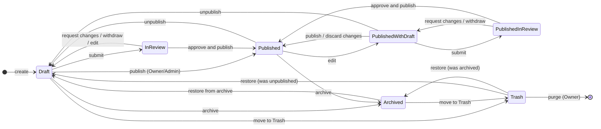

# A1 — Publishing, versions, preview and cache invalidation

**Status:** Phase A1 specification. **Design only — nothing in this document is implemented.** It defines how content
moves from an editor's draft to the public website (A3 builds the core; A8 completes history, comparison, scheduling,
review comments and audit views), how versions are kept, how previews work, and how the public cache is refreshed.

Related documents: [A1-ARCHITECTURE](A1-ARCHITECTURE.md) · [A1-DATABASE-SCHEMA](A1-DATABASE-SCHEMA.md) ·
[A1-CONTENT-MODEL](A1-CONTENT-MODEL.md) · [A1-SECURITY-RBAC](A1-SECURITY-RBAC.md) · [A1-MEDIA-STORAGE](A1-MEDIA-STORAGE.md) ·
[A1-MIGRATION-PLAN](A1-MIGRATION-PLAN.md).

---

## 1. Core idea: working copy, revisions, published documents

Every piece of public content belongs to an **aggregate**: one root row plus everything published with it (its
translations, its ordered children, its links and, for pages and services, its sections). The aggregates are:

| Aggregate (entity type) | Root table | Published with it |
|---|---|---|
| `page` | `pages` | `page_translations`, `page_sections` (+ translations) |
| `service` | `services` | translations, gallery items (+ captions), machine / related-service / featured-project links, the service's own detail-page sections |
| `project` | `projects` | translations, photos (`project_media`), categories, services, flags |
| `machine`, `industry`, `client`, `certificate`, `project_category` | their tables | translations and child rows |
| `reusable_section` | `reusable_sections` | translations |
| `ordering` | `entity_orderings` | `entity_ordering_items` (the order of a whole collection) |
| `menu` | `menus` | items + translations |
| `site_settings` | `site_settings` | translations, phones, interface text |
| `theme` | `theme_settings` | design-token overrides |
| `form` | `forms` | translations, fields (+ translations) |

Three representations exist for each aggregate:

1. **Working copy** — the normalized rows editors change (relational tables with foreign keys and constraints). The
   public site never reads them.
2. **Revisions** — immutable JSON snapshots of the whole aggregate (`revisions.snapshot`), written on save, submit,
   publish, unpublish, archive, restore and import. They are the version history.
3. **Published document** — the *public projection* of the live revision (`published_documents.document`): only public
   fields (no provenance notes, flags, internal notes or expiry dates), hidden sections removed, restricted media
   removed. **The public site reads content only from `published_documents` (plus `public_media` and `redirects`).**

Consequences:

- A draft cannot leak: there is no code path from the public renderer to working tables or revisions.
- Editing a live page never changes the live page until someone publishes.
- Unpublishing is one row delete (plus cache invalidation) and takes effect at once.
- Restoring an old version is copying a snapshot into the working copy — history is never rewritten.

## 2. Status model

The brief's four states (DRAFT, IN REVIEW, PUBLISHED, ARCHIVED) describe two different questions, so the data keeps
them apart and the admin shows them together:

| Column (every aggregate root) | Values | Question |
|---|---|---|
| `publication_status` | `unpublished` · `published` · `archived` | Is a version live? |
| `draft_status` | `none` · `draft` · `in_review` | Does the working copy differ from the live version, and where is it in review? |

A pending row in `scheduled_publications` adds the **Scheduled** marker. Displayed state:

| publication_status | draft_status | Shown as |
|---|---|---|
| unpublished | draft | **Draft** |
| unpublished | in_review | **In review** |
| published | none | **Published** |
| published | draft | **Published** · changes in draft |
| published | in_review | **Published** · changes in review |
| archived | none | **Archived** |
| *(any)* + pending schedule | | adds **Scheduled for {date, Riyadh time}** |
| `deleted_at` set | | **In Trash** |



## 3. Transitions

Permissions are those of [A1-SECURITY-RBAC](A1-SECURITY-RBAC.md) §5 (written here as `publish`, `review`…; the real keys
are per resource, e.g. `projects.publish`).

| # | Action | Allowed from | Result | Who | Gate |
|---|---|---|---|---|---|
| T1 | Create | — | unpublished · draft | `edit` | lenient validation (structure only) |
| T2 | Save | any state except archived / Trash | draft_status = draft (publication unchanged) | `edit` | lenient validation; `lock_version` must match |
| T3 | Submit for review | draft_status = draft | in_review | `submit` | **strict validation** (§4) |
| T4 | Request changes | in_review | draft | `review` | a comment is required |
| T5 | Withdraw from review | in_review | draft | the submitter, or `edit` | — |
| T6 | Approve and publish | in_review | published · none | `publish`, or `publish_reviewed` **and** not the submitter | strict validation + legal gate (§4.3) |
| T7 | Publish directly | draft or in_review | published · none | `publish` (Owner, Admin) | strict validation + legal gate |
| T8 | Schedule | draft or in_review | + pending schedule of a fixed revision | as T6 / T7 | strict validation now **and** again at run time |
| T9 | Cancel schedule | pending schedule | schedule cancelled | creator, or `publish` | — |
| T10 | Discard changes | published · draft / in_review | published · none (working copy reset to the live revision) | `edit` | confirmation |
| T11 | Unpublish | published | unpublished · draft | `publish` | impact check (§6) + confirmation |
| T12 | Archive | unpublished or published | archived · none | `archive` | impact check + confirmation |
| T13 | Restore from archive | archived | unpublished · draft | `archive` | — |
| T14 | Move to Trash | unpublished or archived (never published) | `deleted_at` set | `delete` | — |
| T15 | Restore from Trash | Trash | previous state | `delete` | slug still free |
| T16 | Purge | Trash | rows removed (and, for media, files) | `purge` (Owner) | no references in either scope; typed confirmation |
| T17 | Restore a revision | any state except Trash | working copy = that snapshot (upcast), draft_status = draft | `edit` + `restore` | references re-checked at the next submit/publish |

**Invalid transitions are rejected by the service layer** (and never offered in the interface), for example:
publishing an archived item (restore first), moving a published item to the Trash (unpublish or archive first),
editing an archived item, publishing with a required language incomplete, a reviewer approving their own submission,
an editor publishing, any transition with a stale `lock_version`.

**Owner override.** The Owner may publish directly from any non-archived state without review, including legal pages.
The override is recorded (`audit_events.action = '<type>.publish'` with `summary` stating "published without review")
and the legal-review confirmation (§4.3) is still required — the Owner confirms it.

**Whether Admins may publish without review** is an Owner decision (default proposed: yes, as above).

## 4. Validation gates

### 4.1 Lenient (save)
Schema shape only: types, lengths, enum values, known block types and schema versions, reference ids well-formed. A
draft may be incomplete (an empty Arabic title is allowed while drafting). Nothing on save can make the site change.

### 4.2 Strict (submit, publish, schedule — and again when a schedule runs)
- Every **required locale** (`locales.is_required`, English and Arabic today) is complete for the aggregate: required
  fields non-empty; translation status `complete` (not `draft` or `needs_review`).
- Every reference resolves to an aggregate that is **published at that moment** (a link to an unpublished project is
  an error, not a silent gap), except references the content model marks as "optional when unavailable".
- **Media:** every media item in a slot that will be displayed is deliverable (approved, public, no blocking flag, not
  deleted, file ready). A restricted, pending, private or internal item cannot be published in a displayed slot —
  whatever the editor selected ([A1-MEDIA-STORAGE](A1-MEDIA-STORAGE.md) §4).
- Slug valid, unique, not reserved; a changed slug of a live aggregate produces a redirect plan without conflicts
  ([A1-CONTENT-MODEL](A1-CONTENT-MODEL.md) §5.5).
- Type-specific rules: certificate texts pass the **digit guard** (no runs of 7+ digits, grouped digits, ISO dates or
  expiry words — the rule `e2e/commerce-certificates.spec.ts` applies today); statistics and machine power figures
  carry a provenance note; service-page featured projects list that service in their own record; external links are
  `https:`; menu targets are live.
- Block settings and content validate against their **current** schema version (older ones are upcast first).

### 4.3 Legal gate
Pages with `requires_legal_review = 1` (Privacy, Terms) can be published only by a holder of `legal.publish` (Owner by
default) who ticks "The legal text has been reviewed by …" and enters who reviewed it; the confirmation is stored in
the publish revision's `message` and the audit event. Removing a "Pending confirmation" note from a legal section is a
legal edit (CLAUDE.md: the pending notes block launch). Legal text is never published automatically, including by a
schedule created by someone without `legal.publish`.

## 5. The publish transaction

One database transaction per publish; idempotent if retried:

1. `SELECT … FOR UPDATE` the aggregate root (serializes publishers of the same aggregate); check `lock_version`.
2. Load the working copy; run the strict validation (§4.2) against **published** state of referenced aggregates.
3. Write a revision of kind `publish` (full snapshot, `live_from = now`); close the previous publish revision
   (`live_until = now`).
4. Build the **public projection** with the projection function of the aggregate's current schema version; upsert
   `published_documents` (entity_type, entity_id, revision_id, slug, document, sha256, published_at).
5. If a live slug changed: insert `redirects` rows (308) from the old addresses (both locales) to the new ones; reject
   the publish if that would conflict with a live address or create a chain or loop.
6. Rebuild `content_references` for scope `published` and the `search_documents` row for scope `published`.
7. Update the root: `publication_status = 'published'`, `draft_status = 'none'`, `published_revision_id`,
   `published_at`, `published_by`, `first_published_at` if empty; cancel superseded schedules.
8. Insert `cache_invalidations` rows for the tags in §8; write `audit_events`.
9. Commit. **After** the commit: call `revalidateTag(tag, { expire: 0 })` for each tag in the current process (so this
   process is fresh at once), and optionally request the affected public URLs once to re-render them (the warm step).

If any step fails the transaction rolls back and nothing becomes visible. If the process dies after the commit but
before step 9, the `cache_invalidations` rows still make every process re-render on its next read (§8.3).

Unpublish, archive and purge run the same pattern: delete the `published_documents` row, remove published references,
invalidate, audit.

## 6. Impact checks (unpublish, archive, purge, slug change)

Before taking something offline the admin shows, from `content_references` (scope `published`): pages and sections that
show it, menus that link it, redirects that target it. Unpublishing does not edit other aggregates: the public renderer
already drops references to aggregates that are not live (a menu item to an unpublished page is skipped; a homepage
selection simply has one item fewer). The admin flags the gaps ("3 pages link this project") so the editor can fix them.
Purging is blocked while anything references the item in either scope.

**Addresses of unpublished content** answer with the localized 404 (as an unknown address does today). An editor
unpublishing a page may create a redirect at the same time (Owner/Admin). A `410 Gone` mode is not proposed.

## 7. Scheduled publication

- `scheduled_publications` stores the action (`publish` or `unpublish`), the exact **revision** to publish, `run_at` in
  UTC (entered and shown in Asia/Riyadh — UTC+3 all year, no daylight saving) and its status.
- **Runner:** a cPanel cron job every 5 minutes (Namecheap's minimum interval, reported in its knowledgebase) runs a
  small Node script that calls `POST /api/internal/scheduler` on the app with the `CRON_SECRET` header. The route
  handler (inside the app process, so `revalidateTag` works there) takes due rows with `SELECT … FOR UPDATE SKIP
  LOCKED` (or an advisory `GET_LOCK`), re-checks the creator's permission and the strict validation, publishes as in §5
  and marks the row `done` / `failed`. A cron script cannot invalidate Next.js caches itself (Next 16.3.8 throws outside
  a request), hence the endpoint.
- Precision: up to 5 minutes late (cron granularity) plus the time of the run. If exact timing ever matters, the owner
  can ask the host about shorter intervals.
- A failure keeps the row `failed`, writes `last_error`, audits, queues an email to the scheduler's creator (A7 outbox)
  and shows on the dashboard. Nothing is published partially.
- Editing the working copy after scheduling does not change what will be published (the schedule names a revision);
  the admin shows "the scheduled version is older than your draft". Publishing manually supersedes the schedule.
- The job logs into `system_job_runs` (dashboard: "Scheduler last ran 3 min ago").

## 8. Caching and invalidation

### 8.1 What the research found (Next.js 16.3.8, installed source)
- With the default cache handler, invalidated tags and on-demand revalidation live **in the memory of the one process**
  that received the call; nothing is written to disk or shared. Another process keeps serving its copy, and a restarted
  process forgets the invalidation (`server/lib/incremental-cache/file-system-cache.js`, `tags-manifest.external.js`;
  documented in `docs/01-app/02-guides/self-hosting.md` and `how-revalidation-works.md`).
- The host may run more than one process for the app (LiteSpeed's Node launcher spawns processes on demand; Passenger
  normally keeps one for Node) and stops or restarts them on its own schedule (web-server reloads, memory limits, idle
  rules). See [A1-ARCHITECTURE](A1-ARCHITECTURE.md) §7.
- `revalidateTag(tag, profile)` takes a second argument in Next 16: `{ expire: 0 }` = expire now (next request
  re-renders), `'max'` = serve stale once while re-rendering. `updateTag` works only in Server Actions.
  `revalidatePath` maps to the path's implicit tag. Neither works outside a request (cron scripts).

### 8.2 Design
- Public data reads go through cached functions (`unstable_cache` today, the documented way without Cache Components)
  carrying **tags**; the page that uses them inherits the tags.
- A **custom cache handler** (Next's `cacheHandler` option, A3) wraps the built-in file-system cache unchanged (same
  disk layout, same in-memory LRU) and adds one check: an entry older than the newest `cache_invalidations.invalidated_at`
  of any of its tags is treated as missing (re-rendered before serving). Each process refreshes its copy of recent
  invalidations from the database at most once a second (one indexed query); errors fall back to the built-in
  behaviour. The handler does nothing during `next build` (no database there).
- Every DB-backed route keeps a time-based safety net (`revalidate`, proposed 1 hour) so that a missed invalidation can
  never last long.
- The handler does **not persist 404 results of unknown slugs** (today every unknown `/…/projects/<slug>` writes cache
  files; a crawler could grow them without limit against the account's 300,000-inode quota).
- The handler depends on a Next.js internal module: Next stays pinned to an exact version (as today) and the handler is
  re-verified on every upgrade (a test that two processes sharing one `.next` see each other's invalidations).

### 8.3 Tags

| Tag | Read by | Invalidated when |
|---|---|---|
| `doc:<type>:<id>` | the aggregate's own page(s) | that aggregate is published, unpublished, archived, purged |
| `type:<type>` | lists (projects overview, homepage selections, service pages' machine/project lists, the services menu…) | any aggregate of that type changes publication |
| `ordering:<key>` | lists in that collection order | the ordering is published |
| `menu:<key>` | every page (shell) | the menu is published |
| `settings:site` | every page (shell, footer, structured data), contact | site settings published |
| `settings:theme` | every page | theme published |
| `media` | every page that resolves media | approval, restriction, flags, files or alt text of any media item change |
| `redirects` | the 404 paths' redirect lookup | a redirect is created, changed or removed |
| `sitemap` | `/sitemap.xml` | any routable aggregate is published or unpublished; a slug changes |
| `site` | everything | the emergency "refresh the whole site" action (Owner/Admin) |
| `_N_T_/<path>` | (Next's implicit path tag) | `revalidatePath` for a specific page |

Because the header's Services menu, the footer and the company facts appear on every page, publishing a service, a menu
or the site settings refreshes the whole site — at this site's size (about 100 pages) that is a few seconds of
rendering spread over the next visits, and it is correct. Media changes are rare and invalidate broadly for the same
reason (one tag instead of one per image keeps each page's tag list short).

**Invalidation mode.** Publish, unpublish, archive, restriction of media and redirect changes use **expire** (the next
visitor waits for a fresh render, typically a fraction of a second; never stale content after a removal). Only the
time-based safety net uses stale-while-revalidate.

### 8.4 After a release
Pages are rendered at runtime on first request (the build has no database, see [A1-ARCHITECTURE](A1-ARCHITECTURE.md)
§6). After every release a **page warm-up** (the same approach as `scripts/warm-images.mjs`: sitemap → every page, at
most 2 requests at a time, gentle, stops on 429/503/508) fills the cache so that visitors get cached pages.

### 8.5 What is not cached
Admin pages and actions (`no-store`), previews (draft mode is `private, no-store` by design), enquiry submissions,
media of the private area, unknown-address 404s (not stored, see §8.2).

## 9. Revisions (version history)

### 9.1 When revisions are written
| Kind | Written by | Sealed (never pruned) |
|---|---|---|
| `save` | each save of the working copy (explicit save and autosave) | no |
| `submit` | T3 | yes |
| `publish` | T6, T7, a schedule | yes (`live_from` / `live_until`) |
| `unpublish`, `archive` | T11, T12 | yes |
| `restore` | T17 (records `restored_from_id`) | yes |
| `import` | the A9 migration (one per aggregate) | yes |

### 9.2 Snapshot format
A snapshot is the whole aggregate in a canonical, versioned JSON shape (`schema_version`), including admin-only fields,
validated before it is written. Example (excerpt, a project):

```json
{
  "schemaVersion": 1,
  "type": "project",
  "id": "01JABCDEF0123456789ABCDEFG",
  "slug": "clock-tower-landmark",
  "galleryRef": "05",
  "isFeatured": true,
  "source": { "basis": "profile", "pages": "8-11", "note": null },
  "translations": {
    "en": { "title": "Clock Tower Landmark", "summary": "A clock tower with a patterned lattice façade — …", "status": "complete" },
    "ar": { "title": "برج الساعة", "summary": "برج ساعة بواجهة شبكية مزخرفة — …", "status": "complete" }
  },
  "categoryIds": ["01J…structures", "01J…public-realm", "01J…laser-cutting"],
  "serviceIds": ["01J…steel-structures", "01J…laser-cutting", "01J…fabrication"],
  "mediaIds": ["01J…clock-tower-1", "01J…clock-tower-2", "01J…clock-tower-3"],
  "flags": [],
  "seo": { "robotsIndex": true, "robotsFollow": true, "inSitemap": true, "translations": { "en": {}, "ar": {} } }
}
```

Old snapshots stay readable: each aggregate type has **upcasters** (`v1 → v2 → …`) applied when a snapshot is read for
preview, comparison or restore. A schema change that cannot be upcast safely is a migration task (A1-DATABASE-SCHEMA §10),
never a silent loss.

### 9.3 Compare, preview, restore
- **Compare** any two revisions (or a revision and the working copy): a field-level, per-language diff, with sections
  matched by id (moved / added / removed / changed) and media shown as thumbnails.
- **Preview** a revision with the real public components (§11), as it would look if published now.
- **Restore** copies the snapshot into the working copy (T17) and writes a `restore` revision; the live version is
  untouched until someone publishes.
- **What was live on a date:** the `publish` revision whose `live_from ≤ t < live_until` (needed, for example, to
  know which privacy policy an enquiry was submitted under — `enquiries.privacy_revision_id`).

### 9.4 Retention (Owner decision; proposed)
Sealed revisions: kept indefinitely (they are small: a project is a few kilobytes, a page with sections tens of
kilobytes). Unsealed `save` revisions: older than 90 days are pruned, keeping the latest 20 per aggregate. Pruning is a
daily job, logged in `system_job_runs`, and never touches a revision referenced by `published_documents`, a schedule, an
enquiry or an audit event's before/after pair from the last 12 months.

## 10. Section-level drafts

The unit of publication is the **aggregate** (a page with all its sections), not a single section: a page is reviewed,
previewed and published as a whole, so a half-updated page never goes live. Within that:

- The admin tracks **changes per section** (compared with the live revision): unchanged, changed, added, removed,
  moved — shown in the page's outline and in the compare view.
- **Revert section** restores one section from the live revision into the working copy (other draft changes stay).
- Hidden sections (`is_visible = 0`) stay in the draft and its revisions but never reach the public projection.
- **Reusable (global) sections** have their own lifecycle: editing the six pillars once and publishing them updates the
  homepage and About together; the publish dialog lists every page that links the block.
- Publishing a page never publishes the reusable sections it links (each keeps its own live version).

## 11. Preview

**Goal:** see unpublished content exactly as visitors will — the real production components, Desktop / Tablet /
Mobile, English / Arabic, light / dark — without any way for the public to reach it.

**Mechanism (A3):**
1. The editor clicks Preview in the admin (`POST /api/admin/preview` with the entity and optional revision). The
   handler checks the admin session and the `preview.use` permission, enables Next's **draft mode** (cookie
   `__prerender_bypass`), stores the preview target in the admin session, and redirects to the public address
   computed on the server (never to an address taken from the request — no open redirect).
2. In draft mode Next renders the route dynamically and bypasses every cache (verified in the 16.3.8 source; responses
   are `private, no-store`).
3. The public read model returns **working-copy** data **only when both** draft mode is on **and** a valid admin session
   with `preview.use` exists (the draft-mode cookie alone is a build-wide value, not an authorization). Otherwise it
   serves published data as usual.
4. Exit preview: `POST /api/admin/preview/exit` disables draft mode.

**Frames:** the admin shows the preview in an iframe at 1440 × 900, 834 × 1112 and 390 × 844 CSS pixels (the widths the
site's tests use), with an EN/AR switch and a light/dark switch. The page inside the frame is pixel-identical to
production: the "Preview" banner and controls live in the admin frame around it, never inside the page. Choosing the
theme from the admin needs the boot script to honour a `theme` parameter **only in draft mode** — a small change to
`src/lib/commerce-boot.ts` for A5, listed as a design-sensitive change for review.

**Revisions:** previewing a specific revision uses the same mechanism with the revision id as the target.

**Headers:** preview responses are already `private, no-store`; the admin adds `X-Robots-Tag: noindex, nofollow`.

**Shareable preview links** (someone without an account reviewing a draft): not proposed by default. If the Owner wants
them: a signed, single-revision, read-only token valid for at most 72 hours, revocable, `noindex`, audited — an Owner
decision.

**Hardening notes from the research:** the draft-mode cookie value (`previewModeId`) is shared by the whole build and is
reused across builds for 14 days unless `.next/cache/.previewinfo` is deleted before a release build; it also authorizes
on-demand revalidation requests. The release procedure deletes it before each build, and `.next` / the deployment
archive are treated as secret material.

## 12. Undo and redo

Undo/redo is an **editor-session** feature, separate from revisions: the editor keeps a command history in memory
(each field change, section move, add or remove is a command) for the open document; it is cleared on reload and never
stored. Persisted history is the revision list (§9). Autosave writes `save` revisions while editing (proposed: after 5
seconds without typing, and on leaving the page), so a closed tab loses at most a few seconds; the undo history does
not survive it, the revisions do.

**Concurrent editing:** every aggregate has `lock_version`; a save with an outdated version is rejected with "Someone
else changed this page — review their changes" (the compare view opens). An optional presence hint ("Sara is editing
this page") can be added in A8; no hard locks.

## 13. Delete, archive and Trash

- **Archive** hides an aggregate from the public site and from the admin's default lists, keeps it read-only and
  restorable.
- **Trash** (`deleted_at`) is the soft delete for unpublished or archived aggregates; restorable (Owner/Admin) until
  purged. A proposed retention of 30 days in the Trash before the Owner can purge in bulk (Owner decision).
- **Purge** removes the rows (children cascade) and, for media, the files; it is Owner-only, needs a typed confirmation
  and is blocked while any reference exists in either scope (`content_references` plus foreign keys with
  `ON DELETE RESTRICT`).
- System pages, the homepage, legal pages, templates, menus, settings, theme and orderings cannot be deleted.
- Slugs stay reserved while an aggregate is in the Trash (the unique index includes it), so an old address is never
  silently reused.

## 14. Relation to the audit log

Every transition above writes one `audit_events` row in the same transaction (actor, role, session, request id, action,
entity, title, outcome, before/after revision ids). Denied attempts (permission, validation, stale version) are audited
with outcome `denied` or `failed`. The audit log answers "who changed what and when"; revisions answer "what exactly
changed". See [A1-SECURITY-RBAC](A1-SECURITY-RBAC.md) §11.

## 15. Timestamps

All timestamps are stored in UTC as `DATETIME(3)`; every database session sets `time_zone = '+00:00'`. The admin
displays and accepts times in **Asia/Riyadh** (UTC+3, no daylight saving) and labels them ("09:30 Riyadh time").
Schedules are entered in Riyadh time and stored in UTC. Public pages show dates only where content provides them
(e.g. a legal page's effective date, a `DATE`).
